630. Course Schedule III

There are `n` different online courses numbered from `1` to `n`. Each course has some duration(course length) `t` and closed on `dth` day. A course should be taken **continuously** for `t` days and must be finished before or on the `dth` day. You will start at the `1st` day.

Given `n` online courses represented by pairs `(t,d)`, your task is to find the maximal number of courses that can be taken.

**Example:**
```
Input: [[100, 200], [200, 1300], [1000, 1250], [2000, 3200]]
Output: 3
Explanation: 
There're totally 4 courses, but you can take 3 courses at most:
First, take the 1st course, it costs 100 days so you will finish it on the 100th day, and ready to take the next course on the 101st day.
Second, take the 3rd course, it costs 1000 days so you will finish it on the 1100th day, and ready to take the next course on the 1101st day. 
Third, take the 2nd course, it costs 200 days so you will finish it on the 1300th day. 
The 4th course cannot be taken now, since you will finish it on the 3300th day, which exceeds the closed date.
```

**Note:**

* The integer `1 <= d, t, n <= 10,000`.
* You can't take two courses simultaneously.

# Solution
---
## Approach 1: Brute Force
**Algorithm**

The most naive solution will be to consider every possible permutation of the given courses and to try to take as much courses as possible by taking the courses in a serial order in every permutation. We can find out the maximum number of courses that can be taken from out of values obtained from these permutations.

**Complexity Analysis**

* Time complexity : $O\big((n+1)!\big)$. A total of $n!$ permutations are possible for the $courses$ array of length $n$. For every permutation, we scan over the $n$ elements of the permutation to find the number of courses that can be taken in each case.

* Space complexity : $O(n)$. Each permutation needs nn space.

## Approach 2: Recursion with Memoization
**Algorithm**

Before we move on to the better approaches, let's discuss one basic idea to solve the given problem. Suppose, we are considering only two courses $(a,x)$ and $(b,y)$. Let's assume $y>x$. Now, we'll look at the various relative values which $a$ and $b$ can take, and which course should be taken first in each of these cases. In all the cases, we assume that the course's duration is always lesser than its end day i.e. $a<x$ and $b<y$.

1. (a+b) ≤ x: In this case, we can take the courses in any order. Both the courses can be taken irrespective of the order in which the courses are taken.

    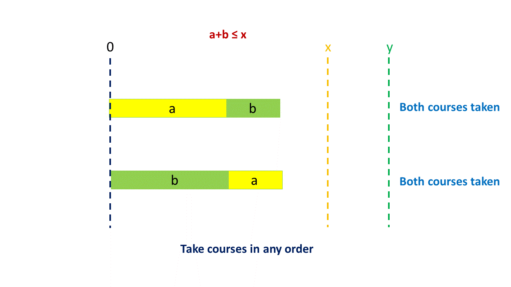
1. (a+b)>x, $a>b$, (a+b) ≤ y: In this case, as is evident from the figure, both the courses can be taken only by taking course $a$ before $b$.

    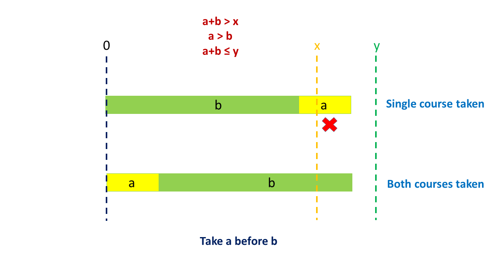
1. (a+b)>x, $b>a$, (a+b) ≤ y: In this case also, both the courses can be taken only by taking course $a$ before $b$.

    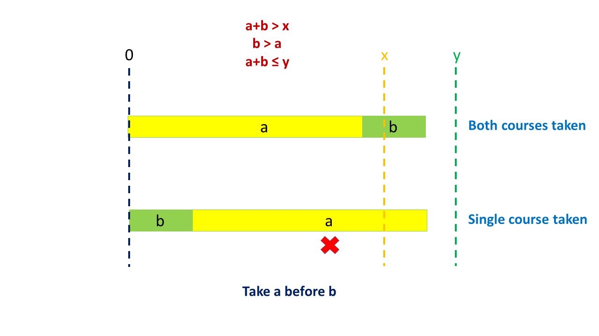
1. (a+b)>y: In this case, irrespective of the order in which we take the courses, only one course can be taken.

    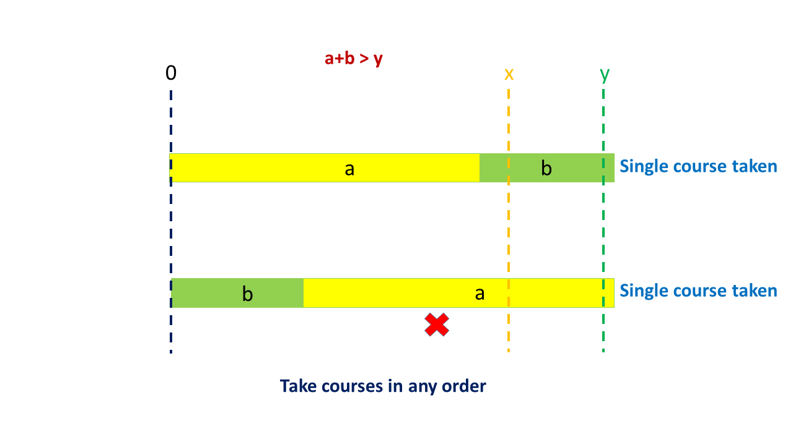

From the above example, we can conclude that it is always profitable to take the course with a smaller end day prior to a course with a larger end day. This is because, the course with a smaller duration, if can be taken, can surely be taken only if it is taken prior to a course with a larger end day.

Based on this idea, firstly, we sort the given $courses$ array based on their end days. Then, we try to take the courses in a serial order from this sorted $courses$ array.

In order to solve the given problem, we make use of a recursive function `schedule(courses, i, time)` which returns the maximum number of courses that can be taken starting from the $i^{th}$ course(starting from 0), given the time aleady consumed by the other courses is $time$, i.e. the current time is $time$, given a $courses$ array as the schedule.

Now, in each function call to `schedule(courses, i, time)`, we try to include the current course in the taken courses. But, this can be done only if $time + duration_i < end\_day_i$. Here, $duration_i$ refers to the duration of the $i^{th}$ course and $end\_day_i$ refers to the end day of the $i^{th}$ course.

If the course can be taken, we increment the number of courses taken and obtain the number of courses that can be taken by passing the updated time and courses' index. i.e. we make the function call `schedule(courses, i + 1, time + duration_i)`. Let's say, we store the number of courses that can be taken by taking the current course in $taken$ variable.

Further, for every current course, we also leave the current course, and find the number of courses that can be taken thereof. Now, we need not update the time, but we need to update the courses' index. Thus, we make the function call, `schedule(courses, i + 1, time)`. Let's say, we store the count obtained in $not\_taken$ variable.

While returning the number of courses at the end of each function call, we return the maximum value out of $taken$ and $not\_taken$.

Thus, the function call schedule(courses, 0, 0) gives the required result.

In order to remove this redundancy, we make use of a memoization array $memo$, such that $memo[i][j]$ is used to store the result of the function call `schedule(courses, i, time)`. Thus, whenever the same function call is made again, we can return the result directly from the $memo$ array. This helps to prune the search space to a great extent.

```java
public class Solution {
    public int scheduleCourse(int[][] courses) {
        Arrays.sort(courses, (a, b) -> a[1] - b[1]);
        Integer[][] memo = new Integer[courses.length][courses[courses.length - 1][1] + 1];
        return schedule(courses, 0, 0, memo);
    }
    public int schedule(int[][] courses, int i, int time, Integer[][] memo) {
        if (i == courses.length)
            return 0;
        if (memo[i][time] != null)
            return memo[i][time];
        int taken = 0;
        if (time + courses[i][0] <= courses[i][1])
            taken = 1 + schedule(courses, i + 1, time + courses[i][0], memo);
        int not_taken = schedule(courses, i + 1, time, memo);
        memo[i][time] = Math.max(taken, not_taken);
        return memo[i][time];
    }
}
```

**Complexity Analysis**

* Time complexity : $O(n*d)$. $memo$ array of size nnxdd is filled once. Here, nn refers to the number of courses in the given $courses$ array and $d$ refers to the maximum value of the end day from all the end days in the $courses$ array.

* Space complexity : $O(n*d)$. $memo$ array of size nnxdd is used.

## Approach 3: Iterative Solution
For the current approach, the idea goes as follows. As discussed in the previous approaches, we need to sort the given $courses$ array based on the end days. Thus, we consider the courses in the ascending order of their end days. We keep a track of the current time in a $time$ variable. Along with this, we also keep a track of the number of courses taken till now in $count$ variable.

For each course being considered currently(let's say $i^{th}$ course), we try to take this course. But, to be able to do so, the current course should end before its corresponding end day i.e. $time + duration_i ≤ end\day_i$. Here, $duration_i$ refers to the duration of the $i^{th}$ course and $end\_day_i$ refers to the end day of the $i^{th}$ course.

If this course can be taken, we update the current time to $time + duration_i$ and also increment the current $count$ value to indicate that one more course has been taken.

But, if we aren't able to take the current course i.e. $time + duration_i > end\_day_i$, we can try to take this course by removing some other course from amongst the courses that have already been taken. But, the current course can fit in by removing some other course, only if the duration of the course($j^{th}$) being removed $duration_j$ is larger than the current course's duration, $duration_i$ i.e. $duration_j > duration_i$.

We are sure of the fact that by removing the $j^{th}$ course, we can fit in the current course, because, $course_j$ was already fitting in the duration available till now. Since, $duration_i < duration_j$, the current course can surely take its place. Thus, we look for a course from amongst the taken courses having a duration larger than the current course.

But why are we doing this replacement? The answer to this question is as follows. By replacing the $j^{th}$ course, with the $i^{th}$ course of a relatively smaller duration, we can increase the time available for upcoming courses to be taken. An extra $duration_j - duration_i$ time can be made available by doing so.

Now, for this saving in time to be maximum, the course taken for the replacement should be the one with the maximum duration. Thus, from amongst the courses that have been taken till now, we find the course having the maximum duration which should be more than the duration of the current course(which can't be taken).

Let's say, this course be called as $max\_i$. Thus, now, a saving of $duration_{max\_i} - duration_i$ can be achived, which could help later in fitting in more courses to be taken.

If such a course, $max\_i$, is found, we remove this course from the taken courses and consider the current course as taekn. We also mark this course with $\text{-1}$ to indicate that this course has not been taken and should not be considered in the future again for replacement.

But, if such a course isn't found, we can't take the current course at any cost. Thus, we mark the current course with $\text{-1}$ to indicate that the current course has not been taken.

At the end, the value of $count$ gives the required result.

The following animation illustrates the process.

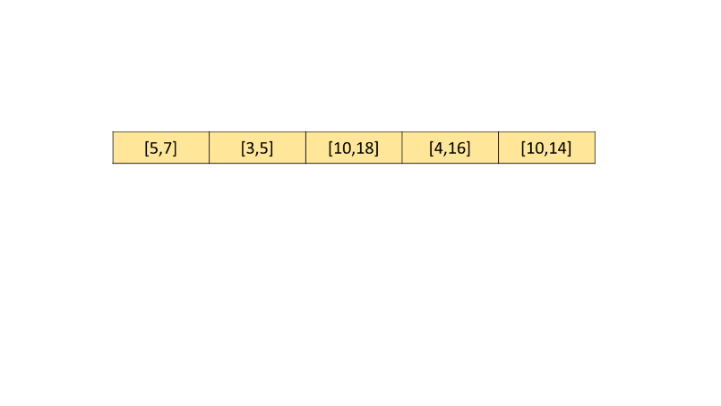
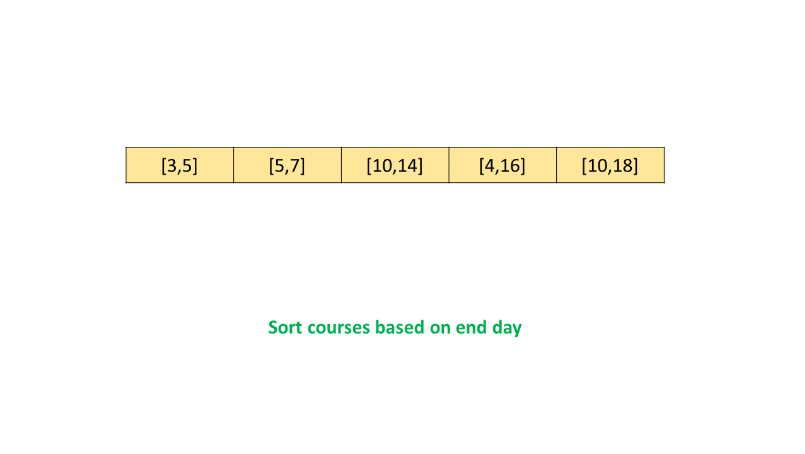
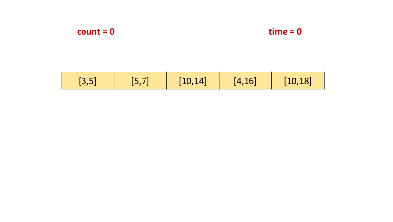
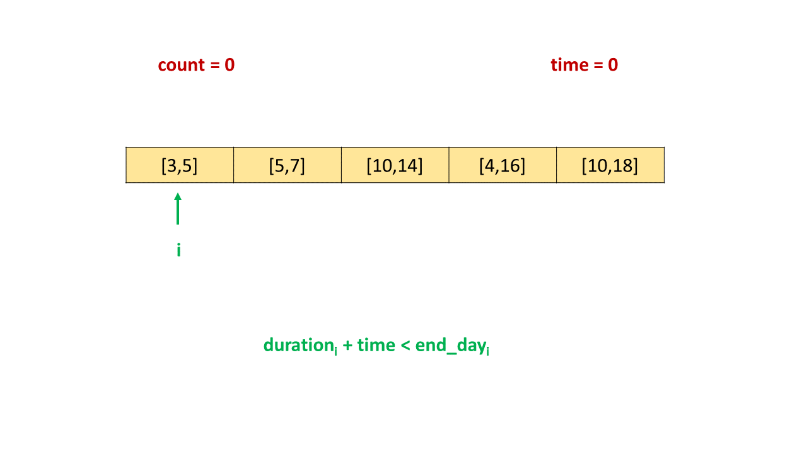
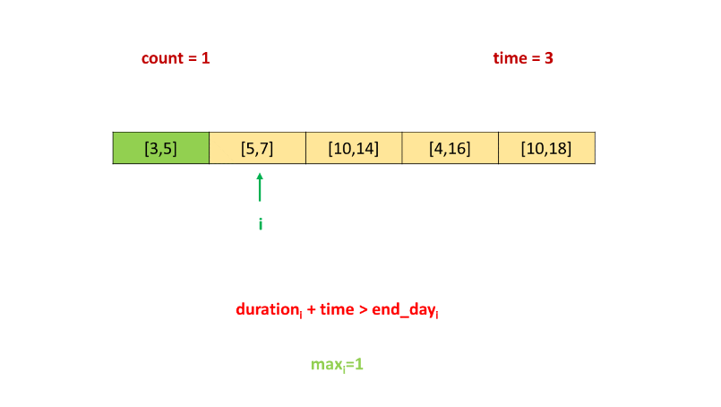
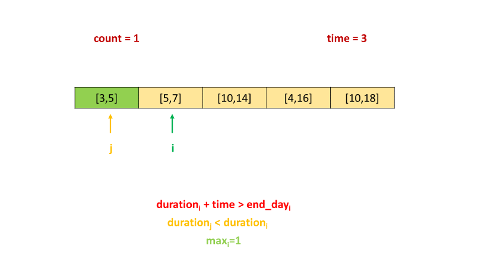
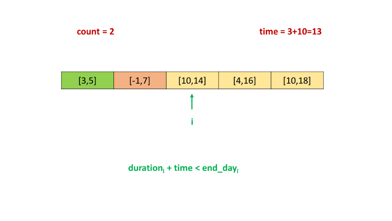
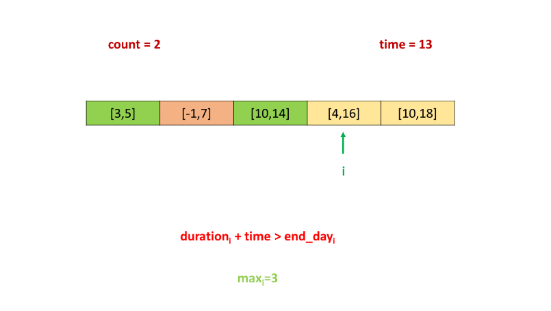

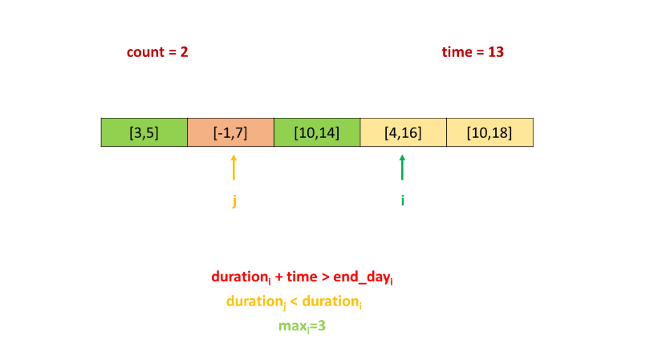
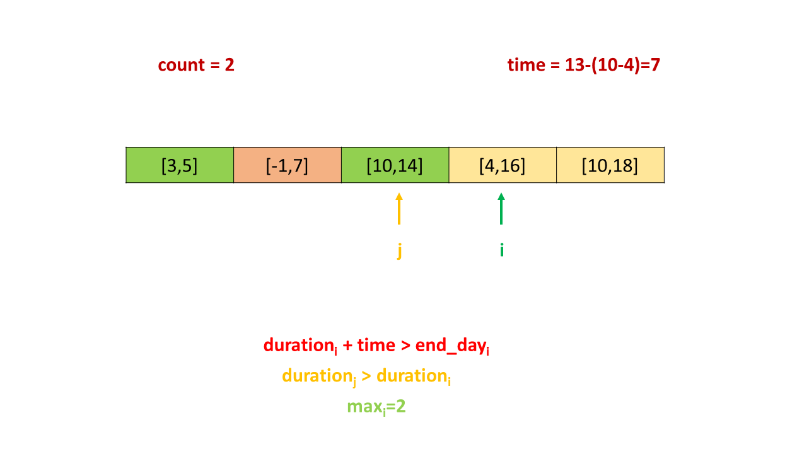
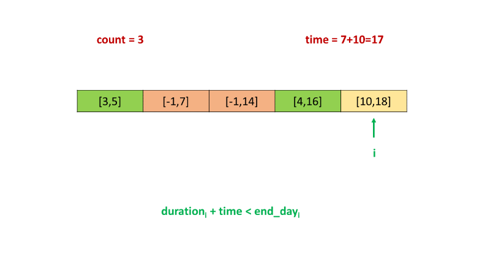
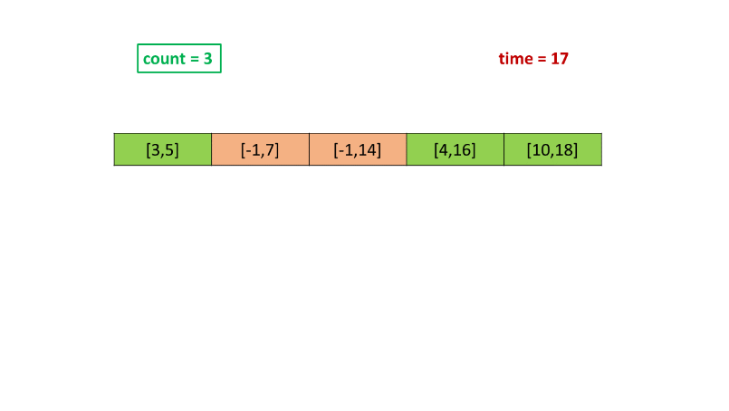

```java
public class Solution {
    public int scheduleCourse(int[][] courses) {
        System.out.println(courses.length);
        Arrays.sort(courses, (a, b) -> a[1] - b[1]);
        int time = 0, count = 0;
        for (int i = 0; i < courses.length; i++) {
            if (time + courses[i][0] <= courses[i][1]) {
                time += courses[i][0];
                count++;
            } else {
                int max_i = i;
                for (int j = 0; j < i; j++) {
                    if (courses[j][0] > courses[max_i][0])
                        max_i = j;
                }
                if (courses[max_i][0] > courses[i][0]) {
                    time += courses[i][0] - courses[max_i][0];
                }
                courses[max_i][0] = -1;
            }
        }
        return count;
    }
}
```

**Complexity Analysis**

* Time complexity : $O(n^2)$. We iterate over the countcount array of size $n$ once. For every element currently considered, we could scan backwards till the first element, giving $O(n^2)$ complexity. Sorting the $count$ array takes $O\big(n \log n\big)$ time for $count$ array.

* Space complexity : $O(1)$. Constant extra space is used.

## Approach 4: Optimized Iterative
In the last approach, we've seen that, in the case of current course which can't be taken direclty, i.e. for $time + duration_i > end\_day_i$, we need to traverse back in the $courses$ array till the beginning to find a course with the maximum duration which is larger than the current course's duration. This backward traversal also goes through the courses which aren't taken and thus, can't be replaced, and have been marked as $\text{-1}$.

We can bring in some optimization here. For this, we should search among only those courses which have been taken(and not the ones which haven't been taken).

To do so, as we iterate over the $courses$ array, we also keep on updating it, such that the first $count$ number of elements in this array now correspond to only those $count$ number of courses which have been taken till now.

Thus, whenever we update the $count$ to indicate that one more course has been taken, we also update the $courses[count]$ entry to reflect the current course that has just been taken.

Whenever, we find a course for which $time + duration_i > end\_day_i$, we find a $max_i$ course from only amongst these first $count$ number of courses in the $courses$ array, which indicate the courses that have been taken till now.

Also, instead of marking this $max_i^{th}$ course with a $\text{-1}$, we can simply replace this course with the current course. Thus, the first $count$ courses still reflect the courses that have been taken till now.

```java
public class Solution {
    public int scheduleCourse(int[][] courses) {
        System.out.println(courses.length);
        Arrays.sort(courses, (a, b) -> a[1] - b[1]);
        int time = 0, count = 0;
        for (int i = 0; i < courses.length; i++) {
            if (time + courses[i][0] <= courses[i][1]) {
                time += courses[i][0];
                courses[count++] = courses[i];
            } else {
                int max_i = i;
                for (int j = 0; j < count; j++) {
                    if (courses[j][0] > courses[max_i][0])
                        max_i = j;
                }
                if (courses[max_i][0] > courses[i][0]) {
                    time += courses[i][0] - courses[max_i][0];
                    courses[max_i] = courses[i];
                }
            }
        }
        return count;
    }
}
```

**Complexity Analysis**

* Time complexity : $O(n*count)$. We iterate over a total of $n$ elements of the $courses$ array. For every element, we can traverse backwards upto atmost $count$(final value) number of elements.

* Space complexity : $O(1)$. Constant extra space is used.

## Approach 5: Extra List
**Algorithm**

In the last approach, we updated the $course$ array itself so that the first $count$ elements indicate the $count$ number of courses that have been taken till now. If it is required to retain the $courses$ array as such, we can do the same job by maintaining a separate list $valid\_list$ which is the list of those courses that have been taken till now.

Thus, to find the $max_i$ course, we need to search in this list only. Further, when replacing this $max_i^{th}$ course with the current course, we can replace this $max_i$ course in the list with current course directly. The rest of the method remains the same as the last approach.

```java

```

**Complexity Analysis**

* Time complexity : $O(n*m)$. We iterate over a total of $n$ elements of the $courses$ array. For every element, we can traverse over atmost $m$ number of elements. Here, $m$ refers to the final length of the $valid\_list$.

* Space complexity : $O(n)$. The $valid\_list$ can contain atmost $n$ courses.

## Approach 6: Priority Queue
**Algorithm**

This approach is inspired by @stomach_ache

In the last few approaches, we've seen that we needed to traverse over the courses which have been taken to find the course(with the maximum duration) which can be replaced by the current course(if it can't be taken directly). These traversals can be saved, if we make use of a Priority Queue, $queue$(which is implemented as a Max-Heap) which contains the durations of all the courses that have been taken till now.

The iteration over the sorted $courses$ remains the same as in the last approaches. Whenver the current course ($i^{th}$ course) can be taken($time + duration_i ≤ end\_day_i$), it is added to the $queue$ and the value of the current time is updated to $time + duration_i$.

If the current course can't be taken directly, as in the previous appraoches, we need to find a course whose duration $duration_j$ is maximum from amongst the courses taken till now. Now, since we are maintaing a Max-Heap, $queue$, we can obtain this duration directly from this $queue$. If the duration $duration_j > duration_i$, we can replace the $j^{th}$ course, with the current one.

Thus, we remove the $duration_j$ from the $queue$ and add the current course's duration $duration_i$ to the $queue$. We also need to make proper adjustments to the $time$ to account for this replacement done.

At the end, the number of elements in the $queue$ represent the number of courses that have been taken till now.

```java
public class Solution {
    public int scheduleCourse(int[][] courses) {
        Arrays.sort(courses, (a, b) -> a[1] - b[1]);
        PriorityQueue < Integer > queue = new PriorityQueue < > ((a, b) -> b - a);
        int time = 0;
        for (int[] c: courses) {
            if (time + c[0] <= c[1]) {
                queue.offer(c[0]);
                time += c[0];
            } else if (!queue.isEmpty() && queue.peek() > c[0]) {
                time += c[0] - queue.poll();
                queue.offer(c[0]);
            }
        }
        return queue.size();
    }
}
```

**Complexity Analysis**

* Time complexity : $O\big(n \log n\big)$. At most $n$ elements are added to the $queue$. Adding each element is followed by heapification, which takes $O\big(\log n\big)$ time.

* Space complexity : $O(n)$. The $queue$ containing the durations of the courses taken can have atmost $n$ elements

# Submissions
---
**Solution 1: (DP Top-Down, Time Limit Exceeded)**
```python
class Solution:
    def scheduleCourse(self, courses: List[List[int]]) -> int:
        N = len(courses)
        courses = sorted(courses, key=lambda x: x[1])
        
        @functools.lru_cache(None)
        def schedule(i, time):
            if i == N:
                return 0
            taken = 0
            if time + courses[i][0] <= courses[i][1]:
                taken = 1 + schedule(i+1, time+courses[i][0])
            not_taken = schedule(i+1, time)
            return max(taken, not_taken)
        
        return schedule(0, 0)
```

**Solution 2: (Priority Queue)**
```
Runtime: 1032 ms
Memory Usage: 19 MB
```
```python
class Solution:
    def scheduleCourse(self, courses: List[List[int]]) -> int:
        # Time:   O(n log n) sorting takes n log n, and n is the number of courses.
		# Space: O(n) where n is the number of courses. In the worst cases you add the duration of all courses to the heap.
		
        h = []
        time = 0
        
        # Sort the courses by the due date
        courses.sort(key=lambda x: x[1])
        
        # Iterate over the courses
        for duration, end in courses:
            # If the duration of the course + the current time spent in courses is less or equal than the due date
            if duration+time <= end:
                # Add the duration of the current course (Max Heap)
                heappush(h, -duration)
                # Update the time spent in course
                time += duration
                
            # If you have added courses and the current course is less than the course that takes you the least time
            elif h and -h[0] > duration:
                # Remove the course that takes you the least time
                last_duration = -heappop(h)
                # Update the time spent in courses
                time = time - last_duration + duration
                # Add the current course
                heappush(h, -duration)
                
        # The heap has the number of courses you can take
        return len(h)
```

**Solution 3: (Priority Queue, greedy push then pick max)**
```
Runtime: 468 ms
Memory Usage: 56.3 MB
```
```c++
class Solution {
public:
    int scheduleCourse(vector<vector<int>>& courses) {
        sort(courses.begin(), courses.end(), [](vector<int> &c1, vector<int> &c2){
            return c1[1] < c2[1];
        });
        priority_queue<int> pq;
        int cur = 0, duration, lastDay;
        for (auto &c: courses) {
            duration = c[0];
            lastDay = c[1];
            pq.push(duration);
            cur += duration;
            if (cur > lastDay) {
                cur -= pq.top();
                pq.pop();
            }
        }
        return pq.size();
    }
};
```

**Solution 4: (Heap)**
```
Runtime: 708 ms
Memory Usage: 19.3 MB
```
```python
class Solution:
    def scheduleCourse(self, courses: List[List[int]]) -> int:
        heap, time = [], 0
        for t, end in sorted(courses, key=lambda x: x[1]):
            time += t
            heapq.heappush(heap, -t)
            if time > end:
                nt = heapq.heappop(heap)
                time += nt
        return len(heap)
```
