632. Smallest Range Covering Elements from K Lists

You have `k` lists of sorted integers in ascending order. Find the **smallest** range that includes at least one number from each of the `k` lists.

We define the range [a,b] is smaller than range [c,d] `if b-a < d-c` or `a < c if b-a == d-c`.

 

**Example 1:**
```
Input: [[4,10,15,24,26], [0,9,12,20], [5,18,22,30]]
Output: [20,24]
Explanation: 
List 1: [4, 10, 15, 24,26], 24 is in range [20,24].
List 2: [0, 9, 12, 20], 20 is in range [20,24].
List 3: [5, 18, 22, 30], 22 is in range [20,24].
``` 

**Note:**

* The given list may contain duplicates, so ascending order means >= here.
* `1 <= k <= 3500`
* `-105 <= value of elements <= 105`.

# Solution
---
## Approach #1 Brute Force [Time Limit Exceeded]

The naive approach is to consider every pair of elements, $nums[i][j]$ and $nums[k][l]$ from amongst the given lists and consider the range formed by these elements. For every range currently considered, we can traverse over all the lists to find if at least one element from these lists can be included in the current range. If so, we store the end-points of the current range and compare it with the previous minimum range found, if any, satisfying the required criteria, to find the smaller range from among them.

Once all the element pairs have been considered as the ranges, we can obtain the required minimum range.


**Java**
```java

public class Solution {
    public int[] smallestRange(int[][] nums) {
        int minx = 0, miny = Integer.MAX_VALUE;
        for (int i = 0; i < nums.length; i++) {
            for (int j = 0; j < nums[i].length; j++) {
                for (int k = i; k < nums.length; k++) {
                    for (int l = (k == i ? j : 0); l < nums[k].length; l++) {
                        int min = Math.min(nums[i][j], nums[k][l]);
                        int max = Math.max(nums[i][j], nums[k][l]);
                        int n, m;
                        for (m = 0; m < nums.length; m++) {
                            for (n = 0; n < nums[m].length; n++) {
                                if (nums[m][n] >= min && nums[m][n] <= max)
                                    break;
                            }
                            if (n == nums[m].length)
                                break;
                        }
                        if (m == nums.length) {
                            if (miny - minx > max - min || (miny - minx == max - min && minx > min)) {
                                miny = max;
                                minx = min;
                            }
                        }
                    }
                }
            }
        }
        return new int[] {minx, miny};
    }
}
```

**Complexity Analysis**

* Time complexity : $O(n^3)$. Considering every possible range(element pair) requires $O(n^2)$ time. For each range considered, we need to traverse over all the elements of the given lists in the worst case requiring another $O(n)$ time. Here, nn refers to the total number of elements in the given lists.

* Space complexity : $O(1)$. Constant extra space is used.

## Approach #2 Better Brute Force [Time Limit Exceeded]
**Algorithm**

In the last approach, we consider every possible range and then traverse over every list to check if atleast one of the elements from these lists lies in the required range. Instead of doing this traversal for every range, we can make use of Binary Search to find the index of the element just larger than(or equal to) the lower limit of the range currently considered.

If all the elements in the current list are lesser than this lower limit, we'll get the index as $nums[k].length$ for the $k^{th}$ list being currently checked. In this case, none of the elements of the current list lies in the current range.

On the other hand, if all the elements in this list are larger than this lower limit, we'll get the index of the first element(minimum) in the current list. If this element happens to be larger than the upper limit of the range currently considered, then also, none of the elements of the current list lies within the current range.

Whenever a range is found which satisfies the required criteria, we can compare it with the minimum range found so far to determine the required minimum range.

**Java**
```java
public class Solution {
    public int[] smallestRange(int[][] nums) {
        int minx = 0, miny = Integer.MAX_VALUE;
        for (int i = 0; i < nums.length; i++) {
            for (int j = 0; j < nums[i].length; j++) {
                for (int k = i; k < nums.length; k++) {
                    for (int l = (k == i ? j : 0); l < nums[k].length; l++) {
                        int min = Math.min(nums[i][j], nums[k][l]);
                        int max = Math.max(nums[i][j], nums[k][l]);
                        int n, m;
                        for (m = 0; m < nums.length; m++) {
                            n = Arrays.binarySearch(nums[m], min);
                            if (n < 0)
                                n = -1 - n;
                            if (n == nums[m].length || nums[m][n] < min || nums[m][n] > max)
                                break;
                        }
                        if (m == nums.length) {
                            if (miny - minx > max - min || (miny - minx == max - min && minx > min)) {
                                miny = max;
                                minx = min;
                            }
                        }
                    }
                }
            }
        }
        return new int[] {minx, miny};
    }
}
```

**Complexity Analysis**

* Time complexity : $O\big(n^2log(k)\big)$. The time required to consider every possible range is $O(n^2)$. For every range currently considered, a Binary Search requiring $O\big(log(k)\big)$ time is required. Here, nn refers to the total number of elements in the given lists and kk refers to the average length of each list.

* Space complexity : $O(1)$. Constant extra space is used.

## Approach #3 Using Pointers [Time Limit Exceeded]
**Algorithm**

We'll discuss about the implementation used in the current approach along with the idea behind it.

This approach makes use of an array of pointers, $next$, whose length is equal to the number of given lists. In this array, $next[i]$ refers to the element which needs to be considered next in the $(i-1)^{th}$ list. The meaning of this will become more clearer when we look at the process.

We start by initializing all the elements of $next$ to 0. Thus, currently, we are considering the first (minimum) element among all the lists. Now, we find out the index of the list containing the maximum($max_i$) and minimum($min_i$) elements from amongst the elements currently pointed by $next$. The range formed by these maximum and minimum elements surely
contains atleast one element from each list.

But, now our objective is to minimize this range. To do so, there are two options: Either decrease the maximum value or increase the minimum value.

Now, the maximum value can't be reduced any further, since it already corresponds to the minimum value in one of the lists. Reducing it any further will lead to the exclusion of all the elements of this list(containing the last maximum value) from the new range.

Thus, the only option left in our hand is to try to increase the minimum value. To do so, we now need to consider the next element in the list containing the last minimum value. Thus, we increment the entry at the corresponding index in $next$, to indicate that the next element in this list now needs to be considered.

Thus, at every step, we find the maximum and minimum values being pointed currently, update the $next$ values appropriately, and also find out the range formed by these maximum and minimum values to find out the smallest range satisfying the given criteria.

While doing this process, if any of the lists gets completely exhausted, it means that the minimum value being increased for minimizing the range being considered can't be increased any further, without causing the exclusion of all the elements in atleast one of the lists. Thus, we can stop the search process whenever any list gets completely exhausted.

We can also stop the process, when all the elements of the given lists have been exhausted.

Summarizing the statements above, the process becomes:

1. Initialize $next$ array(pointers) with all 0's.

1. Find the indices of the lists containing the minimum($min_i$) and the maximum($max_i$) elements amongst the elements pointed by the $next$ array.

1. If the range formed by the maximum and minimum elements found above is larger than the previous maximum range, update the boundary values used for the maximum range.

1. Increment the pointer $nums[min_i]$.

1. Repeat steps 2 to 4 till any of the lists gets exhausted.

The animation below illustrates the process for a visual understanding of the process.

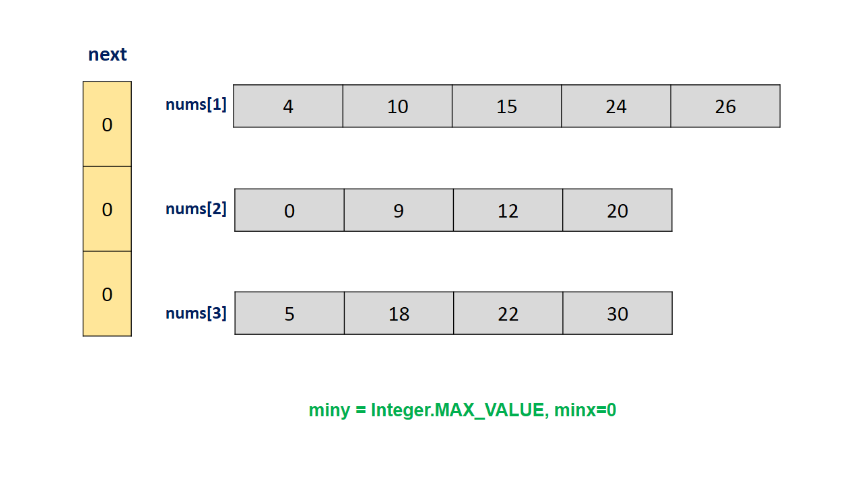
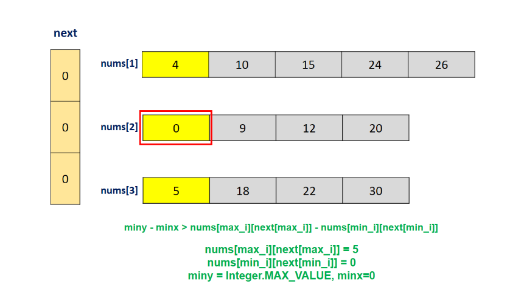
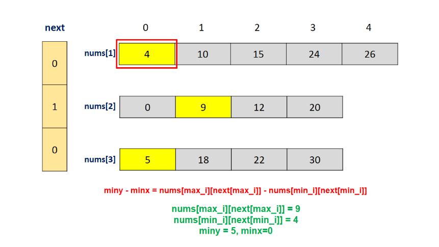
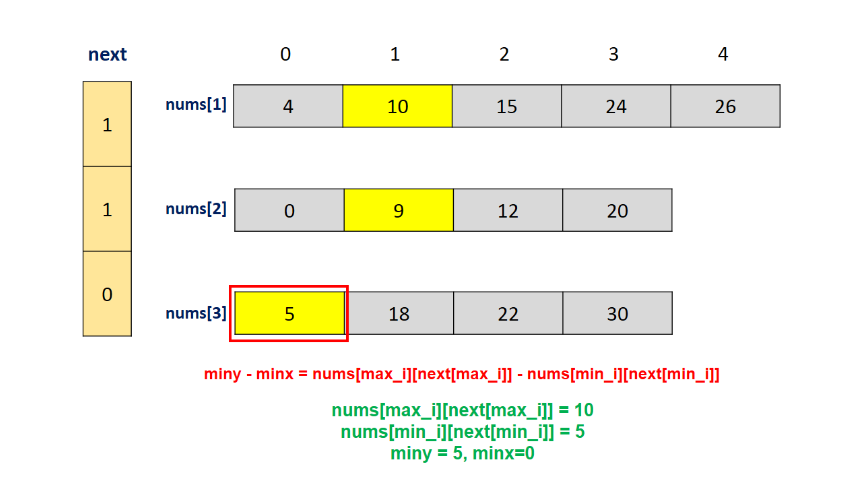
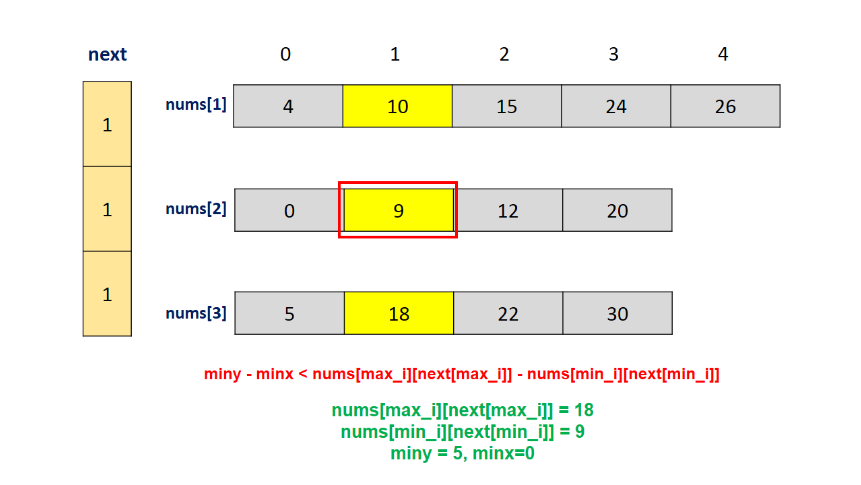
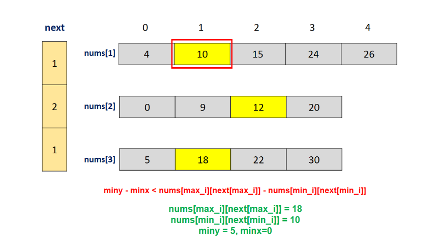
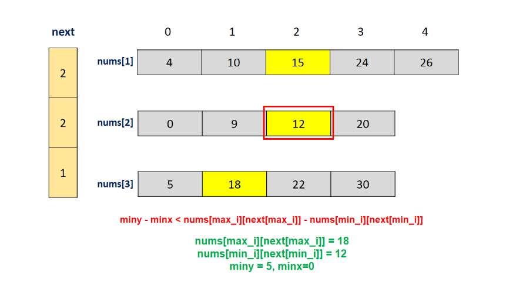
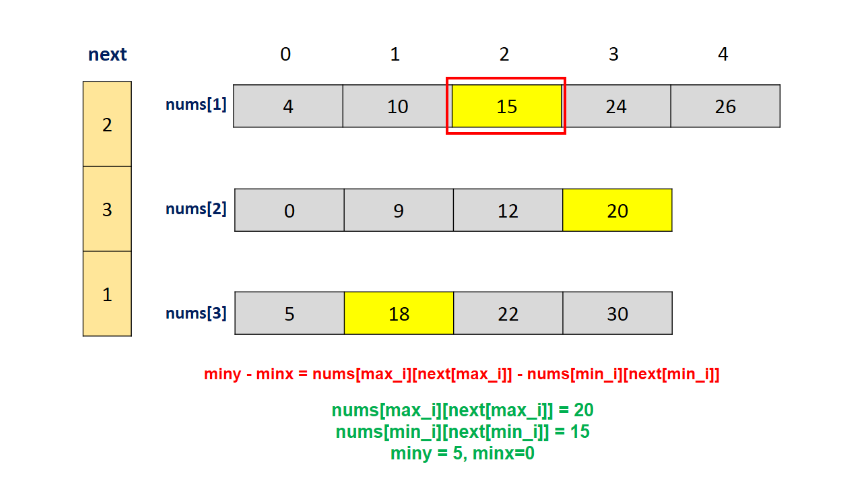
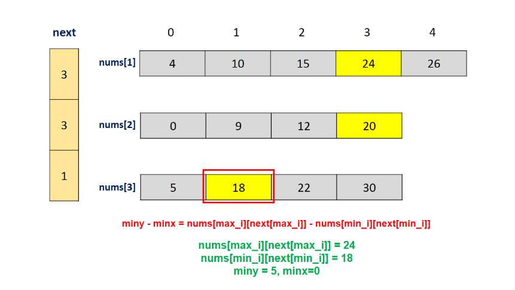
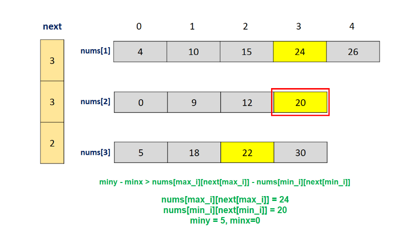
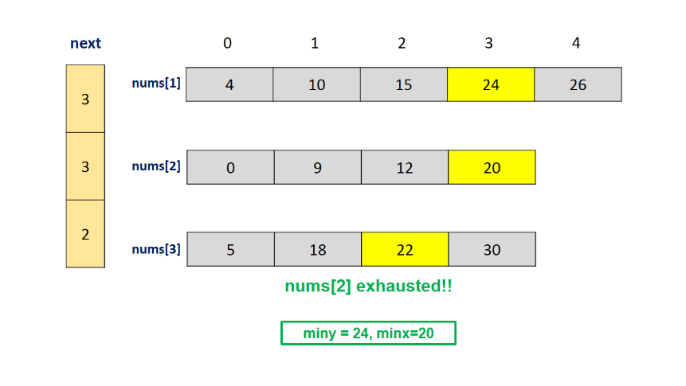

**Java**
```java
public class Solution {
    public int[] smallestRange(int[][] nums) {
        int minx = 0, miny = Integer.MAX_VALUE;
        int[] next = new int[nums.length];
        boolean flag = true;
        for (int i = 0; i < nums.length && flag; i++) {
            for (int j = 0; j < nums[i].length && flag; j++) {
                int min_i = 0, max_i = 0;
                for (int k = 0; k < nums.length; k++) {
                    if (nums[min_i][next[min_i]] > nums[k][next[k]])
                        min_i = k;
                    if (nums[max_i][next[max_i]] < nums[k][next[k]])
                        max_i = k;
                }
                if (miny - minx > nums[max_i][next[max_i]] - nums[min_i][next[min_i]]) {
                    miny = nums[max_i][next[max_i]];
                    minx = nums[min_i][next[min_i]];
                }
                next[min_i]++;
                if (next[min_i] == nums[min_i].length) {
                    flag = false;
                }
            }
        }
        return new int[] {minx, miny};
    }
}
```

**Complexity Analysis**

* Time complexity : $O(n*m)$. In the worst case, we need to traverse over $next$ array(of length $m$) for all the elements of the given lists. Here, nn refers to the total number of elements in all the lists. $m$ refers to the total number of lists.

* Space complexity : $O(m)$. $next$ array of size $m$ is used.

## Approach #4 Using Priority Queue [Accepted]:
**Algorithm**

In the last approach, at each step, we update the pointer corresponding to the current minimum element and traverse over the whole $next$ array to determine the new maximum and minimum values. We can do some optimization here, by making use of a simple observation.

Whenever we update a single entry of $next$ to consider the new maximum and minimum values(if we already know the last maximum and minimum values), all the elements to be considered for finding the maximum and minimum values remain the same except the new element being pointed by a single updated entry in $next$. This new entry is certainly larger than the last minimum value(since that was the reasoning behind the updation).

Thus, we can't be sure whether this is the new minimum element or not. But, since it is larger than the last value being considered, it could be a potential competitor for the new maximum value. Thus, we can directly compare it with the last maximum value to determine the current maximum value.

Now, we're left with finding the minimum value iteratively at every step. To avoid this iterative process, a better idea is to make use of a Min-Heap, which stores the values being pointed currently by the $next$ array. Thus, the minimum value always lies at the top of this heap, and we need not do the iterative search process.

At every step, we remove the minimum element from this heap and find out the range formed by the current maximum and minimum values, and compare it with the minimum range found so far to determine the required minimum range. We also update the increment the index in $next$ corresponding to the list containing this minimum entry and add this element to the heap as well.

The rest of the process remains the same as the last approach.

**Java**
```java
public class Solution {
    public int[] smallestRange(int[][] nums) {
        int minx = 0, miny = Integer.MAX_VALUE, max = Integer.MIN_VALUE;
        int[] next = new int[nums.length];
        boolean flag = true;
        PriorityQueue < Integer > min_queue = new PriorityQueue < Integer > ((i, j) -> nums[i][next[i]] - nums[j][next[j]]);
        for (int i = 0; i < nums.length; i++) {
            min_queue.offer(i);
            max = Math.max(max, nums[i][0]);
        }
        for (int i = 0; i < nums.length && flag; i++) {
            for (int j = 0; j < nums[i].length && flag; j++) {
                int min_i = min_queue.poll();
                if (miny - minx > max - nums[min_i][next[min_i]]) {
                    minx = nums[min_i][next[min_i]];
                    miny = max;
                }
                next[min_i]++;
                if (next[min_i] == nums[min_i].length) {
                    flag = false;
                    break;
                }
                min_queue.offer(min_i);
                max = Math.max(max, nums[min_i][next[min_i]]);
            }
        }
        return new int[] { minx, miny};
    }
}
```

**Complexity Analysis**

* Time complexity : $O\big(n*log(m)\big)$. Heapification of $m$ elements requires $O\big(log(m)\big)$ time. This step could be done for all the elements of the given lists in the worst case. Here, $n$ refers to the total number of elements in all the lists. $m$ refers to the total number of lists.

* Space complexity : $O(m)$. $next$ array of size $m$ is used. A Min-Heap with mm elements is also used.

# Submissions
---
**Solution 1: (Two Pointers, Hash Table)**

Extremely similar to 76. Minimum Window Substring, just change str to list of number.

**Explanations:** The essence of this problem is to find the smallest range that intersect with all groups. counts maps group ID to the number that group shows up. groups is the number of current groups in range res.
Then, it is the same algorithm as https://leetcode.com/problems/minimum-window-substring/discuss/571711/Python-Two-pointers-with-Explanations

**Complexity:** O(N + NlogN), N is the total number of elements in nums. O( NlogN) is for sorting v. O(N) is the two pointers part. Space O(N).

```
Runtime: 276 ms
Memory Usage: 23.7 MB
```
```python
class Solution:
    def smallestRange(self, nums: List[List[int]]) -> List[int]:
        v, seen, k = [], set(), len(nums)
        for i in range(k):
            for n in nums[i]:
                if (n, i) not in seen:
                    v.append((n, i))
                    seen.add((n, i))
        v.sort()
        slow, groups, counts = 0, 0, collections.Counter()
        res, minR = [0, 0], float('inf')
        for fast in range(len(v)):
            if counts[v[fast][1]] == 0:
                groups += 1
            counts[v[fast][1]] += 1
            while slow <= fast and groups == k:
                diff = v[fast][0] - v[slow][0]
                if diff < minR or (diff == minR and v[slow][0] < res[0]):
                    minR, res = v[fast][0] - v[slow][0], [v[slow][0], v[fast][0]]
                counts[v[slow][1]] -= 1
                if counts[v[slow][1]] == 0:
                    groups -= 1
                slow += 1
        return res
```

**Solution 2: (Heap)**
```
Runtime: 300 ms
Memory Usage: 20 MB
```
```python
class Solution:
    def smallestRange(self, nums: List[List[int]]) -> List[int]:
        pointer = [0]*len(nums)
        heap = []
        maxv = max([a[0] for a in nums])
        res = float('inf')
        for i in range(len(nums)):
            heapq.heappush(heap,(nums[i][0],i))
        while 1:
            diff = maxv - heap[0][0]
            if diff < res:
                res = diff
                r = [heap[0][0], heapq.nlargest(1,heap)[0][0]]
            p = heapq.heappop(heap)[1]
            if pointer[p] == len(nums[p])-1:
                break
            pointer[p] += 1
            maxv = max(maxv, nums[p][pointer[p]])
            heapq.heappush(heap,(nums[p][pointer[p]],p))
        return r
```

**Solution 3: (Binary Search)**
```
Runtime: 296 ms
Memory Usage: 18.4 MB
```
```python
from bisect import bisect
class Solution:
    def smallestRange(self, nums: List[List[int]]) -> List[int]:
        numlist = []
        for i,l in enumerate(nums):
            if not l:
                return []
            idx = bisect(numlist,(l[0],0))
            numlist.insert(idx,(l.pop(0),i))
        
        res = []
        res_range = float('inf')
        while nums:
            min_val = numlist[0][0]
            min_idx = numlist[0][1]
            max_val = numlist[-1][0]
            if max_val - min_val < res_range:
                res_range = max_val - min_val
                res = [min_val,max_val]
            
            numlist.pop(0)
            l = nums[min_idx]
            if not l:
                break
            idx = bisect(numlist,(l[0],0))
            numlist.insert(idx,(l.pop(0),min_idx))
            
        return res
```

**Solution 4: (Sliding Window)**

           [4,      10,     15,             24,   26]
    [0,           9,    12,           20]
              [5,               18,      22             30]
    ---------------------------------------------------------
                                     [20    24]
    ^left                                               ^right
r0: ^i         ^j
    0          5
r1:  ^i           ^j
     1            9
            ^i    ^j
            4     9
r2:          ^i     ^j
             5      10
             ^i     ^j
             5      10
r3:            ^i               ^j
               6                18
                        ^i      ^j
                        12      18
r4:                      ^i           ^j
                         13           20
                            ^i        ^j
                            15        20
r5:                          ^i              ^j
                             16              24
                                      ^i     ^j
                                      20     24
r6:                                     ^i                     ^j
    {1}    {0,1}  {0,1,2}
              {0,1,2}
              6   6 6   7   

```
Runtime: 669 ms
Memory: 379.15 MB
```
```c++
class Solution {
public:
    vector<int> smallestRange(vector<vector<int>>& nums) {
        int n = nums.size(), left = INT_MAX, right = INT_MIN, i, j;
        if (n == 1) {
            return {nums[0][0], nums[0][0]};
        }
        unordered_map<int, vector<int>> dp;
        for (i = 0; i < n; i ++) {
            for (j = 0; j < nums[i].size(); j ++) {
                left = min(left, nums[i][j]);
                right = max(right, nums[i][j]);
                dp[nums[i][j]].push_back(i);
            }
        }
        unordered_map<int,int> cur;
        vector<int> ans;
        i = left, j = left;
        for (auto ii: dp[left]) {
            cur[ii] += 1;
        }
        while (j+1 <= right) {
            while (j+1 <= right && cur.size() < n) {
                if (dp.count(j+1)) {
                    for (auto ii: dp[j+1]) {
                        cur[ii] += 1;
                    }
                }
                j += 1;
            }
            if (cur.size() < n) {
                break;
            }
            while (cur.size() == n) {
                if (dp[i].size()) {
                    if (ans.empty() || ans[1] - ans[0] > j-i) {
                        ans = {i, j};
                    }
                    for (auto ii: dp[i]) {
                        cur[ii] -= 1;
                        if (cur[ii] == 0) {
                            cur.erase(ii);
                        }
                    }
                }
                i += 1;
            }
        }
        return ans;
    }
};
```

**Solution 5: (Sliding Window)**
```
Runtime: 29 ms
Memory: 23.96 MB
```
```c++
class Solution {
public:
    vector<int> smallestRange(vector<vector<int>>& nums) {
        int n = nums.size(), i, j;
        if (n == 1) {
            return {nums[0][0], nums[0][0]};
        }
        map<int, vector<int>> dp;
        for (i = 0; i < n; i ++) {
            for (j = 0; j < nums[i].size(); j ++) {
                dp[nums[i][j]].push_back(i);
            }
        }
        unordered_map<int,int> cur;
        vector<int> ans;
        auto it_i = dp.begin(),  it_j = dp.begin();
        while (it_j != dp.end()) {
            while (it_j != dp.end() && cur.size() < n) {
                for (auto ii: it_j->second) {
                    cur[ii] += 1;
                }
                it_j++;
            }
            if (cur.size() < n) {
                break;
            }
            while (cur.size() == n) {
                if (ans.empty() || ans[1] - ans[0] > prev(it_j)->first-it_i->first) {
                    ans = {it_i->first, prev(it_j)->first};
                }
                for (auto ii: it_i->second) {
                    cur[ii] -= 1;
                    if (cur[ii] == 0) {
                        cur.erase(ii);
                    }
                }
                it_i++;
            }
        }
        return ans;
    }
};
```

**Solution 6: (Two Pointer, Sliding Window)**
```
Runtime: 41 ms
Memory: 22.45 MB
```
```c++
class Solution {
public:
    vector<int> smallestRange(vector<vector<int>>& nums) {
        vector<pair<int, int>> merged;

        // Merge all lists with their list index
        for (int i = 0; i < nums.size(); i++) {
            for (int num : nums[i]) {
                merged.push_back({num, i});
            }
        }

        // Sort the merged list
        sort(merged.begin(), merged.end());

        // Two pointers to track the smallest range
        unordered_map<int, int> freq;
        int left = 0, count = 0;
        int rangeStart = 0, rangeEnd = INT_MAX;

        for (int right = 0; right < merged.size(); right++) {
            freq[merged[right].second]++;
            if (freq[merged[right].second] == 1) count++;

            // When all lists are represented, try to shrink the window
            while (count == nums.size()) {
                int curRange = merged[right].first - merged[left].first;
                if (curRange < rangeEnd - rangeStart) {
                    rangeStart = merged[left].first;
                    rangeEnd = merged[right].first;
                }

                freq[merged[left].second]--;
                if (freq[merged[left].second] == 0) count--;
                left++;
            }
        }

        return {rangeStart, rangeEnd};
    }
};
```
