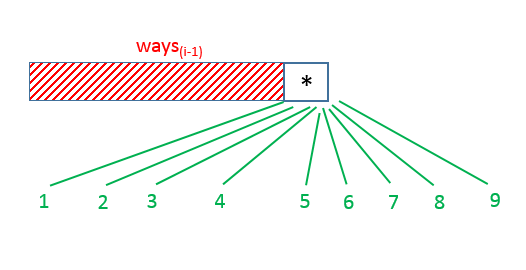
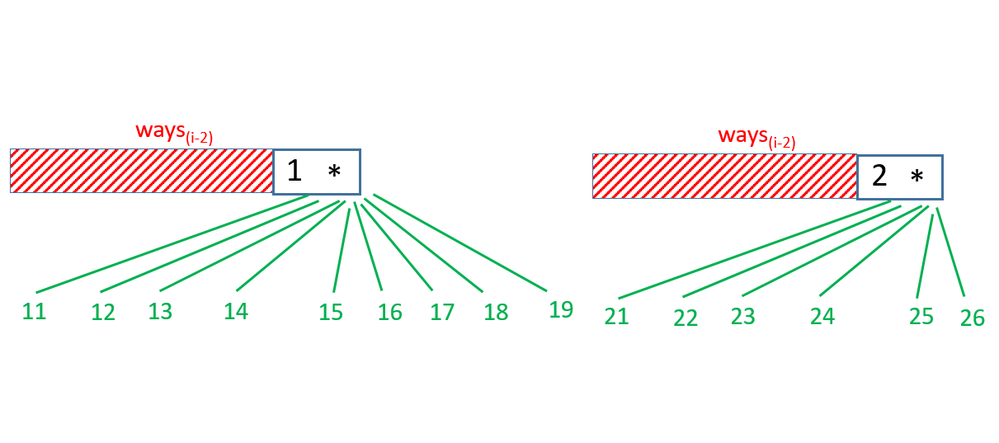
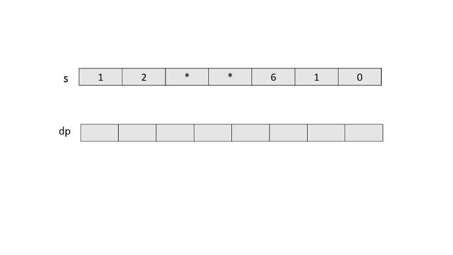
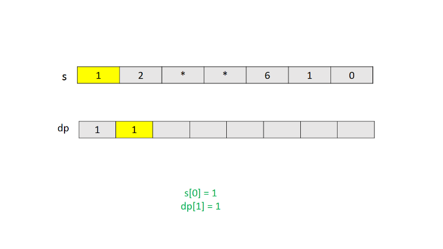
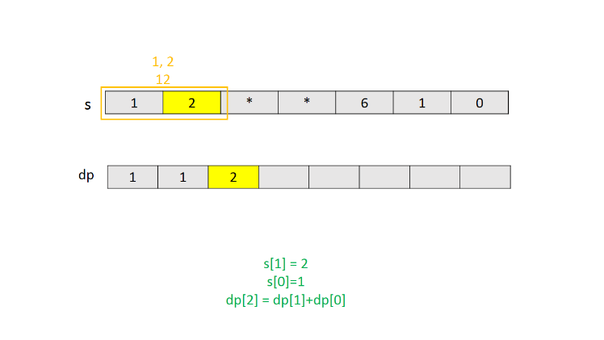
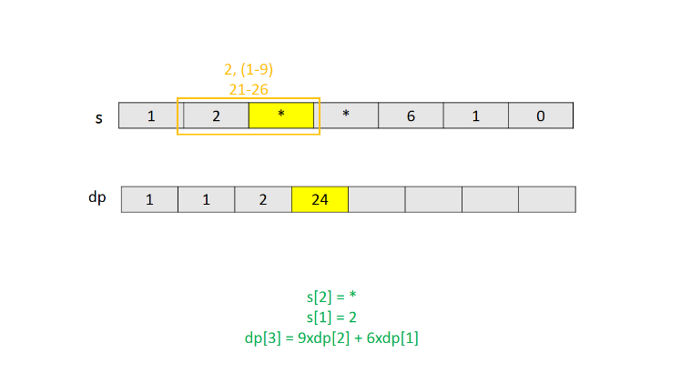
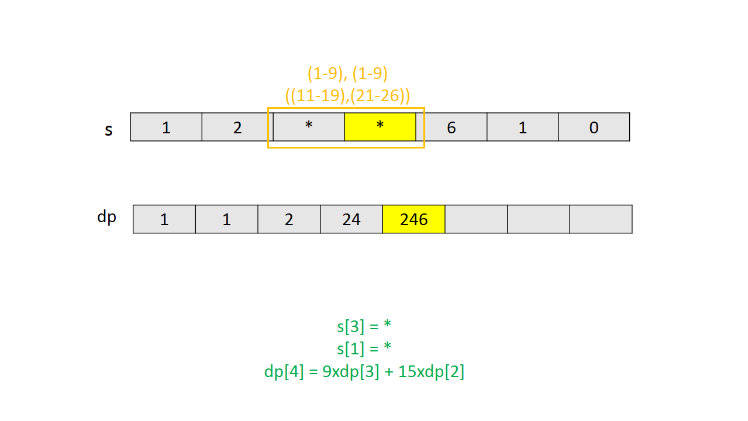
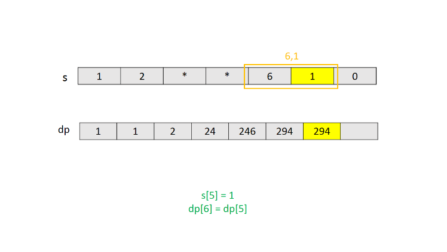
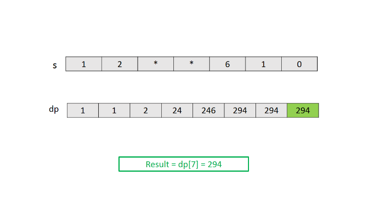

639. Decode Ways II

A message containing letters from `A-Z` is being encoded to numbers using the following mapping way:
```
'A' -> 1
'B' -> 2
...
'Z' -> 26
```
Beyond that, now the encoded string can also contain the character '*', which can be treated as one of the numbers from 1 to 9.

Given the encoded message containing digits and the character '*', return the total number of ways to decode it.

Also, since the answer may be very large, you should return the output mod 10^9 + 7.

**Example 1:**
```
Input: "*"
Output: 9
Explanation: The encoded message can be decoded to the string: "A", "B", "C", "D", "E", "F", "G", "H", "I".
```

**Example 2:**
```
Input: "1*"
Output: 9 + 9 = 18
```

**Note:**

* The length of the input string will fit in range `[1, 105]`.
* The input string will only contain the character '*' and digits '0' - '9'.

# Submissions
---
## Approach 1: Recursion with Memoization
**Algorithm**

In order to find the solution to the given problem, we need to consider every case possible(for the arrangement of the input digits/characters) and what value needs to be considered for each case. Let's look at each of the possibilites one by one.

Firstly, let's assume, we have a function `ways(s,i)` which returns the number of ways to decode the input string $s$, if only the characters upto the $i^{th}$ index in this string are considered. We start off by calling the function `ways(s, s.length()-1)` i.e. by considering the full length of this string $s$.

We started by using the last index of the string $s$. Suppose, currently, we called the function as `ways(s,i)`. Let's look at how we proceed. At every step, we need to look at the current character at the last index ($i$) and we need to determine the number of ways of decoding that using this $i^{th}$ character could add to the total value. There are the following possiblities for the $i^{th}$ character.

The $i^{th}$ character could be a `*`. In this case, firstly, we can see that this `*` could be decoded into any of the digits from `1-9`. Thus, for every decoding possible upto the index $i-1$, this `*` could be replaced by any of these digits(1-9). Thus, the total number of decodings is 9 times the number of decodings possible for the same string upto the index $i-1$. Thus, this `*` initially adds a factor of `9*ways(s,i-1)` to the total value.



Apart from this, this `*` at the $i^{th}$ index could also contribute further to the total number of ways depending upon the character/digit at its preceding index. If the preceding character happens to be a `1`, by combining this `1` with the current `*`, we could obtain any of the digits from `11-19` which could be decoded into any of the characters from `K-S`. We need to note that these decodings are in addition to the ones already obtained above by considering only a single current `*`(`1-9` decoding to `A-J`). Thus, this `1*` pair could be replaced by any of the numbers from `11-19` irrespective of the decodings done for the previous indices(before $i-1$). Thus, this `1*` pair leads to `8` times the number of decodings possible with the string ss upto the index $i-2$. Thus, this adds a factor of `9 * ways(s, i - 2)` to the total number of decodings.

Similarly, a `2*` pair obtained by a `2` at the index $i-1$ could be considered of the numbers from `21-26`(decoding into `U-Z`), adding a total of `6` times the number of decodings possible upto the index $i-2$.



On the same basis, if the character at the index $i-1$ happens to be another `*`, this `**` pairing could be considered as any of the numbers from `11-19`(9) and `21-26`(6). Thus, the total number of decodings will be `15`(9+6) times the number of decodings possible upto the index $i-2$.

Now, if the $i^{th}$ character could be a digit from `1-9` as well. In this case, the number of decodings that considering this single digit can contribute to the total number is equal to the number of decodings that can be contributed by the digits upto the index $i-1$. But, if the $i^{th}$ character is a `0`, this `0` alone can't contribute anything to the total number of decodings(but it can only contribute if the digit preceding it is a `1` or `2`. We'll consider this case below).

Apart from the value obtained(just above) for the digit at the $i^{th}$ index being anyone from `0-9`, this digit could also pair with the digit at the preceding index, contributing a value dependent on the previous digit. If the previous digit happens to be a `1`, this `1` can combine with any of the current digits forming a valid number in the range `10-19`. Thus, in this case, we can consider a pair formed by the current and the preceding digit, and, the number of decodings possible by considering the decoded character to be a one formed using this pair, is equal to the total number of decodings possible by using the digits upto the index $i-2$ only.

But, if the previous digit is a `2`, a valid number for decoding could only be a one from the range `20-26`. Thus, if the current digit is lesser than `7`, again this pairing could add decodings with count equal to the ones possible by using the digits upto the $(i-2)^{th}$ index only.

Further, if the previous digit happens to be a `*`, the additional number of decodings depend on the current digit again i.e. If the current digit is greater than `6`, this `*` could lead to pairings only in the range `17-19`(`*` can't be replaced by `2` leading to `27-29`). Thus, additional decodings with count equal to the decodings possible upto the index $i-2$.

On the other hand, if the current digit is lesser than `7`, this `*` could be replaced by either a `1` or a `2` leading to the decodings `10-16` and `20-26` respectively. Thus, the total number of decodings possible by considering this pair is equal to twice the number of decodings possible upto the index $i-2$ (since `*` can now be replaced by two values).

This way, by considering every possible case, we can obtain the required number of decodings by making use of the recursive function ways as and where necessary.

By making use of memoization, we can reduce the time complexity owing to duplicate function calls.

```java
public class Solution {
    int M = 1000000007;
    public int numDecodings(String s) {
        Integer[] memo=new Integer[s.length()];
        return ways(s, s.length() - 1,memo);
    }
    public int ways(String s, int i,Integer[] memo) {
        if (i < 0)
            return 1;
        if(memo[i]!=null)
            return memo[i];
        if (s.charAt(i) == '*') {
            long res = 9 * ways(s, i - 1,memo);
            if (i > 0 && s.charAt(i - 1) == '1')
                res = (res + 9 * ways(s, i - 2,memo)) % M;
            else if (i > 0 && s.charAt(i - 1) == '2')
                res = (res + 6 * ways(s, i - 2,memo)) % M;
            else if (i > 0 && s.charAt(i - 1) == '*')
                res = (res + 15 * ways(s, i - 2,memo)) % M;
            memo[i]=(int)res;
            return memo[i];
        }
        long res = s.charAt(i) != '0' ? ways(s, i - 1,memo) : 0;
        if (i > 0 && s.charAt(i - 1) == '1')
            res = (res + ways(s, i - 2,memo)) % M;
        else if (i > 0 && s.charAt(i - 1) == '2' && s.charAt(i) <= '6')
            res = (res + ways(s, i - 2,memo)) % M;
        else if (i > 0 && s.charAt(i - 1) == '*')
                res = (res + (s.charAt(i)<='6'?2:1) * ways(s, i - 2,memo)) % M;
        memo[i]= (int)res;
        return memo[i];
    }
}
```

**Complexity Analysis**

* Time complexity : $O(n)$. Size of recursion tree can go upto nn, since $memo$ array is filled exactly once. Here, $n$ refers to the length of the input string.

* Space complexity : $O(n)$. The depth of recursion tree can go upto $n$.

## Approach 2: Dynamic Programming
**Algorithm**

From the solutions discussed above, we can observe that the number of decodings possible upto any index, $i$, is dependent only on the characters upto the index $i$ and not on any of the characters following it. This leads us to the idea that this problem can be solved by making use of Dynamic Programming.

We can also easily observe from the recursive solution that, the number of decodings possible upto the index $i$ can be determined easily if we know the number of decodings possible upto the index $i-1$ and $i-2$. Thus, we fill in the $dp$ array in a forward manner. $dp[i]$ is used to store the number of decodings possible by considering the characters in the given string ss upto the $(i-1)^{th}$ index only(including it).

The equations for filling this $dp$ at any step again depend on the current character and the just preceding character. These equations are similar to the ones used in the recursive solution.

The following animation illustrates the process of filling the $dp$ for a simple example.












```java
public class Solution {
    int M = 1000000007;
    public int numDecodings(String s) {
        long[] dp = new long[s.length() + 1];
        dp[0] = 1;
        dp[1] = s.charAt(0) == '*' ? 9 : s.charAt(0) == '0' ? 0 : 1;
        for (int i = 1; i < s.length(); i++) {
            if (s.charAt(i) == '*') {
                dp[i + 1] = 9 * dp[i];
                if (s.charAt(i - 1) == '1')
                    dp[i + 1] = (dp[i + 1] + 9 * dp[i - 1]) % M;
                else if (s.charAt(i - 1) == '2')
                    dp[i + 1] = (dp[i + 1] + 6 * dp[i - 1]) % M;
                else if (s.charAt(i - 1) == '*')
                    dp[i + 1] = (dp[i + 1] + 15 * dp[i - 1]) % M;
            } else {
                dp[i + 1] = s.charAt(i) != '0' ? dp[i] : 0;
                if (s.charAt(i - 1) == '1')
                    dp[i + 1] = (dp[i + 1] + dp[i - 1]) % M;
                else if (s.charAt(i - 1) == '2' && s.charAt(i) <= '6')
                    dp[i + 1] = (dp[i + 1] + dp[i - 1]) % M;
                else if (s.charAt(i - 1) == '*')
                    dp[i + 1] = (dp[i + 1] + (s.charAt(i) <= '6' ? 2 : 1) * dp[i - 1]) % M;
            }
        }
        return (int) dp[s.length()];
    }
}
```

**Complexity Analysis**

* Time complexity : $O(n)$. $dp$ array of size $n+1$ is filled once only. Here, $n$ refers to the length of the input string.

* Space complexity : $O(n)$. $dp$ array of size $n+1$ is used.

## Approach 3: Constant Space Dynamic Programming
**Algorithm**

In the last approach, we can observe that only the last two values $dp[i-2]$ and $dp[i-1]$ are used to fill the entry at $dp[i-1]$. We can save some space in the last approach, if instead of maintaining a whole $dp$ array of length $n$, we keep a track of only the required last two values. The rest of the process remains the same as in the last approach.

```java
public class Solution {
    int M = 1000000007;
    public int numDecodings(String s) {
        long first = 1, second = s.charAt(0) == '*' ? 9 : s.charAt(0) == '0' ? 0 : 1;
        for (int i = 1; i < s.length(); i++) {
            long temp = second;
            if (s.charAt(i) == '*') {
                second = 9 * second;
                if (s.charAt(i - 1) == '1')
                    second = (second + 9 * first) % M;
                else if (s.charAt(i - 1) == '2')
                    second = (second + 6 * first) % M;
                else if (s.charAt(i - 1) == '*')
                    second = (second + 15 * first) % M;
            } else {
                second = s.charAt(i) != '0' ? second : 0;
                if (s.charAt(i - 1) == '1')
                    second = (second + first) % M;
                else if (s.charAt(i - 1) == '2' && s.charAt(i) <= '6')
                    second = (second + first) % M;
                else if (s.charAt(i - 1) == '*')
                    second = (second + (s.charAt(i) <= '6' ? 2 : 1) * first) % M;
            }
            first = temp;
        }
        return (int) second;
    }
}
```

**Complexity Analysis**

* Time complexity : $O(n)$. Single loop upto $n$ is required to find the required result. Here, $n$ refers to the length of the input string $s$.

* Space complexity : $O(1)$. Constant space is used.

# Submissions
---
**Solution 1: (Dynamic Programming)**
```
Runtime: 460 ms
Memory Usage: 16.3 MB
```
```python
class Solution:
    def numDecodings(self, s: str) -> int:
        M = 10**9 + 7  
        dp = [None] * (len(s) + 1)
        dp[0] = 1
        dp[1] = 9 if s[0] == '*' else 0 if s[0] == '0' else 1;
        for i in range(1, len(s)):
            if s[i] == '*':
                dp[i + 1] = 9 * dp[i]
                if s[i - 1] == '1':
                    dp[i + 1] = (dp[i + 1] + 9 * dp[i - 1]) % M
                elif s[i - 1] == '2':
                    dp[i + 1] = (dp[i + 1] + 6 * dp[i - 1]) % M
                elif s[i - 1] == '*':
                    dp[i + 1] = (dp[i + 1] + 15 * dp[i - 1]) % M
            else:
                dp[i + 1] = dp[i] if s[i] != '0' else 0
                if s[i - 1] == '1':
                    dp[i + 1] = (dp[i + 1] + dp[i - 1]) % M
                elif s[i - 1] == '2' and s[i] <= '6':
                    dp[i + 1] = (dp[i + 1] + dp[i - 1]) % M
                elif s[i - 1] == '*':
                    dp[i + 1] = (dp[i + 1] + (2 if s[i] <= '6' else 1) * dp[i - 1]) % M
                       
        return dp[len(s)]
```

**Solution 2: (Constant Space Dynamic Programming)**
```
Runtime: 408 ms
Memory Usage: 14.7 MB
```
```python
class Solution:
    def numDecodings(self, s: str) -> int:
        M = 10**9 + 7  
        first, second = 1, 9 if s[0] == '*' else 0 if s[0] == '0' else 1
        for i in range(1, len(s)):
            temp = second
            if s[i] == '*':
                second = 9 * second
                if s[i - 1] == '1':
                    second = (second + 9 * first) % M
                elif s[i - 1] == '2':
                    second = (second + 6 * first) % M
                elif s[i - 1] == '*':
                    second = (second + 15 * first) % M
            else:
                second = second if s[i] != '0' else 0
                if s[i - 1] == '1':
                    second = (second + first) % M
                elif s[i - 1] == '2' and s[i] <= '6':
                    second = (second + first) % M
                elif s[i - 1] == '*':
                    second = (second + (2 if s[i] <= '6' else 1) * first) % M
            first = temp
            
        return second
```