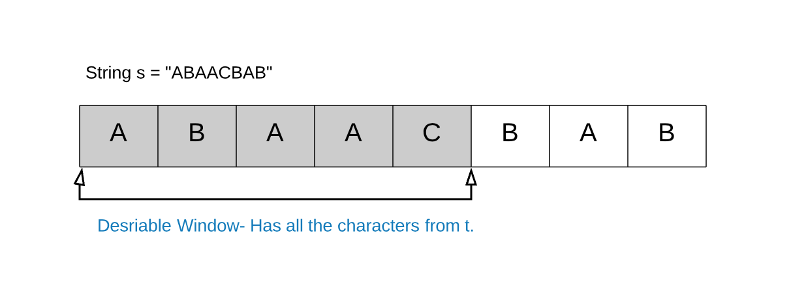
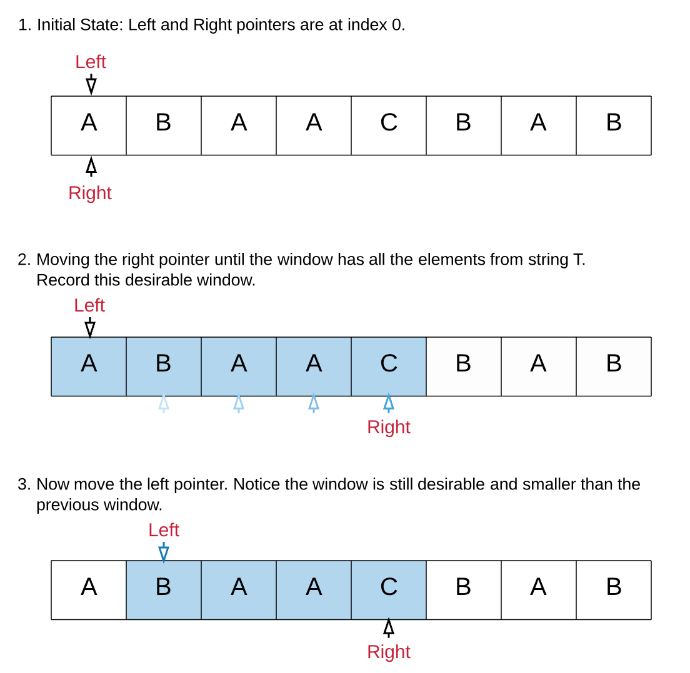
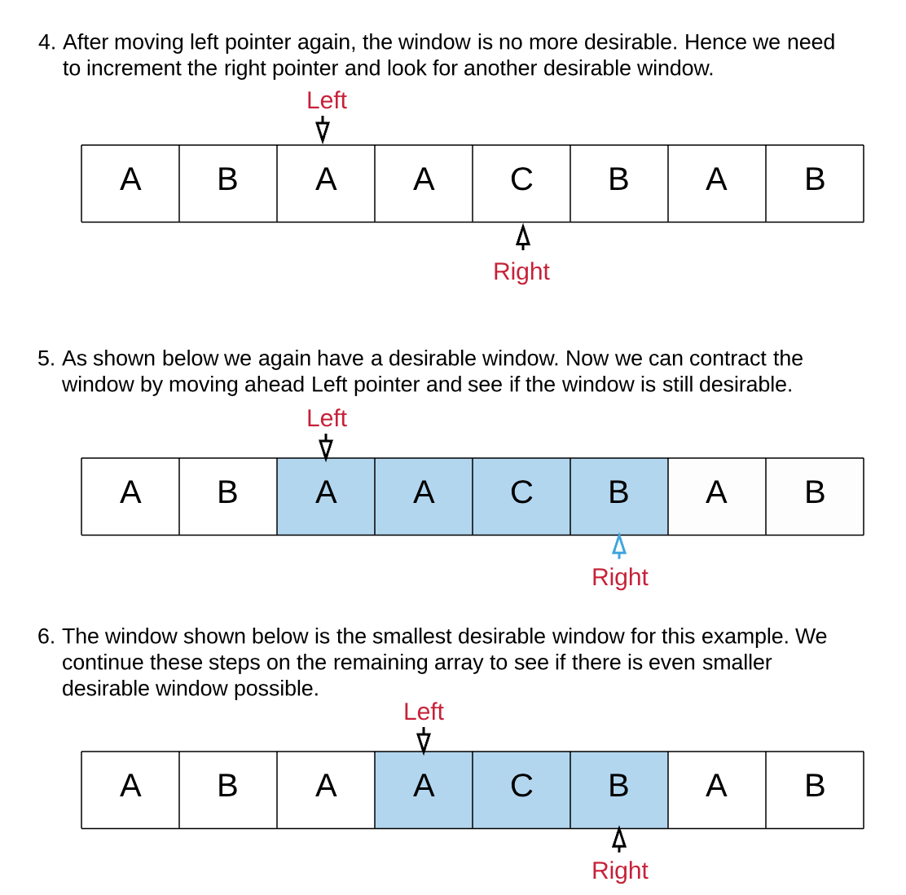

76. Minimum Window Substring

Given a string `S` and a string `T`, find the minimum window in `S` which will contain all the characters in `T` in complexity O(n).

**Example:**
```
Input: S = "ADOBECODEBANC", T = "ABC"
Output: "BANC"
```

**Note:**

* If there is no such window in `S` that covers all characters in `T`, return the empty string `""`.
* If there is such window, you are guaranteed that there will always be only one unique minimum window in `S`.

# Solution
---
## Approach 1: Sliding Window
**Intuition**

The question asks us to return the minimum window from the string $S$ which has all the characters of the string $T$. Let us call a window desirable if it has all the characters from $T$.

We can use a simple sliding window approach to solve this problem.

In any sliding window based problem we have two pointers. One $right$ pointer whose job is to expand the current window and then we have the $left$ pointer whose job is to contract a given window. At any point in time only one of these pointers move and the other one remains fixed.

The solution is pretty intuitive. We keep expanding the window by moving the right pointer. When the window has all the desired characters, we contract (if possible) and save the smallest window till now.

The answer is the smallest desirable window.

For eg. `S = "ABAACBAB" T = "ABC"`. Then our answer window is "ACB" and shown below is one of the possible desirable windows.



**Algorithm**

1. We start with two pointers, $left$ and $right$ initially pointing to the first element of the string $S$.

1. We use the $right$ pointer to expand the window until we get a desirable window i.e. a window that contains all of the characters of $T$.

1. Once we have a window with all the characters, we can move the `left` pointer ahead one by one. If the window is still a desirable one we keep on updating the minimum window size.

1. If the window is not desirable any more, we repeat $step \; 2$ onwards.



The above steps are repeated until we have looked at all the windows. The smallest window is returned.



```python
def minWindow(self, s, t):
    """
    :type s: str
    :type t: str
    :rtype: str
    """

    if not t or not s:
        return ""

    # Dictionary which keeps a count of all the unique characters in t.
    dict_t = Counter(t)

    # Number of unique characters in t, which need to be present in the desired window.
    required = len(dict_t)

    # left and right pointer
    l, r = 0, 0

    # formed is used to keep track of how many unique characters in t are present in the current window in its desired frequency.
    # e.g. if t is "AABC" then the window must have two A's, one B and one C. Thus formed would be = 3 when all these conditions are met.
    formed = 0

    # Dictionary which keeps a count of all the unique characters in the current window.
    window_counts = {}

    # ans tuple of the form (window length, left, right)
    ans = float("inf"), None, None

    while r < len(s):

        # Add one character from the right to the window
        character = s[r]
        window_counts[character] = window_counts.get(character, 0) + 1

        # If the frequency of the current character added equals to the desired count in t then increment the formed count by 1.
        if character in dict_t and window_counts[character] == dict_t[character]:
            formed += 1

        # Try and contract the window till the point where it ceases to be 'desirable'.
        while l <= r and formed == required:
            character = s[l]

            # Save the smallest window until now.
            if r - l + 1 < ans[0]:
                ans = (r - l + 1, l, r)

            # The character at the position pointed by the `left` pointer is no longer a part of the window.
            window_counts[character] -= 1
            if character in dict_t and window_counts[character] < dict_t[character]:
                formed -= 1

            # Move the left pointer ahead, this would help to look for a new window.
            l += 1    

        # Keep expanding the window once we are done contracting.
        r += 1    
    return "" if ans[0] == float("inf") else s[ans[1] : ans[2] + 1]
```

**Complexity Analysis**

* Time Complexity: $O(|S| + |T|)$ where |S| and |T| represent the lengths of strings $S$ and $T$. In the worst case we might end up visiting every element of string $S$ twice, once by left pointer and once by right pointer. $|T|$ represents the length of string $T$.

* Space Complexity: $O(|S| + |T|)$. $|S|$ when the window size is equal to the entire string $S$. $|T|$ when $T$ has all unique characters.

## Approach 2: Optimized Sliding Window
**Intuition**

A small improvement to the above approach can reduce the time complexity of the algorithm to $O(2*|filtered\_S| + |S| + |T|)$, where $filtered\_S$ is the string formed from S by removing all the elements not present in $T$.

This complexity reduction is evident when $|filtered\_S| <<< |S|$.

This kind of scenario might happen when length of string $T$ is way too small than the length of string $S$ and string $S$ consists of numerous characters which are not present in $T$.

**Algorithm**

We create a list called $filtered\_S$ which has all the characters from string $S$ along with their indices in $S$, but these characters should be present in $T$.
```
  S = "ABCDDDDDDEEAFFBC" T = "ABC"
  filtered_S = [(0, 'A'), (1, 'B'), (2, 'C'), (11, 'A'), (14, 'B'), (15, 'C')]
  Here (0, 'A') means in string S character A is at index 0.
```
We can now follow our sliding window approach on the smaller string $filtered\_S$.

```python
def minWindow(self, s, t):
    """
    :type s: str
    :type t: str
    :rtype: str
    """
    if not t or not s:
        return ""

    dict_t = Counter(t)

    required = len(dict_t)

    # Filter all the characters from s into a new list along with their index.
    # The filtering criteria is that the character should be present in t.
    filtered_s = []
    for i, char in enumerate(s):
        if char in dict_t:
            filtered_s.append((i, char))

    l, r = 0, 0
    formed = 0
    window_counts = {}

    ans = float("inf"), None, None

    # Look for the characters only in the filtered list instead of entire s. This helps to reduce our search.
    # Hence, we follow the sliding window approach on as small list.
    while r < len(filtered_s):
        character = filtered_s[r][1]
        window_counts[character] = window_counts.get(character, 0) + 1

        if window_counts[character] == dict_t[character]:
            formed += 1

        # If the current window has all the characters in desired frequencies i.e. t is present in the window
        while l <= r and formed == required:
            character = filtered_s[l][1]

            # Save the smallest window until now.
            end = filtered_s[r][0]
            start = filtered_s[l][0]
            if end - start + 1 < ans[0]:
                ans = (end - start + 1, start, end)

            window_counts[character] -= 1
            if window_counts[character] < dict_t[character]:
                formed -= 1
            l += 1    

        r += 1    
    return "" if ans[0] == float("inf") else s[ans[1] : ans[2] + 1]
```

**Complexity Analysis**

* Time Complexity : $O(|S| + |T|)$ where |S| and |T| represent the lengths of strings $S$ and $T$. The complexity is same as the previous approach. But in certain cases where $|filtered\_S|$ <<< $|S|$, the complexity would reduce because the number of iterations would be $2*|filtered\_S| + |S| + |T|$.
* Space Complexity : $O(|S| + |T|)$.

# Submissions
---
**Solution 1: (Sliding Window)**
```
Runtime: 148 ms
Memory Usage: 14.6 MB
```
```python
class Solution:
    def minWindow(self, s: str, t: str) -> str:
        if not t or not s:
            return ""

        # Dictionary which keeps a count of all the unique characters in t.
        dict_t = collections.Counter(t)

        # Number of unique characters in t, which need to be present in the desired window.
        required = len(dict_t)

        # left and right pointer
        l, r = 0, 0

        # formed is used to keep track of how many unique characters in t are present in the current window in its desired frequency.
        # e.g. if t is "AABC" then the window must have two A's, one B and one C. Thus formed would be = 3 when all these conditions are met.
        formed = 0

        # Dictionary which keeps a count of all the unique characters in the current window.
        window_counts = {}

        # ans tuple of the form (window length, left, right)
        ans = float("inf"), None, None

        while r < len(s):

            # Add one character from the right to the window
            character = s[r]
            window_counts[character] = window_counts.get(character, 0) + 1

            # If the frequency of the current character added equals to the desired count in t then increment the formed count by 1.
            if character in dict_t and window_counts[character] == dict_t[character]:
                formed += 1

            # Try and contract the window till the point where it ceases to be 'desirable'.
            while l <= r and formed == required:
                character = s[l]

                # Save the smallest window until now.
                if r - l + 1 < ans[0]:
                    ans = (r - l + 1, l, r)

                # The character at the position pointed by the `left` pointer is no longer a part of the window.
                window_counts[character] -= 1
                if character in dict_t and window_counts[character] < dict_t[character]:
                    formed -= 1

                # Move the left pointer ahead, this would help to look for a new window.
                l += 1    

            # Keep expanding the window once we are done contracting.
            r += 1    
        return "" if ans[0] == float("inf") else s[ans[1] : ans[2] + 1]
```

**Solution 2: (Sliding Window)**
```
Runtime: 6 ms
Memory Usage: 6.7 MB
```
```c
#define LEN  128

char * minWindow(char * s, char * t){
    int counter[LEN] = {0};
    int start=0, end=0, tLen=strlen(t), sLen=strlen(s);
    int minStart=0, minLen=INT_MAX;
    for(int i = 0; i < LEN; i++) counter[i] = -sLen; //distinguish the letter in and not in t;
    for(int i = 0; t[i]; i++) counter[t[i]] = 0;
    for(int i = 0; t[i]; i++) counter[t[i]]++;
    while(end < sLen)
    {
        if(counter[s[end]]-- > 0) tLen--;
        end++; //move to the next character;
        while(tLen == 0) //a valid substring;
        {
            if(end-start < minLen) //collect the minimal only;
                minStart=start, minLen=end-start;
            counter[s[start]]++;
            if(counter[s[start]] > 0) tLen++; //if s[start] is in t;
            start++; //move forward by ignoring s[start];
        }
    }
    if(minLen != INT_MAX)
    {
        char* t = (char*)malloc(sizeof(char)*(minLen+1));
        *t = '\0';
        strncat(t, s+minStart, minLen);
        return t;
    }
    return "";
}
```
