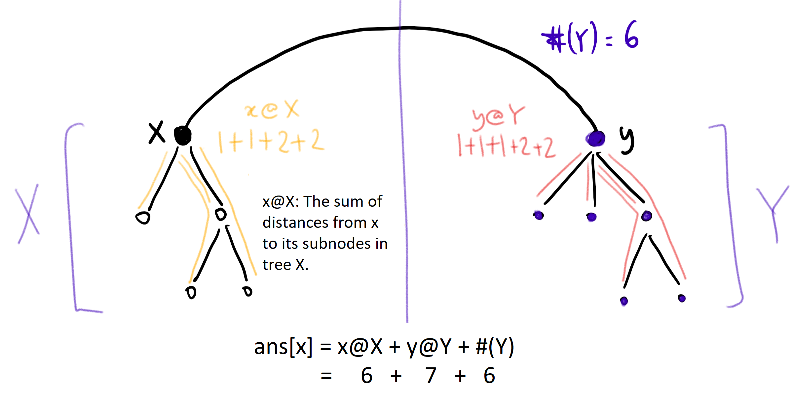
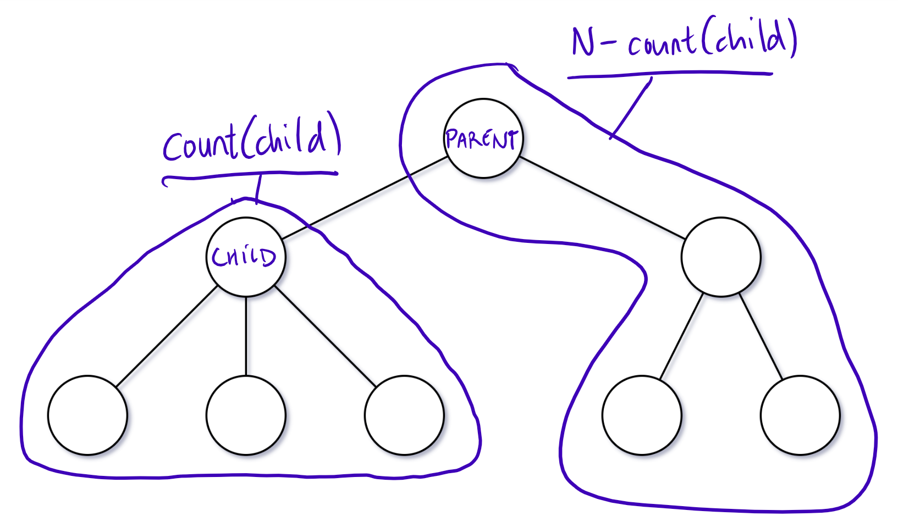

834. Sum of Distances in Tree

An undirected, connected tree with `N` nodes labelled `0...N-1` and `N-1` edges are given.

The `i`th edge connects nodes `edges[i][0]` and `edges[i][1]` together.

Return a list `ans`, where `ans[i]` is the sum of the distances between node `i` and all other nodes.

**Example 1:**
```
Input: N = 6, edges = [[0,1],[0,2],[2,3],[2,4],[2,5]]
Output: [8,12,6,10,10,10]
Explanation: 
Here is a diagram of the given tree:
  0
 / \
1   2
   /|\
  3 4 5
We can see that dist(0,1) + dist(0,2) + dist(0,3) + dist(0,4) + dist(0,5)
equals 1 + 1 + 2 + 2 + 2 = 8.  Hence, answer[0] = 8, and so on.
```

* Note: `1 <= N <= 10000`

# Solution
---
## Approach #1: Subtree Sum and Count [Accepted]
**Intuition**

Let `ans` be the returned answer, so that in particular `ans[x]` be the answer for node `x`.

Naively, finding each `ans[x]` would take $O(N)$ time (where $N$ is the number of nodes in the graph), which is too slow. This is the motivation to find out how `ans[x]` and `ans[y]` are related, so that we cut down on repeated work.

Let's investigate the answers of neighboring nodes $x$ and $y$. In particular, say $xy$ is an edge of the graph, that if cut would form two trees $X$ (containing $x$) and $Y$ (containing $y$).



Then, as illustrated in the diagram, the answer for $x$ in the entire tree, is the answer of $x$ on $X$ `"x@X"`, plus the answer of $y$ on $Y$ `"y@Y"`, plus the number of nodes in $Y$ `"#(Y)"`. The last part `"#(Y)"` is specifically because for any node `z` in `Y`, `dist(x, z) = dist(y, z) + 1`.

By similar reasoning, the answer for $y$ in the entire tree is `ans[y] = x@X + y@Y + #(X)`. Hence, for neighboring nodes $x$ and $y$, `ans[x] - ans[y] = #(Y) - #(X)`.

**Algorithm**

Root the tree. For each node, consider the subtree $S_{\text{node}}$ of that node plus all descendants. Let `count[node]` be the number of nodes in $S_{\text{node}}$, and `stsum[node]` ("subtree sum") be the sum of the distances from node to the nodes in $S_{\text{node}}$.

We can calculate `count` and `stsum` using a post-order traversal, where on exiting some node, the `count` and `stsum` of all descendants of this node is correct, and we now calculate `count[node] += count[child]` and `stsum[node] += stsum[child] + count[child]`.

This will give us the right answer for the root: `ans[root] = stsum[root]`.

Now, to use the insight explained previously: if we have a node `parent` and it's child `child`, then these are neighboring nodes, and so `ans[child] = ans[parent] - count[child] + (N - count[child])`. This is because there are `count[child]` nodes that are `1` easier to get to from `child` than `parent`, and `N-count[child]` nodes that are `1` harder to get to from `child` than `parent`.



Using a second, pre-order traversal, we can update our answer in linear time for all of our nodes.

```python
class Solution(object):
    def sumOfDistancesInTree(self, N, edges):
        graph = collections.defaultdict(set)
        for u, v in edges:
            graph[u].add(v)
            graph[v].add(u)

        count = [1] * N
        ans = [0] * N
        def dfs(node = 0, parent = None):
            for child in graph[node]:
                if child != parent:
                    dfs(child, node)
                    count[node] += count[child]
                    ans[node] += ans[child] + count[child]

        def dfs2(node = 0, parent = None):
            for child in graph[node]:
                if child != parent:
                    ans[child] = ans[node] - count[child] + N - count[child]
                    dfs2(child, node)

        dfs()
        dfs2()
        return ans
```

**Complexity Analysis**

* Time Complexity: $O(N)$, where $N$ is the number of nodes in the graph.

* Space Complexity: $O(N)$.

# Submissions
---
**Solution: (Subtree Sum and Count)**
```
Runtime: 444 ms
Memory Usage: 27.9 MB
```
```python
class Solution:
    def sumOfDistancesInTree(self, N: int, edges: List[List[int]]) -> List[int]:
        graph = collections.defaultdict(set)
        for u, v in edges:
            graph[u].add(v)
            graph[v].add(u)

        count = [1] * N
        ans = [0] * N
        def dfs(node = 0, parent = None):
            for child in graph[node]:
                if child != parent:
                    dfs(child, node)
                    count[node] += count[child]
                    ans[node] += ans[child] + count[child]

        def dfs2(node = 0, parent = None):
            for child in graph[node]:
                if child != parent:
                    ans[child] = ans[node] - count[child] + N - count[child]
                    dfs2(child, node)

        dfs()
        dfs2()
        return ans
```