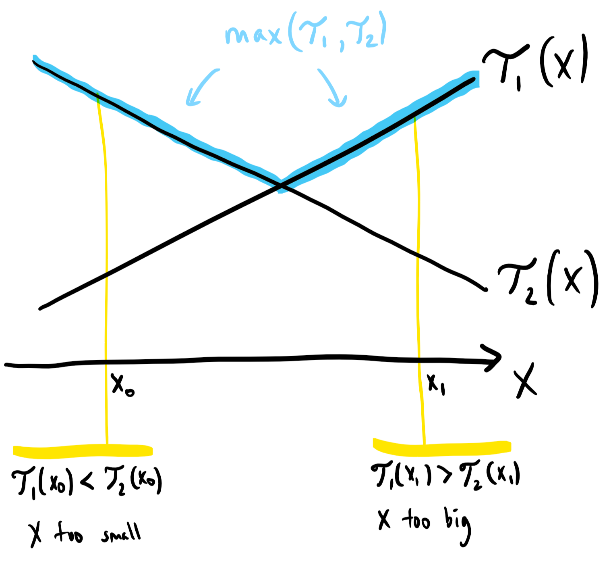
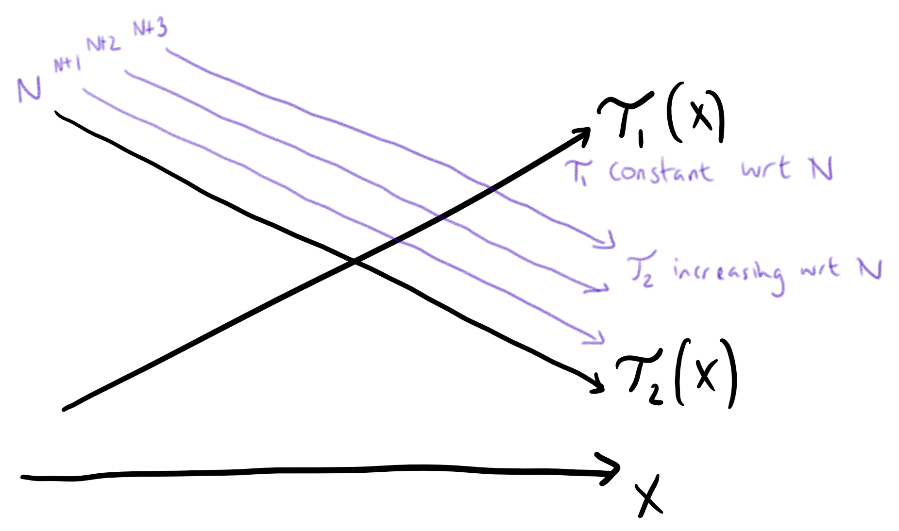
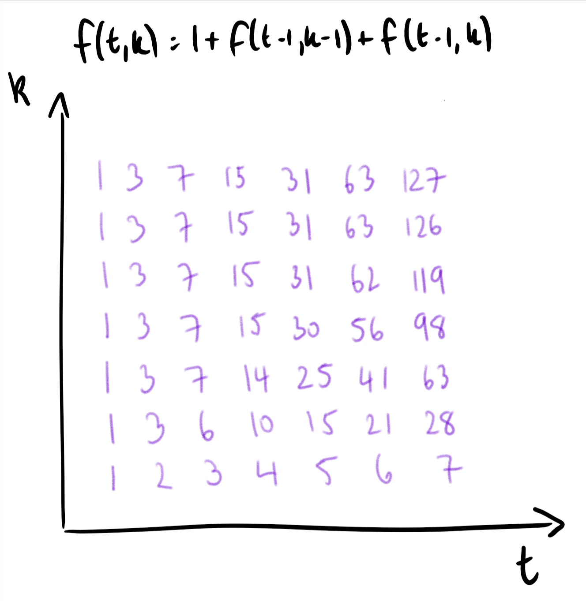

887. Super Egg Drop

You are given `K` eggs, and you have access to a building with `N` floors from `1` to `N`. 

Each egg is identical in function, and if an egg breaks, you cannot drop it again.

You know that there exists a floor `F` with `0 <= F <= N` such that any egg dropped at a floor higher than `F` will break, and any egg dropped at or below floor `F` will not break.

Each move, you may take an egg (if you have an unbroken one) and drop it from any floor `X` (with `1 <= X <= N`). 

Your goal is to know **with certainty** what the value of `F` is.

What is the minimum number of moves that you need to know with certainty what `F` is, regardless of the initial value of `F`?

 

**Example 1:**
```
Input: K = 1, N = 2
Output: 2
Explanation: 
Drop the egg from floor 1.  If it breaks, we know with certainty that F = 0.
Otherwise, drop the egg from floor 2.  If it breaks, we know with certainty that F = 1.
If it didn't break, then we know with certainty F = 2.
Hence, we needed 2 moves in the worst case to know what F is with certainty.
```

**Example 2:**
```
Input: K = 2, N = 6
Output: 3
```

**Example 3:**
```
Input: K = 3, N = 14
Output: 4
```

**Note:**

* `1 <= K <= 100`
* `1 <= N <= 10000`

# Solution
---
## Approach 1: Dynamic Programming with Binary Search
**Intuition**

It's natural to attempt dynamic programming, as we encounter similar subproblems. Our state is `(K, N)`: `K` eggs and `N` floors left. When we drop an egg from floor `X`, it either survives and we have state `(K, N-X)`, or it breaks and we have state `(K-1, X-1)`.

This approach would lead to a $O(K N^2)$ algorithm, but this is not efficient enough for the given constraints. However, we can try to speed it up. Let `dp(K, N)` be the maximum number of moves needed to solve the problem in state `(K, N)`. Then, by our reasoning above, we have:

$\text{dp}(K, N) = \min\limits_{1 \leq X \leq N} \Big( \max(\text{dp}(K-1, X-1), \text{dp}(K, N-X)) \Big)$

Now for the key insight: Because $\text{dp}(K, N)$ is a function that is increasing on $N$, the first term $\mathcal{T_1} = \text{dp}(K-1, X-1)$ in our $\max$ expression is an increasing function on $X$, and the second term $\mathcal{T_2} = \text{dp}(K, N-X)$ is a decreasing function on $X$. This means that we do not need to check every $X$ to find the minimum -- instead, we can binary search for the best $X$.

**Algorithm**



Continuing our discussion, if $\mathcal{T_1} < \mathcal{T_2}$, then the $X$ value chosen is too small; and if $\mathcal{T_1} > \mathcal{T_2}$, then $X$ is too big. However, this argument is not quite correct: when there are only two possible values of $X$, we need to check both.

Using the above fact, we can use a binary search to find the correct value of $X$ more efficiently than checking all $N$ of them.

```python
class Solution(object):
    def superEggDrop(self, K, N):
        memo = {}
        def dp(k, n):
            if (k, n) not in memo:
                if n == 0:
                    ans = 0
                elif k == 1:
                    ans = n
                else:
                    lo, hi = 1, n
                    # keep a gap of 2 X values to manually check later
                    while lo + 1 < hi:
                        x = (lo + hi) / 2
                        t1 = dp(k-1, x-1)
                        t2 = dp(k, n-x)

                        if t1 < t2:
                            lo = x
                        elif t1 > t2:
                            hi = x
                        else:
                            lo = hi = x

                    ans = 1 + min(max(dp(k-1, x-1), dp(k, n-x))
                                  for x in (lo, hi))

                memo[k, n] = ans
            return memo[k, n]

        return dp(K, N)
```

**Complexity Analysis**

* Time Complexity: $O(K * N \log N)$.

* Space Complexity: $O(K * N)$.

## Approach 2: Dynamic Programming with Optimality Criterion
**Intuition**

As in Approach 1, we try to speed up our $O(K N^2)$ algorithm. Again, for a state of $K$ eggs and $N$ floors, where $\text{dp}(K, N)$ is the answer for that state, we have:

$\text{dp}(K, N) = \min\limits_{1 \leq X \leq N} \Big( \max(\text{dp}(K-1, X-1), \text{dp}(K, N-X)) \Big)$

Now, suppose $X_{\emptyset} = \text{opt}(K, N)$ is the smallest $X$ for which that minimum is attained: that is, the smallest value for which

$\text{dp}(K, N) = \Big( \max(\text{dp}(K-1, X_{\emptyset}-1), \text{dp}(K, N-X_{\emptyset})) \Big)$

The key insight that we will develop below, is that $\text{opt}(K, N)$ is an increasing function in $N$.



The first term of our $\max$ expression, $\mathcal{T_1} = \text{dp}(K-1, X-1)$, is increasing with respect to $X$, but constant with respect to $N$. The second term, $\mathcal{T_2} = \text{dp}(K, N-X)$, is decreasing with respect to $X$, but increasing with respect to $N$.

This means that as $N$ increases, the intersection point $X_{\emptyset} = \text{opt}(K, N)$ of these two lines is increasing, as we can see in the diagram.

**Algorithm**

Perform "bottom up" dynamic programming based on the recurrence below, keeping track of $X_{\emptyset} = \text{opt}(K, N)$. Again:

$\text{dp}(K, N) = \min\limits_{1 \leq X \leq N} \Big( \max(\text{dp}(K-1, X-1), \text{dp}(K, N-X)) \Big)$

When we want to find $\text{dp}(K, N+1)$, instead of searching for $X$ from $1 \leq X \leq N$, we only have to search through $X_{\emptyset} \leq X \leq N$.

Actually, (as illustrated by the diagram,) if ever the next $X+1$ is worse than the current $X$, then we've searched too far, and we know our current $X$ is best for this $N$.

```python
class Solution(object):
    def superEggDrop(self, K, N):

        # Right now, dp[i] represents dp(1, i)
        dp = range(N+1)

        for k in xrange(2, K+1):
            # Now, we will develop dp2[i] = dp(k, i)
            dp2 = [0]
            x = 1
            for n in xrange(1, N+1):
                # Let's find dp2[n] = dp(k, n)
                # Increase our optimal x while we can make our answer better.
                # Notice max(dp[x-1], dp2[n-x]) > max(dp[x], dp2[n-x-1])
                # is simply max(T1(x-1), T2(x-1)) > max(T1(x), T2(x)).
                while x < n and max(dp[x-1], dp2[n-x]) > \
                                max(dp[x], dp2[n-x-1]):
                    x += 1

                # The final answer happens at this x.
                dp2.append(1 + max(dp[x-1], dp2[n-x]))

            dp = dp2

        return dp[-1]
```

**Complexity Analysis**

* Time Complexity: $O(K * N)$.

* Space Complexity: $O(N)$.

## Approach 3: Mathematical
**Intuition**

Let's ask the question in reverse: given $T$ moves (and $K$ eggs), what is the most number of floors $f(T, K)$ that we can still "solve" (find $0 \leq F \leq f(T, K)$ with certainty)? Then, the problem is to find the least $T$ for which $f(T, K) \geq N$. Because more tries is always at least as good, $f$ is increasing on $T$, which means we could binary search for the answer.

Now, we find a similar recurrence for $f$ as in the other approaches. If in an optimal strategy we drop the egg from floor $X_{\emptyset}$, then either it breaks and we can solve $f(T-1, K-1)$ lower floors (floors $< X_{\emptyset}$); or it doesn't break and we can solve $f(T-1, K)$ higher floors (floors $\geq X_{\emptyset}$). In total,

$f(T, K) = 1 + f(T-1, K-1) + f(T-1, K)$

Also, it is easily seen that $f(t, 1) = t$ when $t \geq 1$, and $f(1, k) = 1$ when $k \geq 1$.



From here, we don't need to solve the recurrence mathematically - we could simply use it to generate all $O(K * \max(T))$ possible values of $f(T, K)$.

However, there is a mathematical solution to this recurrence. If $g(t, k) = f(t, k) - f(t, k-1)$, [the difference between the $k-1$th and $k$th term,] then subtracting the two equations:

$f(T, K) = 1 + f(T-1, K-1) + f(T-1, K)$

$f(T, K-1) = 1 + f(T-1, K-2) + f(T-1, K-1)$

we get:

$g(t, k) = g(t-1, k) + g(t-1, k-1)$

This is a binomial recurrence with solution $g(t, k) = \binom{t}{k+1}$, so that indeed,

$f(t, k) = \sum\limits_{1 \leq x \leq K} g(t, x) = \sum \binom{t}{x}$

Alternative Mathematical Derivation

Alternatively, when we have $t$ tries and $K$ eggs, the result of our $t$ throws must be a $t$-length sequence of successful and failed throws, with at most K failed throws. The number of sequences with $0$ failed throws is $\binom{t}{0}$, the number of sequences with $1$ failed throw is $\binom{t}{1}$ etc., so that the number of such sequences is $\sum\limits_{0 \leq x \leq K} \binom{t}{x}$.

Hence, we can only distinguish at most these many floors in $t$ tries (as each sequence can only map to 1 answer per sequence.) This process includes distinguishing $F = 0$, so that the corresponding value of $N$ is one less than this sum.

However, this is also a lower bound for the number of floors that can be distinguished, as the result of a throw on floor $X$ will bound the answer to be either at most $X$ or greater than $X$. Hence, in an optimal throwing strategy, each such sequence actually maps to a unique answer.

**Algorithm**

Recapping our algorithm, we have the increasing [wrt $t$] function $f(t, K) = \sum\limits_{1 \leq x \leq K} \binom{t}{x}$, and we want the least tt so that $f(t, K) \geq N$. We binary search for the correct $t$.

To evaluate $f(t, K)$ quickly, we can transform the previous binomial coefficient to the next (in the summand) by the formula $\binom{n}{k} * \frac{n-k}{k+1} = \binom{n}{k+1}$.

```python
class Solution(object):
    def superEggDrop(self, K, N):
        def f(x):
            ans = 0
            r = 1
            for i in range(1, K+1):
                r *= x-i+1
                r //= i
                ans += r
                if ans >= N: break
            return ans

        lo, hi = 1, N
        while lo < hi:
            mi = (lo + hi) // 2
            if f(mi) < N:
                lo = mi + 1
            else:
                hi = mi
        return lo
```

**Complexity Analysis**

* Time Complexity: $O(K * \log N)$.

* Space Complexity: $O(1)$.

# Submissions
---
**Solution 1: (Dynamic Programming with Binary Search)**
```
Runtime: 916 ms
Memory Usage: 23.8 MB
```
```python
class Solution:
    def superEggDrop(self, K: int, N: int) -> int:
        memo = {}
        def dp(k, n):
            if (k, n) not in memo:
                if n == 0:
                    ans = 0
                elif k == 1:
                    ans = n
                else:
                    lo, hi = 1, n
                    # keep a gap of 2 X values to manually check later
                    while lo + 1 < hi:
                        x = (lo + hi) // 2
                        t1 = dp(k-1, x-1)
                        t2 = dp(k, n-x)

                        if t1 < t2:
                            lo = x
                        elif t1 > t2:
                            hi = x
                        else:
                            lo = hi = x

                    ans = 1 + min(max(dp(k-1, x-1), dp(k, n-x))
                                  for x in (lo, hi))

                memo[k, n] = ans
            return memo[k, n]

        return dp(K, N)
```

**Solution 2: (Dynamic Programming with Optimality Criterion)**
```
Runtime: 2972 ms
Memory Usage: 14 MB
```
```python
class Solution:
    def superEggDrop(self, K: int, N: int) -> int:
        # Right now, dp[i] represents dp(1, i)
        dp = range(N+1)

        for k in range(2, K+1):
            # Now, we will develop dp2[i] = dp(k, i)
            dp2 = [0]
            x = 1
            for n in range(1, N+1):
                # Let's find dp2[n] = dp(k, n)
                # Increase our optimal x while we can make our answer better.
                # Notice max(dp[x-1], dp2[n-x]) > max(dp[x], dp2[n-x-1])
                # is simply max(T1(x-1), T2(x-1)) > max(T1(x), T2(x)).
                while x < n and max(dp[x-1], dp2[n-x]) > \
                                max(dp[x], dp2[n-x-1]):
                    x += 1

                # The final answer happens at this x.
                dp2.append(1 + max(dp[x-1], dp2[n-x]))

            dp = dp2

        return dp[-1]
```

**Solution 3: (Mathematical)**
```
Runtime: 32 ms
Memory Usage: 14 MB
```
```python
class Solution:
    def superEggDrop(self, K: int, N: int) -> int:
        def f(x):
            ans = 0
            r = 1
            for i in range(1, K+1):
                r *= x-i+1
                r //= i
                ans += r
                if ans >= N: break
            return ans

        lo, hi = 1, N
        while lo < hi:
            mi = (lo + hi) // 2
            if f(mi) < N:
                lo = mi + 1
            else:
                hi = mi
        return lo
```