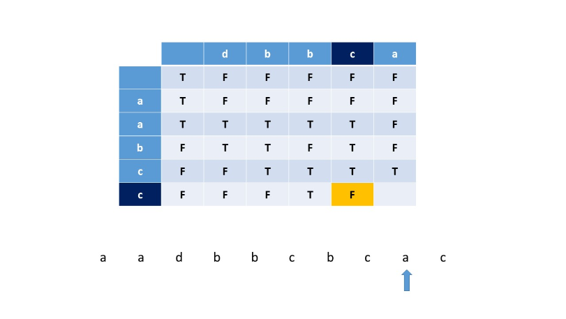

97. Interleaving String

Given `s1`, `s2`, `s3`, find whether `s3` is formed by the interleaving of `s1` and `s2`.

**Example 1:**
```
Input: s1 = "aabcc", s2 = "dbbca", s3 = "aadbbcbcac"
Output: true
```

**Example 2:**
```
Input: s1 = "aabcc", s2 = "dbbca", s3 = "aadbbbaccc"
Output: false
```
# Summary
---
We need to determine whether a given string can be formed by interleaving the other two strings.

# Solution
---
## Approach 1: Brute Force

The most basic idea is to find every string possible by all interleavings of the two given strings $s1$ and $s2$. In order to implement this method, we are using recursion. We start by taking the current character of the first string $s1$ and then appending all possible interleavings of the remaining portion of the first string $s1$ and the second string $s2$ and comparing each result formed with the required interleaved string $s3$. Similarly, we choose one character from the second string $s2$ and form all the interleavings with the remaining portion of $s2$ and $s1$ to check if the required string s1s1 can be formed.

For implementing the recursive function, we make the function call recursively as $is\_Interleave(s1,i+1,s2,j,res+s1.charAt(i),s3)$, in which we have chosen the current character from $s1$ and then make another function call $is\_Interleave(s1,i,s2,j+1,res+s2.charAt(j),s3)$, in which the current character of $s2$ is chosen. Here, $res$ refers to that portion(interleaved) of $s1$ and $s2$ which has already been processed. If anyone of these calls return the result as TrueTrue, it means that at least one interleaving gives the required result $s3$. The recursive calls end when both the strings $s1$ and $s2$ have been fully processed.

Let's look at a small example to see how the execution proceeds.

```
s1="abc"
s2="bcd"
s3="abcbdc"
```

Firstly we choose 'a' of $s1$ as the processed part i.e. res and call the recursive function considering the new strings as $s1$="bc", $s2$="bcd", $s3$="abcbdc". When this function returns a result, we again call the recursive function but with the new strings as $s1$="abc", $s2$="cd", $s3$="abcbdc"

```java
public class Solution {
    public boolean is_Interleave(String s1,int i,String s2,int j,String res,String s3)
    {
        if(res.equals(s3) && i==s1.length() && j==s2.length())
            return true;
        boolean ans=false;
        if(i<s1.length())
            ans|=is_Interleave(s1,i+1,s2,j,res+s1.charAt(i),s3);
        if(j<s2.length())
            ans|=is_Interleave(s1,i,s2,j+1,res+s2.charAt(j),s3);
        return ans;

    }
    public boolean isInterleave(String s1, String s2, String s3) {
        return is_Interleave(s1,0,s2,0,"",s3);
    }
}
```
**Complexity Analysis**

* Time complexity : $O(2^{m+n})$. $m$ is the length of $s1$ and $n$ is the length of $s2$.

* Space complexity : $O(m+n)$. The size of stack for recursive calls can go upto m+nm+n.

## Approach 2: Recursion with memoization
**Algorithm**

In the recursive approach discussed above, we are considering every possible string formed by interleaving the two given strings. But, there will be cases encountered in which, the same portion of $s1$ and $s2$ would have been processed already but in different orders(permutations). But irrespective of the order of processing, if the resultant string formed till now is matching with the required string($s3$), the final result is dependent only on the remaining portions of $s1$ and $s2$, but not on the already processed portion. Thus, the recursive approach leads to redundant computations.

This redundancy can be removed by making use of memoization along with recursion. For this, we maitain 3 pointers $i, j, k$ which correspond to the index of the current character of $s1, s2, s3$ respectively. Also, we maintain a 2D memo array to keep a track of the substrings processed so far. $memo[i][j]$ stores a 1/0 or -1 depending on whether the current portion of strings i.e. upto $i^{th}$ index for $s1$ and upto $j^{th}$ index for s2 has already been evaluated. Again, we start by selecting the current character of $s1$ (pointed by $i$). If it matches the current character of $s3$ (pointed by $k$), we include it in the processed string and call the same function recurively as: $is\_Interleave(s1, i+1, s2, j, s3, k+1,memo)$

Thus, here we have called the function by incrementing the pointers $i$ and $k$ since the portion of strings upto those indices has already been processed. Similarly, we choose one character from the second string and continue. The recursive function ends when either of the two strings $s1$ or $s2$ has been fully processed. If, let's say, the string $s1$ has been fully processed, we directly compare the remaining portion of $s2$ with the remaining portion of $s3$. When the backtrack occurs from the recursive calls, we store the value returned by the recursive functions in the memoization array memo appropriatelys so that when it is encountered the next time, the recursive function won't be called, but the memoization array itself will return the previous generated result.

```java
public class Solution {
    public boolean is_Interleave(String s1, int i, String s2, int j, String s3, int k, int[][] memo) {
        if (i == s1.length()) {
            return s2.substring(j).equals(s3.substring(k));
        }
        if (j == s2.length()) {
            return s1.substring(i).equals(s3.substring(k));
        }
        if (memo[i][j] >= 0) {
            return memo[i][j] == 1 ? true : false;
        }
        boolean ans = false;
        if (s3.charAt(k) == s1.charAt(i) && is_Interleave(s1, i + 1, s2, j, s3, k + 1, memo)
                || s3.charAt(k) == s2.charAt(j) && is_Interleave(s1, i, s2, j + 1, s3, k + 1, memo)) {
            ans = true;
        }
        memo[i][j] = ans ? 1 : 0;
        return ans;
    }
    public boolean isInterleave(String s1, String s2, String s3) {
        int memo[][] = new int[s1.length()][s2.length()];
        for (int i = 0; i < s1.length(); i++) {
            for (int j = 0; j < s2.length(); j++) {
                memo[i][j] = -1;
            }
        }
        return is_Interleave(s1, 0, s2, 0, s3, 0, memo);
    }
}
```

**Complexity Analysis**

* Time complexity : $O(2^{m+n})$. $m$ is the length of $s1$ and $n$ is the length of $s2$.

* Space complexity : $O(m+n)$. The size of stack for recursive calls can go upto $m+n$.

## Approach 3: Using 2D Dynamic Programming
**Algorithm**

The recursive approach discussed in above solution included a character from one of the strings $s1$ or $s2$ in the resultant interleaved string and called a recursive function to check whether the remaining portions of $s1$ and $s2$ can be interleaved to form the remaining portion of $s3$. In the current approach, we look at the same problem the other way around. Here, we include one character from $s1$ or $s2$ and check whether the resultant string formed so far by one particular interleaving of the the current prefix of $s1$ and $s2$ form a prefix of $s3$.

Thus, this approach relies on the fact that the in order to determine whether a substring of $s3$(upto index $k$), can be formed by interleaving strings $s1$ and $s2$ upto indices $i$ and $j$ respectively, solely depends on the characters of $s1$ and $s2$ upto indices $i$ and $j$ only and not on the characters coming afterwards.

To implement this method, we'll make use of a 2D boolean array $dp$. In this array $dp[i][j]$ implies if it is possible to obtain a substring of length $(i+j+2)$ which is a prefix of s3s3 by some interleaving of prefixes of strings $s1$ and $s2$ having lengths $(i+1)$ and $(j+1)$ respectively. For filling in the entry of $dp[i][j]$, we need to consider two cases:

1. The character just included i.e. either at $i^{th}$ index of $s1$ or at $j^{th}$ index of $s2$ doesn't match the character at $k^{th}$ index of $s3$, where $k=i+j+1$. In this case, the resultant string formed using some interleaving of prefixes of $s1$ and $s2$ can never result in a prefix of length $k+1$ in $s3$. Thus, we enter $False$ at the character $dp[i][j]$.

1. The character just included i.e. either at $i^{th}$ index of $s1$ or at $j^{th}$ index of $s2$ matches the character at $k^{th}$ index of $s3$, where $k=i+j+1$. Now, if the character just included(say xx) which matches the character at $k^{th}$ index of $s3$, is the character at $i^{th}$ index of $s1$, we need to keep $x$ at the last position in the resultant interleaved string formed so far. Thus, in order to use string $s1$ and $s2$ upto indices $i$ and $j$ to form a resultant string of length $(i+j+2)$ which is a prefix of $s3$, we need to ensure that the strings $s1$ and $s2$ upto indices $(i-1)$ and $j$ respectively obey the same property.

Similarly, if we just included the $j^{th}$ character of $s2$, which matches with the $k^{th}$ character of $s3$, we need to ensure that the strings $s1$ and $s2$ upto indices $i$ and $(j-1)$ also obey the same property to enter a truetrue at $dp[i][j]$.

This can be made clear with the following example:

```
s1="aabcc"
s2="dbbca"
s3="aadbbcbcac"
```





```java
public class Solution {
    public boolean isInterleave(String s1, String s2, String s3) {
        if (s3.length() != s1.length() + s2.length()) {
            return false;
        }
        boolean dp[][] = new boolean[s1.length() + 1][s2.length() + 1];
        for (int i = 0; i <= s1.length(); i++) {
            for (int j = 0; j <= s2.length(); j++) {
                if (i == 0 && j == 0) {
                    dp[i][j] = true;
                } else if (i == 0) {
                    dp[i][j] = dp[i][j - 1] && s2.charAt(j - 1) == s3.charAt(i + j - 1);
                } else if (j == 0) {
                    dp[i][j] = dp[i - 1][j] && s1.charAt(i - 1) == s3.charAt(i + j - 1);
                } else {
                    dp[i][j] = (dp[i - 1][j] && s1.charAt(i - 1) == s3.charAt(i + j - 1)) || (dp[i][j - 1] && s2.charAt(j - 1) == s3.charAt(i + j - 1));
                }
            }
        }
        return dp[s1.length()][s2.length()];
    }
}
```

**Complexity Analysis**

* Time complexity : $O(m \cdot n)$. dp array of size $m*n$ is filled.

* Space complexity : $O(m \cdot n)$. 2D dp of size $(m+1)*(n+1)$ is required. $m$ and $n$ are the lengths of strings $s1$ and $s2$ respectively.

## Approach 4: Using 1D Dynamic Programming
**Algorithm**

This approach is the same as the previous approach except that we have used only 1D $dp$ array to store the results of the prefixes of the strings processed so far. Instead of maintaining a 2D array, we can maintain a 1D array only and update the array's element $dp[i]$when needed using $dp[i-1]$ and the previous value of $dp[i]$.

```java
public class Solution {
    public boolean isInterleave(String s1, String s2, String s3) {
        if (s3.length() != s1.length() + s2.length()) {
            return false;
        }
        boolean dp[] = new boolean[s2.length() + 1];
        for (int i = 0; i <= s1.length(); i++) {
            for (int j = 0; j <= s2.length(); j++) {
                if (i == 0 && j == 0) {
                    dp[j] = true;
                } else if (i == 0) {
                    dp[j] = dp[j - 1] && s2.charAt(j - 1) == s3.charAt(i + j - 1);
                } else if (j == 0) {
                    dp[j] = dp[j] && s1.charAt(i - 1) == s3.charAt(i + j - 1);
                } else {
                    dp[j] = (dp[j] && s1.charAt(i - 1) == s3.charAt(i + j - 1)) || (dp[j - 1] && s2.charAt(j - 1) == s3.charAt(i + j - 1));
                }
            }
        }
        return dp[s2.length()];
    }
}
```

**Complexity Analysis**

* Time complexity : $O(m \cdot n)$. dp array of size nn is filled mm times.

* Space complexity : $O(n)$. $n$ is the length of the string $s1$.

# Submissions
---
**Solution 1: (Brute Force, Time Limit Exceeded)**
```python
class Solution:
    def isInterleave(self, s1: str, s2: str, s3: str) -> bool:
        M, N = len(s1), len(s2)
        
        def is_Interleave(i, j, res):
            if res == s3 and i == M and j == N:
                return True
            ans = False
            if i < M:
                ans = ans | is_Interleave(i + 1, j, res + s1[i])
            if j < N:
                ans = ans | is_Interleave(i, j + 1, res + s2[j])
            return ans
            
        return is_Interleave(0, 0, '')
```

**Solution 2: (Recursion with memoization, DP Top-Down)**
```
Runtime: 28 ms
Memory Usage: 13.2 MB
```
```python
class Solution:
    def isInterleave(self, s1: str, s2: str, s3: str) -> bool:
        M, N = len(s1), len(s2)
        memo = [[-1]*N for _ in range(M)]
        
        def is_Interleave(i, j, k):
            if i == M:
                return s2[j:] == s3[k:]
            if j == N:
                return s1[i:] == s3[k:]
            if memo[i][j] >= 0:
                return True if memo[i][j] == 1 else False
            ans = False
            if s3[k] == s1[i] and is_Interleave(i + 1, j, k + 1) \
               or s3[k] == s2[j] and is_Interleave(i, j + 1, k + 1):
                ans = True
            memo[i][j] = 1 if ans else 0
            return ans
        
        return is_Interleave(0, 0, 0)
```

**Solution 3: (DP Top-Down)**
```
Runtime: 32 ms
Memory Usage: 12.9 MB
```
```python
import functools
class Solution:
    def isInterleave(self, s1: str, s2: str, s3: str) -> bool:
        M, N = len(s1), len(s2)

        @functools.lru_cache(None)
        def is_Interleave(i, j, k):
            if i == M:
                return s2[j:] == s3[k:]
            if j == N:
                return s1[i:] == s3[k:]
            ans = False
            if s3[k] == s1[i] and is_Interleave(i + 1, j, k + 1) \
               or s3[k] == s2[j] and is_Interleave(i, j + 1, k + 1):
                ans = True
            return ans

        return is_Interleave(0, 0, 0)
```


**Solution 4: (Using 2D Dynamic Programming, DP Bottom-Up)**
```
Runtime: 40 ms
Memory Usage: 12.9 MB
```
```python
class Solution:
    def isInterleave(self, s1: str, s2: str, s3: str) -> bool:
        M, N = len(s1), len(s2)
        if len(s3) != M + N:
            return False
        dp = [[False]*(N + 1) for _ in range(M + 1)]
        for i in range(M + 1):
            for j in range(N + 1):
                if i == 0 and j == 0:
                    dp[i][j] = True
                elif i == 0:
                    dp[i][j] = dp[i][j - 1] and s2[j - 1] == s3[i + j - 1]
                elif j == 0:
                    dp[i][j] = dp[i - 1][j] and s1[i - 1] == s3[i + j - 1]
                else:
                    dp[i][j] = dp[i - 1][j] and s1[i - 1] == s3[i + j - 1] \
                    or dp[i][j - 1] and s2[j - 1] == s3[i + j - 1]
        
        return dp[M][N]
```

**Solution 5: (Using 1D Dynamic Programming, DP Bottom-Up)**
```
Runtime: 40 ms
Memory Usage: 12.7 MB
```
```python
class Solution:
    def isInterleave(self, s1: str, s2: str, s3: str) -> bool:
        M, N = len(s1), len(s2)
        if len(s3) != M + N:
            return False
        dp = [False]*(N + 1)
        for i in range(M + 1):
            for j in range(N + 1):
                if i == 0 and j == 0:
                    dp[j] = True
                elif i == 0:
                    dp[j] = dp[j - 1] and s2[j - 1] == s3[i + j - 1]
                elif j == 0:
                    dp[j] = dp[j] and s1[i - 1] == s3[i + j - 1]
                else:
                    dp[j] = dp[j] and s1[i - 1] == s3[i + j - 1] \
                    or dp[j - 1] and s2[j - 1] == s3[i + j - 1]
        
        return dp[N]
```