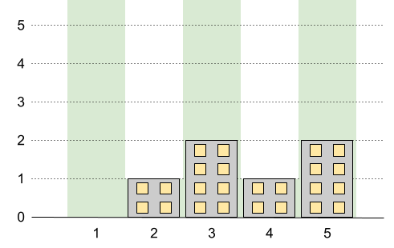
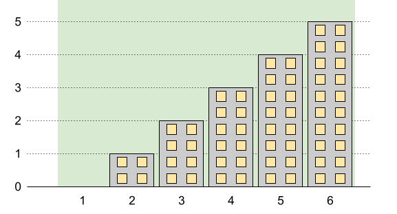
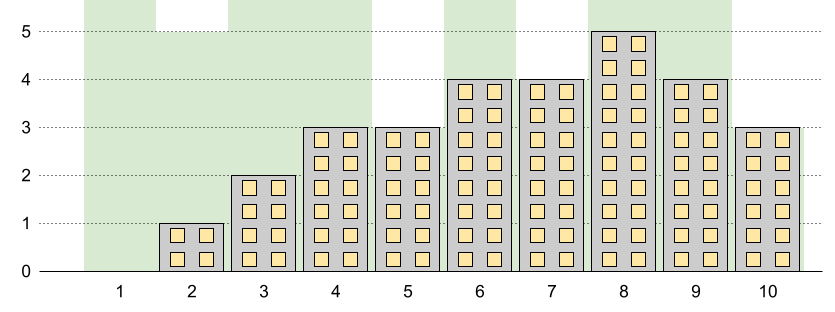

1840. Maximum Building Height

You want to build `n` new buildings in a city. The new buildings will be built in a line and are labeled from `1` to `n`.

However, there are city restrictions on the heights of the new buildings:

* The height of each building must be a non-negative integer.
* The height of the first building **must be** `0`.
* The height difference between any two adjacent buildings **cannot exceed** `1`.

Additionally, there are city restrictions on the maximum height of specific buildings. These restrictions are given as a 2D integer array `restrictions` where `restrictions[i] = [idi, maxHeighti]` indicates that building `idi` must have a height **less than or equal to** `maxHeighti`.

It is guaranteed that each building will appear **at most once** in `restrictions`, and building `1` will not be in restrictions.

Return the **maximum possible height** of the **tallest** building.

 

**Example 1:**


```
Input: n = 5, restrictions = [[2,1],[4,1]]
Output: 2
Explanation: The green area in the image indicates the maximum allowed height for each building.
We can build the buildings with heights [0,1,2,1,2], and the tallest building has a height of 2.
```

**Example 2:**


```
Input: n = 6, restrictions = []
Output: 5
Explanation: The green area in the image indicates the maximum allowed height for each building.
We can build the buildings with heights [0,1,2,3,4,5], and the tallest building has a height of 5.
```

**Example 3:**


```
Input: n = 10, restrictions = [[5,3],[2,5],[7,4],[10,3]]
Output: 5
Explanation: The green area in the image indicates the maximum allowed height for each building.
We can build the buildings with heights [0,1,2,3,3,4,4,5,4,3], and the tallest building has a height of 5.
```

**Constraints:**

* `2 <= n <= 10^9`
* `0 <= restrictions.length <= min(n - 1, 10^5)`
* `2 <= idi <= n`
* `idi` is unique.
* `0 <= maxHeighti <= 109`

## Submissions
---
**Solution 1: (Prefix sum)**
```
Runtime: 1816 ms
Memory Usage: 52.6 MB
```
```python
class Solution:
    def maxBuilding(self, n: int, restrictions: List[List[int]]) -> int:
        restrictions.extend([[1, 0], [n, n - 1]])
        restrictions.sort()
        m = len(restrictions)
        
        for i in range(1, m):
            restrictions[i][1] = min(restrictions[i][1], restrictions[i-1][1] + restrictions[i][0] - restrictions[i-1][0])
        for i in range(m - 2, -1, -1):
            restrictions[i][1] = min(restrictions[i][1], restrictions[i+1][1] + restrictions[i+1][0] - restrictions[i][0])
        
        ans = 0
        for i in range(1, m):
            l, h1 = restrictions[i-1]
            r, h2 = restrictions[i]
            ans = max(ans, max(h1, h2) + (r - l - abs(h1 - h2)) // 2)
        return ans
```