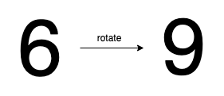
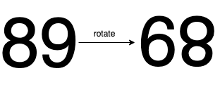
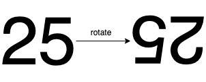

1056. Confusing Number

Given a number `N`, return `true` if and only if it is a confusing number, which satisfies the following condition:

We can rotate digits by 180 degrees to form new digits. When 0, 1, 6, 8, 9 are rotated 180 degrees, they become 0, 1, 9, 8, 6 respectively. When 2, 3, 4, 5 and 7 are rotated 180 degrees, they become invalid. A confusing number is a number that when rotated 180 degrees becomes a **different** number with each digit valid.

 

**Example 1:**


```
Input: 6
Output: true
Explanation: 
We get 9 after rotating 6, 9 is a valid number and 9!=6.
```

**Example 2:**


```
Input: 89
Output: true
Explanation: 
We get 68 after rotating 89, 86 is a valid number and 86!=89.
```

**Example 3:**


```
Input: 11
Output: false
Explanation: 
We get 11 after rotating 11, 11 is a valid number but the value remains the same, thus 11 is not a confusing number.
```

**Example 4:**


```
Input: 25
Output: false
Explanation: 
We get an invalid number after rotating 25.
```

**Note:**

* `0 <= N <= 10^9`
* After the rotation we can ignore leading zeros, for example if after rotation we have 0008 then this number is considered as just 8.

# Submissions
---
**Solution 1: (Math)**
```
Runtime: 24 ms
Memory Usage: 14.2 MB
```
```python
class Solution:
    def confusingNumber(self, N: int) -> bool:
        d = {
            0: 0,
            1: 1,
            6: 9,
            8: 8,
            9: 6
        }
        cur = 0
        q = N
        while q:
            q, r = divmod(q, 10)
            if r not in d:
                return False
            cur = cur*10 + d[r]
        if cur == N: return False
        else: return True
```