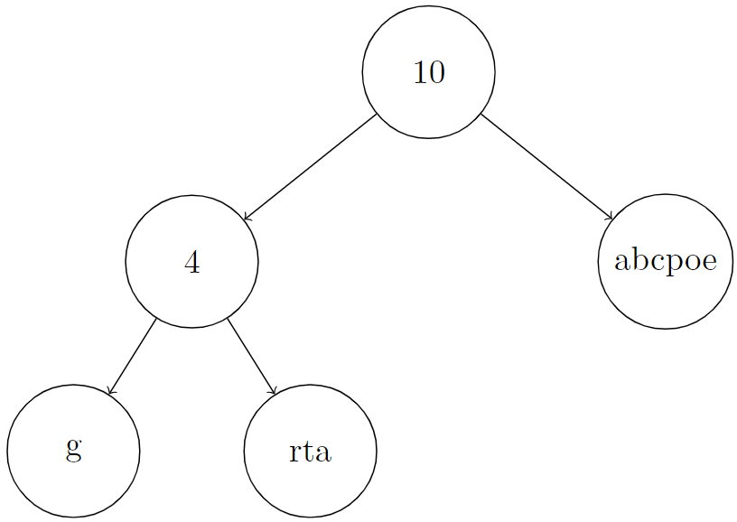
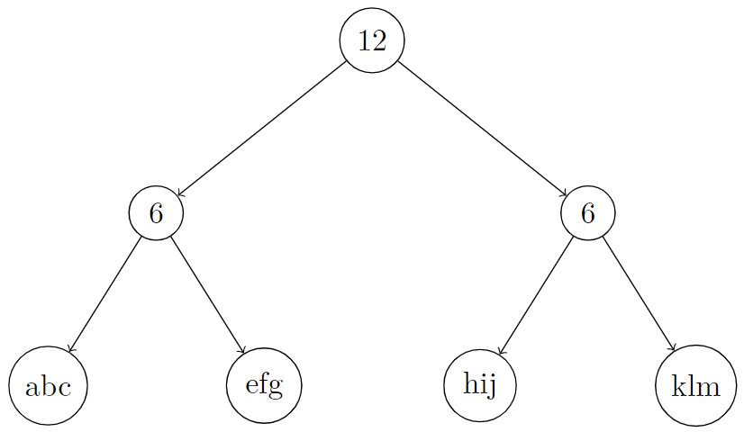
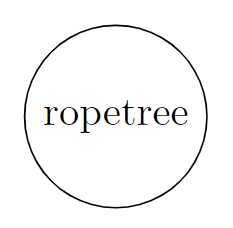

2689. Extract Kth Character From The Rope Tree

You are given the root of a binary tree and an integer k. Besides the left and right children, every node of this tree has two other properties, a string node.val containing only lowercase English letters (possibly empty) and a non-negative integer node.len. There are two types of nodes in this tree:

* **Leaf**: These nodes have no children, `node.len = 0`, and `node.val` is some **non-empty** string.
* **Internal**: These nodes have at least one child (also at most two children), `node.len > 0`, and `node.val` is an **empty** string.

The tree described above is called a Rope binary tree. Now we define `S[node]` recursively as follows:

* If node is some leaf node, `S[node] = node.val`,
* Otherwise if node is some internal node, `S[node] = concat(S[node.left], S[node.right])` and `S[node].length = node.len`.

Return k-th character of the string `S[root]`.

**Note:** If `s` and `p` are two strings, `concat(s, p)` is a string obtained by concatenating `p` to `s`. For example, `concat("ab", "zz") = "abzz"`.

 

**Example 1:**


```
Input: root = [10,4,"abcpoe","g","rta"], k = 6
Output: "b"
Explanation: In the picture below, we put an integer on internal nodes that represents node.len, and a string on leaf nodes that represents node.val.
You can see that S[root] = concat(concat("g", "rta"), "abcpoe") = "grtaabcpoe". So S[root][5], which represents 6th character of it, is equal to "b".
```

**Example 2:**


```
Input: root = [12,6,6,"abc","efg","hij","klm"], k = 3
Output: "c"
Explanation: In the picture below, we put an integer on internal nodes that represents node.len, and a string on leaf nodes that represents node.val.
You can see that S[root] = concat(concat("abc", "efg"), concat("hij", "klm")) = "abcefghijklm". So S[root][2], which represents the 3rd character of it, is equal to "c".
```

**Example 3:**


```
Input: root = ["ropetree"], k = 8
Output: "e"
Explanation: In the picture below, we put an integer on internal nodes that represents node.len, and a string on leaf nodes that represents node.val.
You can see that S[root] = "ropetree". So S[root][7], which represents 8th character of it, is equal to "e".
```

 

**Constraints:**

* The number of nodes in the tree is in the range `[1, 103]`
* `node.val` contains only lowercase English letters
* `0 <= node.val.length <= 50`
* `0 <= node.len <= 10^4`
* for leaf nodes, `node.len = 0` and `node.val` is non-empty
* for internal nodes, `node.len > 0` and `node.val` is empty
* `1 <= k <= S[root].length`

# Submissions
---
**Solution 1: (DFS)**
```
Runtime: 48 ms
Memory: 34.2 MB
```
```c++
/**
 * Definition for a rope tree node.
 * struct RopeTreeNode {
 *     int len;
 *     string val;
 *     RopeTreeNode *left;
 *     RopeTreeNode *right;
 *     RopeTreeNode() : len(0), val(""), left(nullptr), right(nullptr) {}
 *     RopeTreeNode(string s) : len(0), val(std::move(s)), left(nullptr), right(nullptr) {}
 *     RopeTreeNode(int x) : len(x), val(""), left(nullptr), right(nullptr) {}
 *     RopeTreeNode(int x, RopeTreeNode *left, RopeTreeNode *right) : len(x), val(""), left(left), right(right) {}
 * };
 */
class Solution {
public:
    char getKthCharacter(RopeTreeNode* root, int k) {
        if (root->len) {
            const int len = root->left ? max(root->left->len, (int) root->left->val.length()) : 0;
            return len >= k ? getKthCharacter(root->left, k) :  getKthCharacter(root->right, k - len);

        }
        return root->val[k - 1];
    }
};
```
