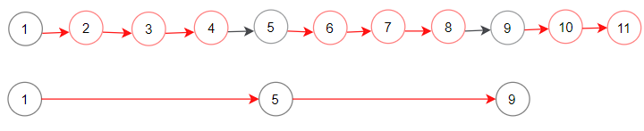

1474. Delete N Nodes After M Nodes of a Linked List

Given the `head` of a linked list and two integers `m` and `n`. Traverse the linked list and remove some nodes in the following way:

* Start with the head as the current node.
* Keep the first `m` nodes starting with the current node.
* Remove the next `n` nodes
* Keep repeating steps 2 and 3 until you reach the end of the list.

Return the head of the modified list after removing the mentioned nodes.

**Follow up question:** How can you solve this problem by modifying the list in-place?

 

**Example 1:**


```
Input: head = [1,2,3,4,5,6,7,8,9,10,11,12,13], m = 2, n = 3
Output: [1,2,6,7,11,12]
Explanation: Keep the first (m = 2) nodes starting from the head of the linked List  (1 ->2) show in black nodes.
Delete the next (n = 3) nodes (3 -> 4 -> 5) show in read nodes.
Continue with the same procedure until reaching the tail of the Linked List.
Head of linked list after removing nodes is returned.
```

**Example 2:**


```
Input: head = [1,2,3,4,5,6,7,8,9,10,11], m = 1, n = 3
Output: [1,5,9]
Explanation: Head of linked list after removing nodes is returned.
```

**Example 3:**
```
Input: head = [1,2,3,4,5,6,7,8,9,10,11], m = 3, n = 1
Output: [1,2,3,5,6,7,9,10,11]
```

**Example 4:**
```
Input: head = [9,3,7,7,9,10,8,2], m = 1, n = 2
Output: [9,7,8]
```

**Constraints:**

* The given linked list will contain between `1` and `10^4` nodes.
* The value of each node in the linked list will be in the range `[1, 10^6]`.
* `1 <= m,n <= 1000`

# Submissions
---
**Solution 1: (Linked List)**
```
Runtime: 60 ms
Memory Usage: 16.8 MB
```
```python
# Definition for singly-linked list.
# class ListNode:
#     def __init__(self, val=0, next=None):
#         self.val = val
#         self.next = next
class Solution:
    def deleteNodes(self, head: ListNode, m: int, n: int) -> ListNode:
        prev, cur = None, head
        while cur:
            cm = m
            while cur and cm:
                cm -= 1
                prev = cur
                cur = cur.next
            cn = n
            while cur and cn:
                cn -= 1
                cur = cur.next
            prev.next = cur
        
        return head
```

**Solution 2: (Linked List)**
```
Runtime: 20 ms
Memory Usage: 15.8 MB
```
```c++
/**
 * Definition for singly-linked list.
 * struct ListNode {
 *     int val;
 *     ListNode *next;
 *     ListNode() : val(0), next(nullptr) {}
 *     ListNode(int x) : val(x), next(nullptr) {}
 *     ListNode(int x, ListNode *next) : val(x), next(next) {}
 * };
 */
class Solution {
public:
    ListNode* deleteNodes(ListNode* head, int m, int n) {
        ListNode* currentNode = head;
        ListNode* lastMNode = head;
        while (currentNode != nullptr) {
            // initialize mCount to m and nCount to n
            int mCount = m, nCount = n;
            // traverse m nodes
            while (currentNode != nullptr && mCount != 0) {
                lastMNode = currentNode;
                currentNode = currentNode->next;
                mCount--;
            }
            // traverse n nodes
            while (currentNode != nullptr && nCount != 0) {
                currentNode = currentNode->next;
                nCount--;
            }
            // delete n nodes
            lastMNode->next = currentNode;
        }
        return head; 
    }
};
```