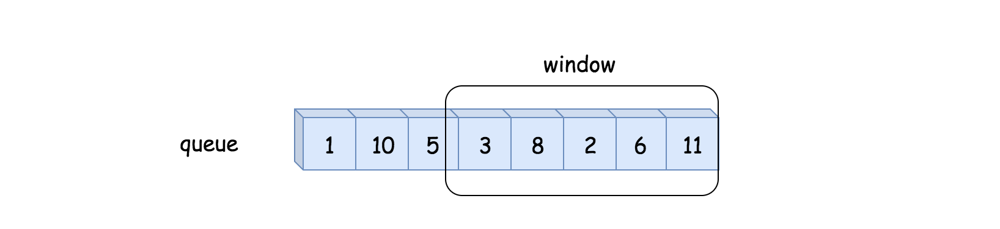
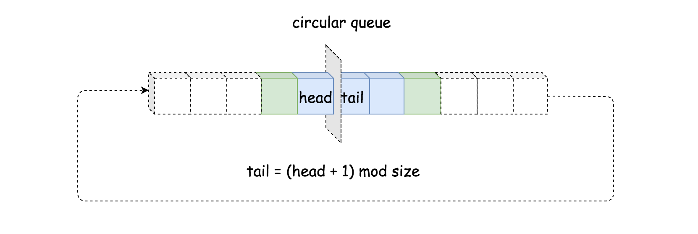
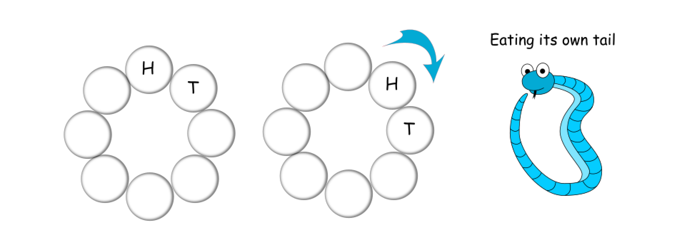

346. Moving Average from Data Stream

Given a stream of integers and a window size, calculate the moving average of all integers in the sliding window.

**Example:**
```
MovingAverage m = new MovingAverage(3);
m.next(1) = 1
m.next(10) = (1 + 10) / 2
m.next(3) = (1 + 10 + 3) / 3
m.next(5) = (10 + 3 + 5) / 3
```

# Solution
---
## Approach 1: Array or List
**Intuition**

Following the description of the problem, we could simply keep track of all the incoming values with the data structure of Array or List. Then from the data structure, later we retrieve the necessary elements to calculate the average.



**Algorithm**

* First, we initialize a variable `queue` to store the values from the data stream, and the variable `n` for the size of the moving window.

* At each invocation of `next(val)`, we first append the value to the `queue`. We then retrieve the last `n` values from the `queue`, in order to calculate the average.

```python
class MovingAverage:
    def __init__(self, size: int):
        self.size = size
        self.queue = []
        
    def next(self, val: int) -> float:
        size, queue = self.size, self.queue
        queue.append(val)
        # calculate the sum of the moving window
        window_sum = sum(queue[-size:])

        return window_sum / min(len(queue), size)
```

**Complexity**

* Time Complexity: $\mathcal{O}(N)$ where $N$ is the size of the moving window, since we need to retrieve $N$ elements from the queue at each invocation of `next(val)` function.
* Space Complexity: $\mathcal{O}(M)$, where $M$ is the length of the queue which would grow at each invocation of the `next(val)` function.

## Approach 2: Double-ended Queue
**Intuition**

We could do better than the first approach in both time and space complexity.

>First of all, one might notice that we do not need to keep all values from the data stream, but rather the last n values which falls into the moving window.

By definition of the moving window, at each step, we add a new element to the window, and at the same time we remove the oldest element from the window. Here, we could apply a data structure called double-ended queue (a.k.a deque) to implement the moving window, which would have the constant time complexity ($\mathcal{O}(1)$) to add or remove an element from both its ends. With the deque, we could reduce the space complexity down to $\mathcal{O}(N)$ where $N$ is the size of the moving window.


Secondly, to calculate the sum, we do not need to reiterate the elements in the moving window.

We could keep the sum of the previous moving window, then in order to obtain the sum of the new moving window, we simply add the new element and deduce the oldest element. With this measure, we then can reduce the time complexity to constant.

**Algorithm**

Here is the definition of the deque from Python. We have similar implementation of deque in other programming languages such as Java.

>Deques are a generalization of stacks and queues (the name is pronounced `deck` and is short for `double-ended queue`). Deques support thread-safe, memory efficient appends and pops from either side of the deque with approximately the same O(1) performance in either direction.

Follow the intuition, we replace the queue with the deque and add a new variable `window_sum` in order to calculate the sum of moving window in constant time.

```python
from collections import deque
class MovingAverage:
    def __init__(self, size: int):
        self.size = size
        self.queue = deque()
        # number of elements seen so far
        self.window_sum = 0
        self.count = 0
    
    def next(self, val: int) -> float:
        self.count += 1
        # calculate the new sum by shifting the window
        self.queue.append(val)
        tail = self.queue.popleft() if self.count > self.size else 0
        
        self.window_sum = self.window_sum - tail + val
        
        return self.window_sum / min(self.size, self.count)
```

**Complexity**

* Time Complexity: $\mathcal{O}(1)$, as we explained in intuition.
* Space Complexity: $\mathcal{O}(N)$, where $N$ is the size of the moving window.

## Approach 3: Circular Queue with Array
**Intuition**

Other than the deque data structure, one could also apply another fun data structure called circular queue, which is basically a queue with the circular shape.



* The major advantage of circular queue is that by adding a new element to a full circular queue, it automatically discards the oldest element. Unlike deque, we do not need to explicitly remove the oldest element.
* Another advantage of circular queue is that a single index suffices to keep track of both ends of the queue, unlike deque where we have to keep a pointer for each end.

**Algorithm**

No need to resort to any library, one could easily implement a circular queue with a fixed-size array. The key to the implementation is the correlation between the index of head and tail elements, which we could summarize in the following formula:

$\text{tail} = (\text{head} + 1) \mod \text{size}$

In other words, the $tail$ element is right next to the $head$ element. Once we move the head forward, we would overwrite the previous tail element.



```python
class MovingAverage:
    def __init__(self, size: int):
        self.size = size
        self.queue = [0] * self.size
        self.head = self.window_sum = 0
        # number of elements seen so far
        self.count = 0
    
    def next(self, val: int) -> float:
        self.count += 1
        # calculate the new sum by shifting the window
        tail = (self.head + 1) % self.size
        self.window_sum = self.window_sum - self.queue[tail] + val
        # move on to the next head
        self.head = (self.head + 1) % self.size
        self.queue[self.head] = val
        return self.window_sum / min(self.size, self.count)
```

**Complexity**

* Time Complexity: $\mathcal{O}(1)$, as we can see that there is no loop in the `next(val)` function.
* Space Complexity: $\mathcal{O}(N)$, where $N$ is the size of the circular queue.

# Submissions
---
**Solution 1: (Circular Queue with Array)**
```
Runtime: 64 ms
Memory Usage: 16.6 MB
```
```python
class MovingAverage:

    def __init__(self, size: int):
        """
        Initialize your data structure here.
        """
        self.size = size
        self.queue = [0] * self.size
        self.head = self.window_sum = 0
        # number of elements seen so far
        self.count = 0

    def next(self, val: int) -> float:
        self.count += 1
        # calculate the new sum by shifting the window
        tail = (self.head + 1) % self.size
        self.window_sum = self.window_sum - self.queue[tail] + val
        # move on to the next head
        self.head = (self.head + 1) % self.size
        self.queue[self.head] = val
        return self.window_sum / min(self.size, self.count)


# Your MovingAverage object will be instantiated and called as such:
# obj = MovingAverage(size)
# param_1 = obj.next(val)
```

**Solution 2: (Deque)**
```
Runtime: 4 ms, Beats 34.08%
Memory: 20.91 MB, Beats 14.81%
```
```c++
class MovingAverage {
    deque<int> dq;
    int sz;
    double a;
public:
    MovingAverage(int size) {
        sz = size;
        a = 0;
    }
    
    double next(int val) {
        a += val;
        dq.push_back(val);
        if (dq.size() > sz) {
            a -= dq.front();
            dq.pop_front();
        }
        return a / dq.size();
    }
};

/**
 * Your MovingAverage object will be instantiated and called as such:
 * MovingAverage* obj = new MovingAverage(size);
 * double param_1 = obj->next(val);
 */
```
