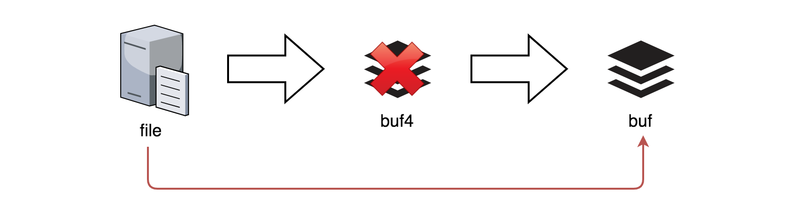

157. Read N Characters Given Read4

Given a file and assume that you can only read the file using a given method `read4`, implement a method to read n characters.

 

**Method read4:**

The API `read4` reads 4 consecutive characters from the file, then writes those characters into the buffer array buf.

The return value is the number of actual characters read.

Note that `read4()` has its own file pointer, much like FILE *fp in C.

**Definition of read4:**
```
    Parameter:  char[] buf4
    Returns:    int

Note: buf4[] is destination not source, the results from read4 will be copied to buf4[]
```

Below is a high level example of how read4 works:


```
File file("abcde"); // File is "abcde", initially file pointer (fp) points to 'a'
char[] buf4 = new char[4]; // Create buffer with enough space to store characters
read4(buf4); // read4 returns 4. Now buf = "abcd", fp points to 'e'
read4(buf4); // read4 returns 1. Now buf = "e", fp points to end of file
read4(buf4); // read4 returns 0. Now buf = "", fp points to end of file
```

**Method read:**

By using the `read4` method, implement the method `read` that reads n characters from the file and store it in the buffer array `buf`. Consider that you **cannot** manipulate the file directly.

The return value is the number of actual characters read.

**Definition of read:**
```
    Parameters:	char[] buf, int n
    Returns:	int

Note: buf[] is destination not source, you will need to write the results to buf[]
```

**Example 1:**
```
Input: file = "abc", n = 4
Output: 3
Explanation: After calling your read method, buf should contain "abc". We read a total of 3 characters from the file, so return 3. Note that "abc" is the file's content, not buf. buf is the destination buffer that you will have to write the results to.
```

**Example 2:**
```
Input: file = "abcde", n = 5
Output: 5
Explanation: After calling your read method, buf should contain "abcde". We read a total of 5 characters from the file, so return 5.
```

**Example 3:**
```
Input: file = "abcdABCD1234", n = 12
Output: 12
Explanation: After calling your read method, buf should contain "abcdABCD1234". We read a total of 12 characters from the file, so return 12.
```

**Example 4:**
```
Input: file = "leetcode", n = 5
Output: 5
Explanation: After calling your read method, buf should contain "leetc". We read a total of 5 characters from the file, so return 5.
```

**Note:**

* Consider that you **cannot** manipulate the file directly, the file is only accesible for `read4` but not for `read`.
* The `read` function will only be called once for each test case.
* You may assume the destination buffer array, `buf`, is guaranteed to have enough space for storing n characters.

# Solution
---
## Overview
**Interview Tendencies: Google and Facebook**

A long time ago, long ago, so long ago that no one can remember, algorithm interview questions were less popular. Ten years ago big companies mainly filtered the candidates by the university ranks, and the interview questions were like please describe how DDR memory works.

Nowadays there are some tendencies to merge this "old-style interview" with the modern algorithm questions interview. The idea is to ask a question which sounds like algorithmic but checks your knowledge of how do computers work: Round-robin CPU scheduling, C10k problem first solved by nginx, etc.

>Is it good or bad? That's a reality to deal with, especially if we speak about Google or Facebook interviews.

**Read N Characters Given Read4**

Back to the problem, the question is "how does the memory work":

* Because of the physical implementation, loading 4 bytes in DDR is faster than to load 1 byte 4 times.

* On the majority of computers today, collection of 4 bytes, or 32 bits, is called a word. Most modern CPUs are optimized for the operations with words.

To sum up, the problem is a practical low-level question. The standard approach (Approach 1) to solve it using the internal buffer of 4 characters:

File -> Internal Buffer of 4 Characters -> Buffer of N Characters.


Figure 1. Approach 1: solution with internal buffer.

Once it's done, and you show your understanding of memory operations, the follow-up question is how to speed up. The answer (Approach 2) is quite straightforward. If it's possible, do not use the internal buffer of 4 characters to avoid the double copy:

File -> Buffer of N Characters.



Figure 2. Approach 2: solution without internal buffer.

# Approach 1: Use Internal Buffer of 4 Characters


**Algorithm**

Let's use an internal buffer of 4 characters to solve this problem:

File -> Internal Buffer of 4 Characters -> Buffer of N Characters.

* Initialize the number of copied characters `copiedChars = 0`, and the number of read characters: `readChars = 4`. It's convenient initialize `readChars` to `4` and then use `readChars != 4` as EOF marker.

    * Initialize an internal buffer of `4` characters: `buf4`.

    * While number of copied characters is less than `N`: `copiedChars < n` and there are still characters in the file: `readChars == 4`:

        * Read from file into internal buffer: `readChars = read4(buf4)`.

        * Copy the characters from internal buffer `buf4` into main buffer `buf` one by one. Increase `copiedChars` after each character. In the number of copied characters is equal to `N`: `copiedChars == n`, interrupt the copy process and return copiedChars.

**Implementation**

**C++**

```c++
class Solution {
public:
    int read(char *buf, int n) {
        int copiedChars = 0, readChars = 4;
        char buf4[4];
        
        while (copiedChars < n && readChars == 4) {
            readChars = read4(buf4);
            
            for (int i = 0; i < readChars; ++i) {
                if (copiedChars == n)
                    return copiedChars;
                buf[copiedChars] = buf4[i];
                ++copiedChars;    
            }    
        }
        return copiedChars;
    }
};
```

**Python**

```python
class Solution:
    def read(self, buf, n) -> int:
        copied_chars = 0
        read_chars = 4
        buf4 = [''] * 4
        
        while copied_chars < n and read_chars == 4:
            read_chars = read4(buf4)
            
            for i in range(read_chars):
                if copied_chars == n:
                    return copied_chars
                buf[copied_chars] = buf4[i]
                copied_chars += 1
        
        return copied_chars
```

**Complexity Analysis**

* Time complexity: $\mathcal{O}(N)$ to copy `N` characters.

* Space complexity: $\mathcal{O}(1)$ to keep `buf4` of 4 elements.

# Approach 2: Speed Up: No Internal Buffer


Figure 4. Solution without internal buffer.

This solution is mainly suitable for the languages (C, C++, Golang) where pointers allow to append directly to the primary buffer `buf`.

**Algorithm**

* Initialize the number of copied characters `copiedChars = 0`, and the number of read characters: `readChars = 4`.

* While number of copied characters is less than N: `copiedChars < n` and there are still characters in the file: `readChars == 4`:

    * Read from file directly into buffer: `read4(buf + copiedChars)`.

    * Increase `copiedChars`: `copiedChars += readChars`.

* Now `buf` contains at least N characters. Return `min(n, copiedChars)`.

```c++
class Solution {
public:
    int read(char *buf, int n) {
        int copiedChars = 0, readChars = 4;
        
        while (copiedChars < n && readChars == 4) {
            readChars = read4(buf + copiedChars);
            copiedChars += readChars;
        }
        return min(n, copiedChars);
    }
};
```

**Complexity Analysis**

* Time complexity: $\mathcal{O}(N)$ to copy `N` characters.

* Space complexity: $\mathcal{O}(1)$.

# Submissions
---
**Solution 1: (Use Internal Buffer of 4 Characters)**
```
Runtime: 32 ms
Memory Usage: 13.9 MB
```
```python
"""
The read4 API is already defined for you.

    @param buf4, a list of characters
    @return an integer
    def read4(buf4):

# Below is an example of how the read4 API can be called.
file = File("abcdefghijk") # File is "abcdefghijk", initially file pointer (fp) points to 'a'
buf4 = [' '] * 4 # Create buffer with enough space to store characters
read4(buf4) # read4 returns 4. Now buf = ['a','b','c','d'], fp points to 'e'
read4(buf4) # read4 returns 4. Now buf = ['e','f','g','h'], fp points to 'i'
read4(buf4) # read4 returns 3. Now buf = ['i','j','k',...], fp points to end of file
"""

class Solution:
    def read(self, buf, n):
        """
        :type buf: Destination buffer (List[str])
        :type n: Number of characters to read (int)
        :rtype: The number of actual characters read (int)
        """
        copied_chars = 0
        read_chars = 4
        buf4 = [''] * 4
        
        while copied_chars < n and read_chars == 4:
            read_chars = read4(buf4)
            
            for i in range(read_chars):
                if copied_chars == n:
                    return copied_chars
                buf[copied_chars] = buf4[i]
                copied_chars += 1
        
        return copied_chars
```

**Solution 1: (Use Internal Buffer of 4 Characters)**
```
Runtime: 0 ms
Memory Usage: 6.5 MB
```
```c++
/**
 * The read4 API is defined in the parent class Reader4.
 *     int read4(char *buf4);
 */

class Solution {
public:
    /**
     * @param buf Destination buffer
     * @param n   Number of characters to read
     * @return    The number of actual characters read
     */
    int read(char *buf, int n) {
        int copiedChars = 0, readChars = 4;
        char buf4[4];
        
        while (copiedChars < n && readChars == 4) {
            readChars = read4(buf4);
            
            for (int i = 0; i < readChars; ++i) {
                if (copiedChars == n)
                    return copiedChars;
                buf[copiedChars] = buf4[i];
                ++copiedChars;    
            }    
        }
        return copiedChars;
    }
};
```

**Solution 1: (Speed Up: No Internal Buffer)**
```
Runtime: 0 ms
Memory Usage: 6.3 MB
```
```c++
/**
 * The read4 API is defined in the parent class Reader4.
 *     int read4(char *buf4);
 */

class Solution {
public:
    /**
     * @param buf Destination buffer
     * @param n   Number of characters to read
     * @return    The number of actual characters read
     */
    int read(char *buf, int n) {
        int copiedChars = 0, readChars = 4;
        
        while (copiedChars < n && readChars == 4) {
            readChars = read4(buf + copiedChars);
            copiedChars += readChars;
        }
        return min(n, copiedChars);
    }
};
```