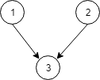

1136. Parallel Courses

There are `N` courses, labelled from 1 to N.

We are given `relations[i] = [X, Y]`, representing a prerequisite relationship between course `X` and course `Y`: course `X` has to be studied before course `Y`.

In one semester you can study any number of courses as long as you have studied all the prerequisites for the course you are studying.

Return the minimum number of semesters needed to study all courses.  If there is no way to study all the courses, return `-1`.

 

**Example 1:**


```
Input: N = 3, relations = [[1,3],[2,3]]
Output: 2
Explanation: 
In the first semester, courses 1 and 2 are studied. In the second semester, course 3 is studied.
```

**Example 2:**


```
Input: N = 3, relations = [[1,2],[2,3],[3,1]]
Output: -1
Explanation: 
No course can be studied because they depend on each other.
```

**Note:**

* `1 <= N <= 5000`
* `1 <= relations.length <= 5000`
* `relations[i][0] != relations[i][1]`
* There are no repeated relations in the input.

# Submissions
---
**Solution 1: (Topological Sort)**
```
Runtime: 312 ms
Memory Usage: 16.3 MB
```
```python
class Solution:
    def minimumSemesters(self, N: int, relations: List[List[int]]) -> int:
        indeg = [0]*N
        g = collections.defaultdict(list)
        for X, Y in relations:
            g[X-1] += [Y-1]
            indeg[Y-1] += 1
        q = [(i, 1) for i, _ in enumerate(indeg) if _ == 0]
        ans = [0]*N
        while q:
            u, semester = q.pop()
            ans[u] = 1
            if all(ans):
                return semester
            for v in g[u]:
                indeg[v] -= 1
                if indeg[v] == 0:
                    q.insert(0, (v, semester+1))
        
        return -1
```