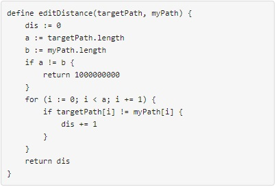
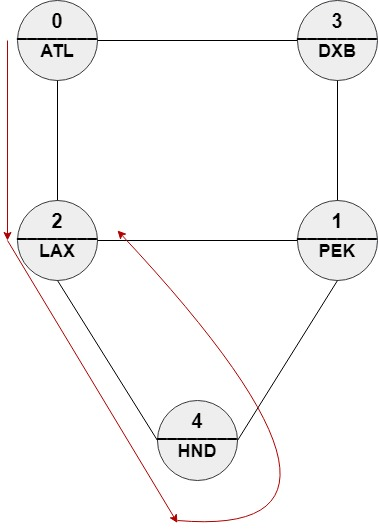
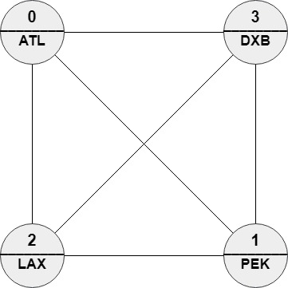

1548. The Most Similar Path in a Graph

We have `n` cities and `m` bi-directional roads where `roads[i] = [ai, bi]` connects city `ai` with city `bi`. Each city has a name consisting of exactly 3 upper-case English letters given in the string array `names`. Starting at any city `x`, you can reach any city `y` where `y != x` (i.e. the cities and the roads are forming an undirected connected graph).

You will be given a string array `targetPath`. You should find a path in the graph of the **same length** and with the **minimum edit distance** to `targetPath`.

You need to return the order of the nodes in the path with the minimum edit distance, The path should be of the same length of `targetPath` and should be valid (i.e. there should be a direct road between `ans[i]` and `ans[i + 1]`). If there are multiple answers return any one of them.

The **edit distance** is defined as follows:



**Follow-up:** If each node can be visited only once in the path, What should you change in your solution?

 

**Example 1:**


```
Input: n = 5, roads = [[0,2],[0,3],[1,2],[1,3],[1,4],[2,4]], names = ["ATL","PEK","LAX","DXB","HND"], targetPath = ["ATL","DXB","HND","LAX"]
Output: [0,2,4,2]
Explanation: [0,2,4,2], [0,3,0,2] and [0,3,1,2] are accepted answers.
[0,2,4,2] is equivalent to ["ATL","LAX","HND","LAX"] which has edit distance = 1 with targetPath.
[0,3,0,2] is equivalent to ["ATL","DXB","ATL","LAX"] which has edit distance = 1 with targetPath.
[0,3,1,2] is equivalent to ["ATL","DXB","PEK","LAX"] which has edit distance = 1 with targetPath.
```

**Example 2:**


```
Input: n = 4, roads = [[1,0],[2,0],[3,0],[2,1],[3,1],[3,2]], names = ["ATL","PEK","LAX","DXB"], targetPath = ["ABC","DEF","GHI","JKL","MNO","PQR","STU","VWX"]
Output: [0,1,0,1,0,1,0,1]
Explanation: Any path in this graph has edit distance = 8 with targetPath.
```

**Example 3:**


```
Input: n = 6, roads = [[0,1],[1,2],[2,3],[3,4],[4,5]], names = ["ATL","PEK","LAX","ATL","DXB","HND"], targetPath = ["ATL","DXB","HND","DXB","ATL","LAX","PEK"]
Output: [3,4,5,4,3,2,1]
Explanation: [3,4,5,4,3,2,1] is the only path with edit distance = 0 with targetPath.
It's equivalent to ["ATL","DXB","HND","DXB","ATL","LAX","PEK"]
```

**Constraints:**

* `2 <= n <= 100`
* `m == roads.length`
* `n - 1 <= m <= (n * (n - 1) / 2)`
* `0 <= ai, bi <= n - 1`
* `ai != bi`
* The graph is guaranteed to be connected and each pair of nodes may have **at most** one direct road.
* `names.length == n`
* `names[i].length == 3`
* `names[i]` consists of upper-case English letters.
* There can be two cities with **the same** name.
* `1 <= targetPath.length <= 100`
* `targetPath[i].length == 3`
* `targetPath[i]` consists of upper-case English letters.

# Submissions
---
**Solution 1: (DP Top-Down)**
```
Runtime: 3636 ms
Memory Usage: 23.4 MB
```
```python
class Solution:
    def mostSimilar(self, n: int, roads: List[List[int]], names: List[str], targetPath: List[str]) -> List[int]:
        # Build the adjacency graph
        adj = collections.defaultdict(set)
        for e in roads:
            adj[e[0]].add(e[1])
            adj[e[1]].add(e[0])
            
        # G is the graph built from the adjacency information from roads.
        # Let's define f(i, u) to return the tuple (edit_distance, best_subpath) where `best_subpath` is some path in
        # G such that when compared with targetPath[i..len(targetPath)-1], it differs minimally with
        # by `edit_distance` nodes. `u` is the i-1 th node we just chose immediately before `best_subpath`.
        # f(i, u) = f(i + 1, v) + (1 if names[v] != targetPath[i] else 0)
        @functools.lru_cache(None)
        def f(i, u):
            if i == len(targetPath):
                return 0, []
            
            min_cost = float('inf')
            best_path = []
            # If `u` is the node we've just chosen for the best path, we then simply need to tac on
            # the best subpath starting from some neighbor of `u`. Since we don't know which one
            # of the neighbors of `u` yields the minimum difference, we'll try all of its neighbors!
            # And of course if `u` is None, it means we've not chosen a previous node. So this means
            # `v` is going to be the first node in the best path, we'll have to start with every node in 
			# the graph and see who leads to the best overall path.
            neighbors = adj[u] if u != None else range(n)
            for v in neighbors:
                cost, sub_path = f(i + 1, v)             
                if names[v] != targetPath[i]:
                    cost += 1
                if cost < min_cost:
                    min_cost = cost
                    best_path = [v] + sub_path

            return (min_cost, best_path)
        
        cost, path = f(0, None)
        return path
```

**Solution 2: (DP Bottom-Up)**
```
Runtime: 3208 ms
Memory Usage: 15.9 MB
```
```python
class Solution:
    def mostSimilar(self, n: int, roads: List[List[int]], names: List[str], targetPath: List[str]) -> List[int]:
        # For the dp-approach, it's the same idea as the recursive top-down approach but bottoms-up. (So the
        # recurrence is f(i) = f(i-1) instead of f(i) = f(i+1). And we want f(len(targetPath)-1) as the answer,
        # not f(0) as the answer)
        #
        # Define f[i][u] to be the edit distance of the best path in G with i+1 nodes, where u is the i-th node
        # in the best path found in G.
        # f[i][u] = f[i-1][v] + (1 if names[u] != targetPath[i] else 0)
        
        adj = collections.defaultdict(set)
        for e in roads:
            adj[e[0]].add(e[1])
            adj[e[1]].add(e[0])
            
        f = [None] * len(targetPath)
        f[0] = [None] * n
        for v in range(n):
            f[0][v] = (1, v) if names[v] != targetPath[0] else (0, v)
            
        for i in range(1, len(targetPath)):
            f[i] = [None] * n
            for v in range(n):
                f[i][v] = (float('inf'), '')
                # u is the prev hop in the best path to v
                for u in adj[v]:
                    cost = f[i-1][u][0] + (1 if names[v] != targetPath[i] else 0)
                    if cost < f[i][v][0]:
                        f[i][v] = (cost, u)
        
        min_cost = float('inf')
        best_hop = None
        for u in range(0, len(f[-1])):
            if f[-1][u][0] < min_cost:
                min_cost = f[-1][u][0]
                best_hop = u
                
        best_path = [best_hop]
        for i in range(len(targetPath) - 1, 0, -1):
            prev_hop = f[i][best_hop][1]
            best_path.insert(0, prev_hop)
            best_hop = prev_hop
        return best_path
```