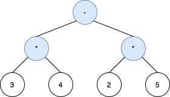
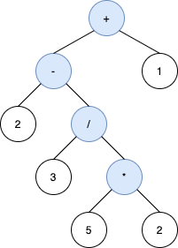
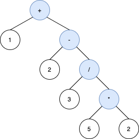

1597. Build Binary Expression Tree From Infix Expression

A binary expression tree is a kind of binary tree used to represent arithmetic expressions. Each node of a binary expression tree has either zero or two children. Leaf nodes (nodes with 0 children) correspond to operands (numbers), and internal nodes (nodes with 2 children) correspond to the operators `'+'` (addition), `'-'` (subtraction), '*' (multiplication), and `'/'` (division).

For each internal node with operator `o`, the infix expression that it represents is (`A o B`), where `A` is the expression the left subtree represents and `B` is the expression the right subtree represents.

You are given a string `s`, an **infix expression** containing operands, the operators described above, and parentheses `'('` and `')'`.

Return any valid **binary expression tree**, which its in-order traversal reproduces `s` after omitting the parenthesis from it (see examples below).

**Please note that order of operations applies in `s`**. That is, expressions in parentheses are evaluated first, and multiplication and division happen before addition and subtraction.

Operands must also appear in the same order in both `s` and the in-order traversal of the tree.

 

**Example 1:**


```
Input: s = "3*4-2*5"
Output: [-,*,*,3,4,2,5]
Explanation: The tree above is the only valid tree whose inorder traversal produces s.
```

**Example 2:**


```
Input: s = "2-3/(5*2)+1"
Output: [+,-,1,2,/,null,null,null,null,3,*,null,null,5,2]
Explanation: The inorder traversal of the tree above is 2-3/5*2+1 which is the same as s without the parenthesis. The tree also produces the correct result and its operands are in the same order as they appear in s.
The tree below is also a valid binary expression tree with the same inorder traversal as s, but it not a valid answer because it does not evaluate to the same value.
```
~[1597_ex1-1.png](img/1597_ex1-1.png)
```
The third tree below is also not valid. Although it produces the same result and is equivalent to the above trees, its inorder traversal does not produce s and its operands are not in the same order as s.
```


**Example 3:**
```
Input: s = "1+2+3+4+5"
Output: [+,+,5,+,4,null,null,+,3,null,null,1,2]
Explanation: The tree [+,+,5,+,+,null,null,1,2,3,4] is also one of many other valid trees.
```

**Constraints:**

* `1 <= s.length <= 1000`
* `s` consists of digits and the characters `'+'`, `'-'`, `'*'`, and `'/'`.
* Operands in `s` are **exactly** `1` digit.
* It is guaranteed that `s` is a valid expression.

# Submissions
---
**Solution 1: (DFS)**
```
Runtime: 4 ms
Memory Usage: 10.5 MB
```
```c++
/**
 * Definition for a binary tree node.
 * struct Node {
 *     char val;
 *     Node *left;
 *     Node *right;
 *     Node() : val(' '), left(nullptr), right(nullptr) {}
 *     Node(char x) : val(x), left(nullptr), right(nullptr) {}
 *     Node(char x, Node *left, Node *right) : val(x), left(left), right(right) {}
 * };
 */
bool check_plus_minus(char c) {
    return c == '+' || c == '-';
}

bool check_mul(char c) {
    return c == '*';
}

bool check_div(char c) {
    return c == '/';
}
class Solution {
public:
    Node* process(string s, int n, bool (*checker)(char)) {
        int in = 0; // to keep track when we are inside any parenthesis
        for (int i = n-1; i >= 0; i--) {
            char c = s[i];
            if (c == ')')
                in++;
            if (c == '(')
                in--;
            
            if (in) continue; // if inside a parenthesis, continue
            
            if ( checker(c) ) {
                Node *res = new Node(c);
                res->left = expTree(s.substr(0, i));
                res->right = expTree(s.substr(i+1));
                return res;
            }
        }
        return nullptr;
    }
    
    Node* expTree(string s) {
        int n = s.size();
        Node *res;

        if (n == 1)
            return new Node(s[0]);
        
        // checking for (expression)+(expression)
        //           or (expression)-(expression)
        // from left
        res = process(s, n, &check_plus_minus);
        if (res) return res;
        
        // checking for (expression)*(expression)
        // from left
        res = process(s, n, &check_mul);
        if (res) return res;
        
        // checking for (expression)/(expression)
        // from left
        res = process(s, n, &check_div);        
        if (res) return res;
        
        // must be of the form (expression)
        return expTree(s.substr(1, n-2));
    }
};
```

**Solution 2: (DFS)**
```
Runtime: 32 ms
Memory Usage: 14.4 MB
```
```python
# Definition for a binary tree node.
# class Node(object):
#     def __init__(self, val=" ", left=None, right=None):
#         self.val = val
#         self.left = left
#         self.right = right
class Solution:
    def expTree(self, s: str) -> 'Node':
        n = len(s)
        if n == 1:
            return Node(s)

        fstOpIdx = None
        kets = 0
        for i in range(n-1, 0, -1):
            if s[i] == ")":
                kets += 1
            elif s[i] == "(":
                kets -= 1
            elif kets == 0:
                if s[i] in "+-":
                    fstOpIdx = i
                    break
                elif s[i] in "*/" and fstOpIdx is None:
                    fstOpIdx = i
        if fstOpIdx is None:
            return self.expTree(s[1:-1])
        rtNd = Node(s[fstOpIdx])
        rtNd.left = self.expTree(s[:fstOpIdx])
        rtNd.right = self.expTree(s[fstOpIdx+1:])
        return rtNd
```