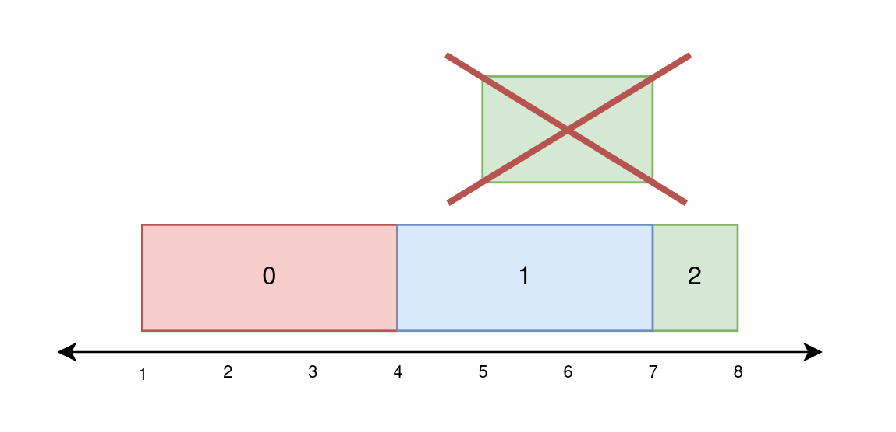
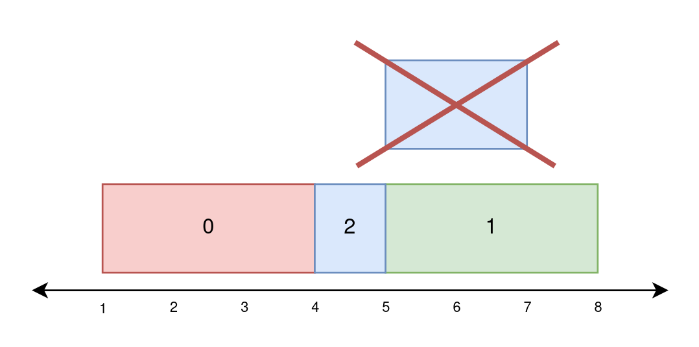
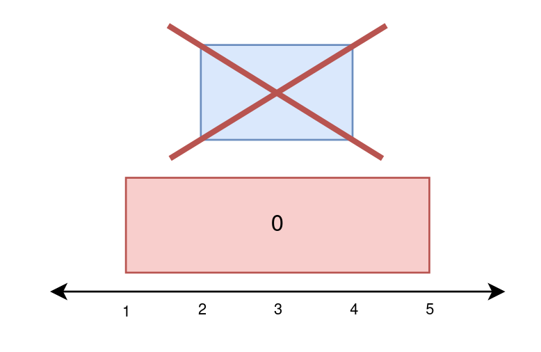

2158. Amount of New Area Painted Each Day

There is a long and thin painting that can be represented by a number line. You are given a 0-indexed 2D integer array `paint` of length `n`, where `paint[i] = [starti, endi]`. This means that on the ith day you need to paint the area **between** `starti` and `endi`.

Painting the same area multiple times will create an uneven painting so you only want to paint each area of the painting at most once.

Return an integer array `worklog` of length `n`, where `worklog[i]` is the amount of new area that you painted on the `i`th day.

 

**Example 1:**


```
Input: paint = [[1,4],[4,7],[5,8]]
Output: [3,3,1]
Explanation:
On day 0, paint everything between 1 and 4.
The amount of new area painted on day 0 is 4 - 1 = 3.
On day 1, paint everything between 4 and 7.
The amount of new area painted on day 1 is 7 - 4 = 3.
On day 2, paint everything between 7 and 8.
Everything between 5 and 7 was already painted on day 1.
The amount of new area painted on day 2 is 8 - 7 = 1. 
```

**Example 2:**


```
Input: paint = [[1,4],[5,8],[4,7]]
Output: [3,3,1]
Explanation:
On day 0, paint everything between 1 and 4.
The amount of new area painted on day 0 is 4 - 1 = 3.
On day 1, paint everything between 5 and 8.
The amount of new area painted on day 1 is 8 - 5 = 3.
On day 2, paint everything between 4 and 5.
Everything between 5 and 7 was already painted on day 1.
The amount of new area painted on day 2 is 5 - 4 = 1. 
```

**Example 3:**


```
Input: paint = [[1,5],[2,4]]
Output: [4,0]
Explanation:
On day 0, paint everything between 1 and 5.
The amount of new area painted on day 0 is 5 - 1 = 4.
On day 1, paint nothing because everything between 2 and 4 was already painted on day 0.
The amount of new area painted on day 1 is 0.
```

**Constraints:**

* `1 <= paint.length <= 10^5`
* `paint[i].length == 2`
* `0 <= starti < endi <= 5 * 10^4`

# Submissions
---
**Solution 1: (Line Sweep)**

    1  2  3  4  5  6  7  8
             ^
    -------  -------  -
    {1,t}    {4,f}
             {4,t}    (7,f)
                {5,t}    {8,f}
    {0}----  {1}------  
                {1,2}
                       {2}

```
Runtime: 243 ms, Beats 30.44%
Memory: 196.84 MB, Beats 15.53%
```
```c++
class Solution {
public:
    vector<int> amountPainted(vector<vector<int>>& paint) {
        int maxEnd = (*max_element(paint.begin(),paint.end(),[](vector<int> &l, vector<int> &r) -> bool { return l[1] < r[1]; }))[1];
        vector<int> res(paint.size());
        vector<vector<pair<int, bool>>> wall(maxEnd + 1);
        for (int i = 0; i < paint.size(); i++) {
            wall[paint[i][0]].push_back(make_pair(i, true));
            wall[paint[i][1]].push_back(make_pair(i, false));
        }
        set<int> layers;
        for (int i = 0; i < maxEnd; i++) {
            for (auto &[index, doesEnter]: wall[i]) {
                if (doesEnter) {
                    layers.insert(index);
                } else {
                    layers.erase(index);
                }
            }
            if (!layers.empty()) {
                res[*(layers.begin())] += 1;
            }
        }
        return res;
    }
};
```
