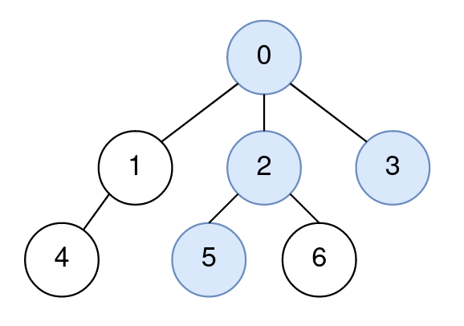
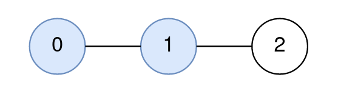
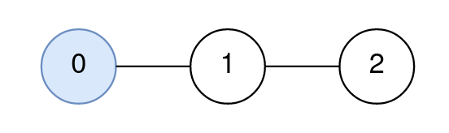

2277. Closest Node to Path in Tree

You are given a positive integer `n` representing the number of nodes in a tree, numbered from `0` to `n - 1` (inclusive). You are also given a 2D integer array `edges` of length `n - 1`, where `edges[i] = [node1i, node2i]` denotes that there is a bidirectional edge connecting `node1i` and `node2i` in the tree.

You are given a **0-indexed** integer array `query` of length `m` where `query[i] = [starti, endi, nodei]` means that for the `i`th query, you are tasked with finding the node on the path from `starti` to `endi` that is closest to `nodei`.

Return an integer array `answer` of length `m`, where `answer[i]` is the answer to the ith query.

 

**Example 1:**


```
Input: n = 7, edges = [[0,1],[0,2],[0,3],[1,4],[2,5],[2,6]], query = [[5,3,4],[5,3,6]]
Output: [0,2]
Explanation:
The path from node 5 to node 3 consists of the nodes 5, 2, 0, and 3.
The distance between node 4 and node 0 is 2.
Node 0 is the node on the path closest to node 4, so the answer to the first query is 0.
The distance between node 6 and node 2 is 1.
Node 2 is the node on the path closest to node 6, so the answer to the second query is 2.
```

**Example 2:**


```
Input: n = 3, edges = [[0,1],[1,2]], query = [[0,1,2]]
Output: [1]
Explanation:
The path from node 0 to node 1 consists of the nodes 0, 1.
The distance between node 2 and node 1 is 1.
Node 1 is the node on the path closest to node 2, so the answer to the first query is 1.
```

**Example 3:**


```
Input: n = 3, edges = [[0,1],[1,2]], query = [[0,0,0]]
Output: [0]
Explanation:
The path from node 0 to node 0 consists of the node 0.
Since 0 is the only node on the path, the answer to the first query is 0.
```

**Constraints:**

* `1 <= n <= 1000`
* `edges.length == n - 1`
* `edges[i].length == 2`
* `0 <= node1i, node2i <= n - 1`
* `node1i != node2i`
* `1 <= query.length <= 1000`
* `query[i].length == 3`
* `0 <= starti, endi, nodei <= n - 1`
* The graph is a tree.

# Submissions
---
**Solution 1: (create distance matrix then dfs from start to end to find shoest distance, O(n * n + m * n))**

We are shooting for a simple solution here. We use an adjacency list al to track neighbors. We also use an adjacency matrix am.

After we populate al, we use dfs to fill am with the shortest distance from a given node to all other nodes. This takes O(n * n) time.

Then, for each query, we use am to go straight for start to end - with each step, we pick one node that is closer to end.

As we ride along the way, we track the closest node to a target.

```
Runtime: 189 ms
Memory: 37.7 MB
```
```c++
class Solution {
    void dfs(int v, int start, int cur, vector<vector<int>> &g, vector<vector<int>> &dist) {
        dist[start][v] = cur;
        for (auto nv : g[v])
            if (dist[start][nv] == -1)
                dfs(nv, start, cur + 1, g, dist);
    }
    int dfs_closest(int v, int end, int node, int res, vector<vector<int>> &g, vector<vector<int>> &dist) {
        for (auto nv : g[v])
            if (dist[v][end] > dist[nv][end])
                return dfs_closest(nv, end, node, dist[res][node] < dist[nv][node] ? res : nv, g, dist);
        return res;
    }     
public:
    vector<int> closestNode(int n, vector<vector<int>>& edges, vector<vector<int>>& query) {
        vector<int> res;
        vector<vector<int>> g(n), dist(n, vector<int>(n, -1));
        for (auto &e : edges) {
            g[e[0]].push_back(e[1]);
            g[e[1]].push_back(e[0]);
        }
        for (int i = 0; i < n; ++i)
            dfs(i, i, 0, g, dist);
        for (auto &q : query)
            res.push_back(dfs_closest(q[0], q[1], q[2], q[0], g, dist));
        return res;
    }
};
```

**Solution 2: (DFS, BFS)**
```
Runtime: 123 ms, Beats 52.38%
Memory: 45.69 MB, Beats 66.67%
```
```c++
class Solution {
    bool dfs(int u, int t, vector<bool> &visited, vector<int> &p, vector<vector<int>> &g) {
        visited[u] = true;
        p.push_back(u);
        if (u == t) {
            return true;
        }
        for (auto &v: g[u]) {
            if (!visited[v]) {
                if (dfs(v, t, visited, p, g)) {
                    return true;
                }
            }
        }
        p.pop_back();
        return false;
    } 
public:
    vector<int> closestNode(int n, vector<vector<int>>& edges, vector<vector<int>>& query) {
        vector<vector<int>> g(n);
        vector<int> p, ans;
        vector<bool> visited(n);
        queue<array<int, 2>> q;
        for (auto &e: edges) {
            g[e[0]].push_back(e[1]);
            g[e[1]].push_back(e[0]);
        }
        for (auto qv: query) {
            int &start = qv[0];
            int &end = qv[1];
            int &node = qv[2];
            dfs(start, end, visited, p, g);
            fill(visited.begin(), visited.end(), false);
            for (auto &v: p) {
                q.push({v, v});
                visited[v] = true;
            }
            p.clear();
            while (q.size()) {
                auto [u, s] = q.front();
                q.pop();
                if (u == node) {
                    ans.push_back(s);
                    break;
                }
                for (auto &v: g[u]) {
                    if (!visited[v]) {
                        visited[v] = true;
                        q.push({v, s});
                    }
                }
            }
            while (q.size()) {
                q.pop();
            }
            fill(visited.begin(), visited.end(), false);
        }
        return ans;
    }
};
```
