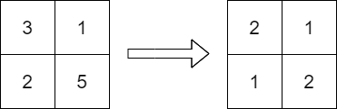

2371. Minimize Maximum Value in a Grid

You are given an `m x n` integer matrix `grid` containing distinct positive integers.

You have to replace each integer in the matrix with a positive integer satisfying the following conditions:

* The **relative** order of every two elements that are in the same row or column should stay the same after the replacements.
* The **maximum** number in the matrix after the replacements should be as small as possible.

The relative order stays the same if for all pairs of elements in the original matrix such that `grid[r1][c1] > grid[r2][c2]` where either `r1 == r2` or `c1 == c2`, then it must be true that `grid[r1][c1] > grid[r2][c2]` after the replacements.

For example, if `grid = [[2, 4, 5], [7, 3, 9]]` then a good replacement could be either `grid = [[1, 2, 3], [2, 1, 4]]` or `grid = [[1, 2, 3], [3, 1, 4]]`.

Return the **resulting** matrix. If there are multiple answers, return any of them.

 

**Example 1:**


```
Input: grid = [[3,1],[2,5]]
Output: [[2,1],[1,2]]
Explanation: The above diagram shows a valid replacement.
The maximum number in the matrix is 2. It can be shown that no smaller value can be obtained.
```

**Example 2:**
```
Input: grid = [[10]]
Output: [[1]]
Explanation: We replace the only number in the matrix with 1.
```

**Constraints:**

* `m == grid.length`
* `n == grid[i].length`
* `1 <= m, n <= 1000`
* `1 <= m * n <= 105`
* `1 <= grid[i][j] <= 10^9`
* `grid` consists of distinct integers.

# Submissions
---
**Solution 1: (Sort, Hash Table)**

    1     4/2   9/6
    6/4   3/1   8/5
    7/5   5/3   2/1

    1->{0.0}
    2->{2,2}
    3->{1,1}
    4->{0,1}

```
Runtime: 32 ms, Beats 98.28%
Memory: 50.24 MB, Beats 60.34%
```
```c++
class Solution {
public:
    vector<vector<int>> minScore(vector<vector<int>>& grid) {
        int m = grid.size(), n = grid[0].size(), i, j;
        vector<tuple<int,int,int>> dp;
        vector<int> r(m), c(n);
        vector<vector<int>> ans(m, vector<int>(n));
        for (i = 0; i < m; i ++) {
            for (j = 0; j < n; j ++) {
                dp.push_back({grid[i][j], i, j});
            }
        }
        sort(dp.begin(), dp.end());
        for (auto [a, i, j]: dp) {
            ans[i][j] = max(r[i], c[j]) + 1;
            r[i] = ans[i][j];
            c[j] = ans[i][j];
        }
        return ans;
    }
};
```
