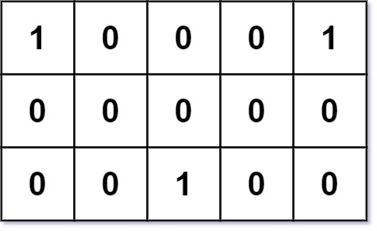

296. Best Meeting Point

Given an `m x n` binary grid `grid` where each `1` marks the home of one friend, return the minimal **total travel distance**.

The **total travel distance** is the sum of the distances between the houses of the friends and the meeting point.

The distance is calculated using Manhattan Distance, where `distance(p1, p2) = |p2.x - p1.x| + |p2.y - p1.y|`.

 

**Example 1:**


```
Input: grid = [[1,0,0,0,1],[0,0,0,0,0],[0,0,1,0,0]]
Output: 6
Explanation: Given three friends living at (0,0), (0,4), and (2,2).
The point (0,2) is an ideal meeting point, as the total travel distance of 2 + 2 + 2 = 6 is minimal.
So return 6.
```

**Example 2:**
```
Input: grid = [[1,1]]
Output: 1
```

**Constraints:**

* `m == grid.length`
* `n == grid[i].length`
* `1 <= m, n <= 200`
* `grid[i][j]` is either `0` or `1`.
* There will be at least two friends in the `grid`.

# Submissions
---
**Solution 1: (Sort)**
```
Runtime: 13 ms
Memory: 12.1 MB
```
```c++
class Solution {
public:
    int minTotalDistance(vector<vector<int>>& grid) {
        vector<int> x_coords, y_coords;
        for (int i = 0; i < grid.size(); i++) {
            for (int j = 0; j < grid[0].size(); j++) {
                if (grid[i][j] == 1) {
                    x_coords.push_back(i);
                    y_coords.push_back(j);
                }
            }
        }
        
        sort(x_coords.begin(), x_coords.end());
        sort(y_coords.begin(), y_coords.end());
        
        int x_median = x_coords[x_coords.size() / 2];
        int y_median = y_coords[y_coords.size() / 2];
        
        int sum = 0;
        for(int i = 0; i < x_coords.size(); i++)
            sum += abs(x_coords[i] - x_median) + abs(y_coords[i] - y_median);
        
        return sum;
    }
};
```
