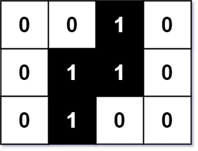

302. Smallest Rectangle Enclosing Black Pixels

You are given an `m x n` binary matrix `image` where `0` represents a white pixel and `1` represents a black pixel.

The black pixels are connected (i.e., there is only one black region). Pixels are connected horizontally and vertically.

Given two integers `x` and `y` that represents the location of one of the black pixels, return the area of the smallest (axis-aligned) rectangle that encloses all black pixels.

You must write an algorithm with less than `O(mn)` runtime complexity

 

**Example 1:**


```
Input: image = [["0","0","1","0"],["0","1","1","0"],["0","1","0","0"]], x = 0, y = 2
Output: 6
```

**Example 2:**
```
Input: image = [["1"]], x = 0, y = 0
Output: 1
```

**Constraints:**

* `m == image.length`
* `n == image[i].length`
* `1 <= m, n <= 100`
* `image[i][j]` is either `'0'` or `'1'`.
* `0 <= x < m`
* `0 <= y < n`
* `image[x][y] == '1'`.
* The black pixels in the `image` only form one component.

# Submissions
---
**Solution 1: (Binary Search, O(mlogn + nlogm))**


      ^ . . 1 . . <t
      x . 1 1 1 .
      v . 1 1 1 .
        . . 1 . .
        . . . . . <b
          ^l    ^r
        < y >

```
Runtime: 0 ms, Beats 100.00%
Memory: 20.22 MB, Beats 76.34%
```
```c++
class Solution {
    int searchColumns(vector<vector<char>>& image, int i, int j, int top, int bottom, bool whiteToBlack) {
        while (i != j) {
            int k = top, mid = (i + j) / 2;
            while (k < bottom && image[k][mid] == '0') ++k;
            if ((k < bottom) == whiteToBlack) // k < bottom means the column mid has black pixel
                j = mid; //search the boundary in the smaller half
            else
                i = mid + 1; //search the boundary in the greater half
        }
        return i;
    }
    int searchRows(vector<vector<char>>& image, int i, int j, int left, int right, bool whiteToBlack) {
        while (i != j) {
            int k = left, mid = (i + j) / 2;
            while (k < right && image[mid][k] == '0') ++k;
            if ((k < right) == whiteToBlack) // k < right means the row mid has black pixel
                j = mid;
            else
                i = mid + 1;
        }
        return i;
    }
public:
    int minArea(vector<vector<char>>& image, int x, int y) {
        int m = image.size(), n = image[0].size();
        int left = searchColumns(image, 0, y, 0, m, true);
        int right = searchColumns(image, y + 1, n, 0, m, false);
        int top = searchRows(image, 0, x, left, right, true);
        int bottom = searchRows(image, x + 1, m, left, right, false);
        return (right - left) * (bottom - top);
    }
};
```
