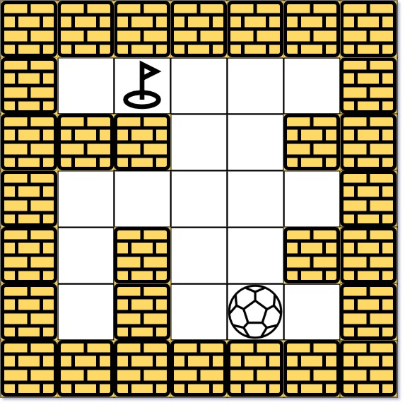
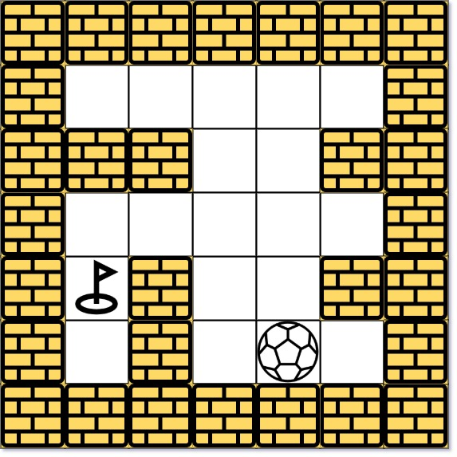

499. The Maze III

There is a ball in a maze with empty spaces (represented as `0`) and walls (represented as `1`). The ball can go through the empty spaces by rolling **up**, **down**, **left** or **right**, but it won't stop rolling until hitting a wall. When the ball stops, it could choose the next direction. There is also a hole in this maze. The ball will drop into the hole if it rolls onto the `hole`.

Given the `m x n` `maze`, the ball's position `ball` and the hole's position `hole`, where `ball = [ballrow, ballcol]` and `hole = [holerow, holecol]`, return a string `instructions` of all the instructions that the ball should follow to drop in the hole with the shortest distance possible. If there are multiple valid instructions, return the **lexicographically minimum** one. If the ball can't drop in the hole, return `"impossible"`.

If there is a way for the ball to drop in the hole, the answer instructions should contain the characters 'u' (i.e., up), 'd' (i.e., down), 'l' (i.e., left), and 'r' (i.e., right).

The distance is the number of empty spaces traveled by the ball from the start position (excluded) to the destination (included).

You may assume that **the borders of the maze are all walls** (see examples).

 

**Example 1:**


```
Input: maze = [[0,0,0,0,0],[1,1,0,0,1],[0,0,0,0,0],[0,1,0,0,1],[0,1,0,0,0]], ball = [4,3], hole = [0,1]
Output: "lul"
Explanation: There are two shortest ways for the ball to drop into the hole.
The first way is left -> up -> left, represented by "lul".
The second way is up -> left, represented by 'ul'.
Both ways have shortest distance 6, but the first way is lexicographically smaller because 'l' < 'u'. So the output is "lul".
```

**Example 2:**


```
Input: maze = [[0,0,0,0,0],[1,1,0,0,1],[0,0,0,0,0],[0,1,0,0,1],[0,1,0,0,0]], ball = [4,3], hole = [3,0]
Output: "impossible"
Explanation: The ball cannot reach the hole.
```

**Example 3:**
```
Input: maze = [[0,0,0,0,0,0,0],[0,0,1,0,0,1,0],[0,0,0,0,1,0,0],[0,0,0,0,0,0,1]], ball = [0,4], hole = [3,5]
Output: "dldr"
```

**Constraints:**

* `m == maze.length`
* `n == maze[i].length`
* `1 <= m, n <= 100`
* `maze[i][j]` is `0` or `1`.
* `ball.length == 2`
* `hole.length == 2`
* `0 <= ballrow, holerow <= m`
* `0 <= ballcol, holecol <= n`
* Both the `ball` and the `hole` exist in an empty space, and they will not be in the same position initially.
* The `maze` contains at least `2` empty spaces.

# Submissions
---
**Solution 1: (Dijkstra)**
```
Runtime: 10 ms
Memory: 11.5 MB
```
```c++
class Solution {
    int dr[4] = {0, 1,  0, -1};
    int dc[4] = {1, 0, -1,  0};
    string ds = "rdlu";
public:
    string findShortestWay(vector<vector<int>>& maze, vector<int>& ball, vector<int>& hole) {
        int m = maze.size(), n = maze[0].size();
        priority_queue<tuple<int,string,int,int>, vector<tuple<int,string,int,int>>, greater<tuple<int,string,int,int>>> pq;
        vector<vector<int>> dist(m, vector<int>(n, INT_MAX));
        int nr, nc, dw;
        pq.push({0, "", ball[0], ball[1]});
        dist[ball[0]][ball[1]] = 0;
        while (pq.size()) {
            auto [w, p, r, c] = pq.top();
            pq.pop();
            if (r == hole[0] && c == hole[1]) {
                return p;
            }
            for (int i = 0; i < 4; i ++) {
                dw = 0;
                nr = r;
                nc = c;
                while (0 <= nr+dr[i] && nr+dr[i] < m && 0 <= nc+dc[i] && nc+dc[i] < n && maze[nr+dr[i]][nc+dc[i]] == 0) {
                    nr += dr[i];
                    nc += dc[i];
                    dw += 1;
                    if (nr == hole[0] && nc == hole[1]) {
                        break;
                    }
                }
                if ((nr != r || nc!= c) && dist[nr][nc] >= dist[r][c] + dw) {
                    pq.push({dist[r][c]+dw, p+ds[i],nr, nc});
                    dist[nr][nc] = dist[r][c] + dw;
                }
            }
        }
        return "impossible";
    }
};
```
