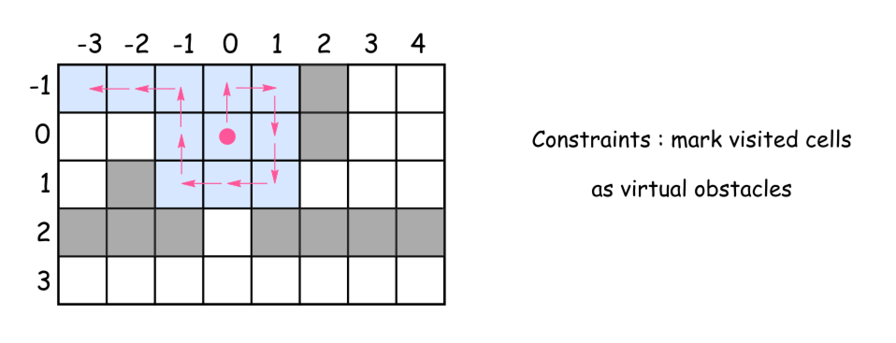
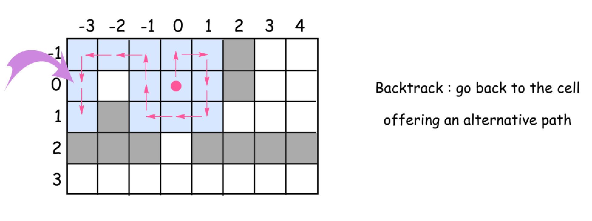
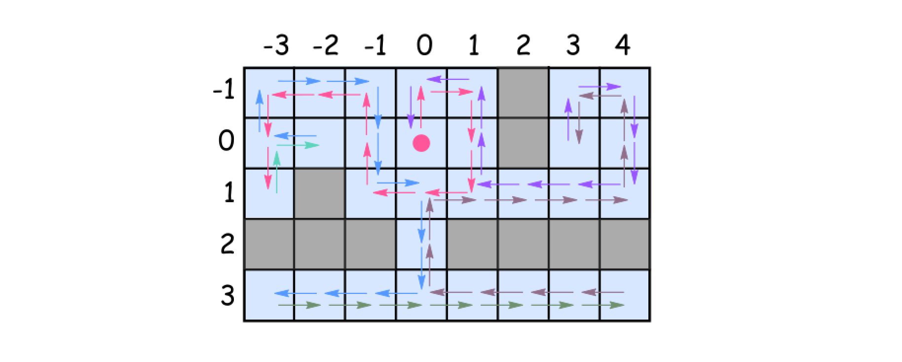

489. Robot Room Cleaner

Given a robot cleaner in a room modeled as a grid.

Each cell in the grid can be empty or blocked.

The robot cleaner with 4 given APIs can move forward, turn left or turn right. Each turn it made is 90 degrees.

When it tries to move into a blocked cell, its bumper sensor detects the obstacle and it stays on the current cell.

Design an algorithm to clean the entire room using only the 4 given APIs shown below.
```
interface Robot {
  // returns true if next cell is open and robot moves into the cell.
  // returns false if next cell is obstacle and robot stays on the current cell.
  boolean move();

  // Robot will stay on the same cell after calling turnLeft/turnRight.
  // Each turn will be 90 degrees.
  void turnLeft();
  void turnRight();

  // Clean the current cell.
  void clean();
}
```

**Example:**
```
Input:
room = [
  [1,1,1,1,1,0,1,1],
  [1,1,1,1,1,0,1,1],
  [1,0,1,1,1,1,1,1],
  [0,0,0,1,0,0,0,0],
  [1,1,1,1,1,1,1,1]
],
row = 1,
col = 3

Explanation:
All grids in the room are marked by either 0 or 1.
0 means the cell is blocked, while 1 means the cell is accessible.
The robot initially starts at the position of row=1, col=3.
From the top left corner, its position is one row below and three columns right.
```

**Notes:**

* The input is only given to initialize the room and the robot's position internally. You must solve this problem "blindfolded". In other words, you must control the robot using only the mentioned 4 APIs, without knowing the room layout and the initial robot's position.
* The robot's initial position will always be in an accessible cell.
* The initial direction of the robot will be facing up.
* All accessible cells are connected, which means the all cells marked as 1 will be accessible by the robot.
* Assume all four edges of the grid are all surrounded by wall.

# Solution
---
## Approach 1: Spiral Backtracking
Concepts to use

Let's use here two programming concepts.

>The first one is called constrained programming.

That basically means to put restrictions after each robot move. Robot moves, and the cell is marked as `visited`. That propagates constraints and helps to reduce the number of combinations to consider.



>The second one called backtracking.

Let's imagine that after several moves the robot is surrounded by the visited cells. But several steps before there was a cell which proposed an alternative path to go. That path wasn't used and hence the room is not yet cleaned up. What to do? To backtrack. That means to come back to that cell, and to explore the alternative path.



**Intuition**

This solution is based on the same idea as maze solving algorithm called right-hand rule. Go forward, cleaning and marking all the cells on the way as visited. At the obstacle turn right, again go forward, etc. Always turn right at the obstacles and then go forward. Consider already visited cells as virtual obstacles.

>What do do if after the right turn there is an obstacle just in front ?

Turn right again.

>How to explore the alternative paths from the cell ?

Go back to that cell and then turn right from your last explored direction.

>When to stop ?

Stop when you explored all possible paths, i.e. all `4` directions (up, right, down, and left) for each visited cell.

**Algorithm**

Time to write down the algorithm for the backtrack function backtrack(cell = (0, 0), direction = 0).

* Mark the cell as visited and clean it up.

* Explore `4` directions : `up`, `right`, `down`, and `left` (the order is important since the idea is always to turn right) :

    * Check the next cell in the chosen direction :

        * If it's not visited yet and there is no obtacles :

            * Move forward.

            * Explore next cells backtrack(new_cell, new_direction).

            * Backtrack, i.e. go back to the previous cell.

        * Turn right because now there is an obstacle (or a virtual obstacle) just in front.

**Implementation**



```python
class Solution(object):       
    def cleanRoom(self, robot):
        """
        :type robot: Robot
        :rtype: None
        """
        def go_back():
            robot.turnRight()
            robot.turnRight()
            robot.move()
            robot.turnRight()
            robot.turnRight()
            
        def backtrack(cell = (0, 0), d = 0):
            visited.add(cell)
            robot.clean()
            # going clockwise : 0: 'up', 1: 'right', 2: 'down', 3: 'left'
            for i in range(4):
                new_d = (d + i) % 4
                new_cell = (cell[0] + directions[new_d][0], \
                            cell[1] + directions[new_d][1])
                
                if not new_cell in visited and robot.move():
                    backtrack(new_cell, new_d)
                    go_back()
                # turn the robot following chosen direction : clockwise
                robot.turnRight()
    
        # going clockwise : 0: 'up', 1: 'right', 2: 'down', 3: 'left'
        directions = [(-1, 0), (0, 1), (1, 0), (0, -1)]
        visited = set()
        backtrack()
```

**Complexity Analysis**

* Time complexity : $\mathcal{O}(4^{N - M})$, where $N$ is a number of cells in the room and $M$ is a number of obstacles, because for each cell the algorithm checks 4 directions.

* Space complexity : $\mathcal{O}(N - M)$, where $N$ is a number of cells in the room and $M$ is a number of obstacles, to track visited cells.

# Submissions
---
**Solution 1: (Backtracking)**
```
Runtime: 76 ms
Memory Usage: 15.1 MB
```
```python
# """
# This is the robot's control interface.
# You should not implement it, or speculate about its implementation
# """
#class Robot:
#    def move(self):
#        """
#        Returns true if the cell in front is open and robot moves into the cell.
#        Returns false if the cell in front is blocked and robot stays in the current cell.
#        :rtype bool
#        """
#
#    def turnLeft(self):
#        """
#        Robot will stay in the same cell after calling turnLeft/turnRight.
#        Each turn will be 90 degrees.
#        :rtype void
#        """
#
#    def turnRight(self):
#        """
#        Robot will stay in the same cell after calling turnLeft/turnRight.
#        Each turn will be 90 degrees.
#        :rtype void
#        """
#
#    def clean(self):
#        """
#        Clean the current cell.
#        :rtype void
#        """

class Solution:
    def cleanRoom(self, robot):
        """
        :type robot: Robot
        :rtype: None
        """
        def go_back():
            robot.turnRight()
            robot.turnRight()
            robot.move()
            robot.turnRight()
            robot.turnRight()

        def backtrack(cell = (0, 0), d = 0):
            visited.add(cell)
            robot.clean()
            # going clockwise : 0: 'up', 1: 'right', 2: 'down', 3: 'left'
            for i in range(4):
                new_d = (d + i) % 4
                new_cell = (cell[0] + directions[new_d][0], \
                            cell[1] + directions[new_d][1])

                if not new_cell in visited and robot.move():
                    backtrack(new_cell, new_d)
                    go_back()
                # turn the robot following chosen direction : clockwise
                robot.turnRight()

        # going clockwise : 0: 'up', 1: 'right', 2: 'down', 3: 'left'
        directions = [(-1, 0), (0, 1), (1, 0), (0, -1)]
        visited = set()
        backtrack()
```

**Solution 2: (Backtracking)**
```
Runtime: 20 ms
Memory Usage: 8.8 MB
```
```c++
/**
 * // This is the robot's control interface.
 * // You should not implement it, or speculate about its implementation
 * class Robot {
 *   public:
 *     // Returns true if the cell in front is open and robot moves into the cell.
 *     // Returns false if the cell in front is blocked and robot stays in the current cell.
 *     bool move();
 *
 *     // Robot will stay in the same cell after calling turnLeft/turnRight.
 *     // Each turn will be 90 degrees.
 *     void turnLeft();
 *     void turnRight();
 *
 *     // Clean the current cell.
 *     void clean();
 * };
 */

class Solution {
public:
    // going clockwise : 0: 'up', 1: 'right', 2: 'down', 3: 'left'
    vector<vector<int>> directions = {{-1, 0}, {0, 1}, {1, 0}, {0, -1}};
    set<pair<int, int>> visited;

    void goBack(Robot& robot) {
        robot.turnRight();
        robot.turnRight();
        robot.move();
        robot.turnRight();
        robot.turnRight();
    }
    
    void backtrack(Robot& robot, int row, int col, int d) {
        visited.insert(pair<int, int>(row, col));
        robot.clean();
        // going clockwise : 0: 'up', 1: 'right', 2: 'down', 3: 'left'
        for (int i = 0; i < 4; ++i) {
          int newD = (d + i) % 4;
          int newRow = row + directions[newD][0];
          int newCol = col + directions[newD][1];

          if ( (visited.find(pair(newRow, newCol)) == visited.end())
               && robot.move()) {
            backtrack(robot, newRow, newCol, newD);
            goBack(robot);
          }
          // turn the robot following chosen direction : clockwise
          // Turn right because now there is an obstacle (or a virtual obstacle) just in front.
          robot.turnRight();
        }
    }
    
    void cleanRoom(Robot& robot) {
        backtrack(robot, 0, 0, 0);
    }
};
```

**Solution 3: (Backtracking)**

         3
         ^
     2 < d > 0
         v
         1

              0  1  2  3  4  5  6  7
    room = [[ 1, 1, 1, 1, 1, 0, 1, 1],  0
             27 26 25 24 23  x 21  20
            [ 1, 1, 1, 1, 1, 0, 1, 1],  1
             28  S  1  2  3  x 22  19
            [ 1, 0, 1, 1, 1, 1, 1, 1],  2
             29  x  6  5  4 16  17 18
            [ 0, 0, 0, 1, 0, 0, 0, 0],  3
              x  x  x  7  x  x  x  x
            [ 1, 1, 1, 1, 1, 1, 1, 1]], row = 1, col = 3
             11 10  9  8  12 13 14 15
```
Runtime: 7 ms, Beats 81.26%
Memory: 11.48 MB, Beats 92.51%
```
```C++
/**
 * // This is the robot's control interface.
 * // You should not implement it, or speculate about its implementation
 * class Robot {
 *   public:
 *     // Returns true if the cell in front is open and robot moves into the cell.
 *     // Returns false if the cell in front is blocked and robot stays in the current cell.
 *     bool move();
 *
 *     // Robot will stay in the same cell after calling turnLeft/turnRight.
 *     // Each turn will be 90 degrees.
 *     void turnLeft();
 *     void turnRight();
 *
 *     // Clean the current cell.
 *     void clean();
 * };
 */

class Solution {
    int dd[5] = {0, 1, 0, -1, 0};
    set<pair<int, int>> st;
    //
    //     ^
    //   robot  ->    ^
    //              robot
    void goBack(Robot& robot) {
        robot.turnRight();
        robot.turnRight();
        robot.move();
        robot.turnRight();
        robot.turnRight();
    }

    void bt(int r, int c, int d, Robot &robot) {
        st.insert({r, c});
        robot.clean();
        int i, nr, nc, nd;
        for (i = 0; i < 4; i++) {
            nd = (d + i) % 4;
            nr = r + dd[nd];
            nc = c + dd[nd + 1];       
            if (!st.count({nr, nc}) && robot.move()) {
                bt(nr, nc, nd, robot);
                goBack(robot);
            }
            robot.turnRight();
        }
    }
public:
    void cleanRoom(Robot& robot) {
        bt(0, 0, 0, robot);
    }
};
```
