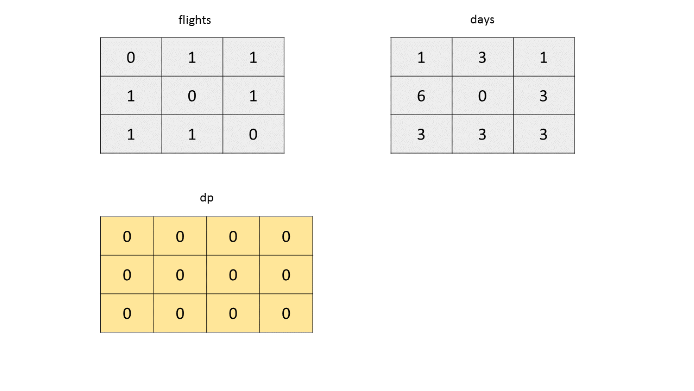

568. Maximum Vacation Days

LeetCode wants to give one of its best employees the option to travel among **N** cities to collect algorithm problems. But all work and no play makes Jack a dull boy, you could take vacations in some particular cities and weeks. Your job is to schedule the traveling to maximize the number of vacation days you could take, but there are certain rules and restrictions you need to follow.

**Rules and restrictions:**
1. You can only travel among **N** cities, represented by indexes from 0 to N-1. Initially, you are in the city indexed 0 on **Monday**.
1. The cities are connected by flights. The flights are represented as a **N*N** matrix (not necessary symmetrical), called flights representing the airline status from the city i to the city j. If there is no flight from the city i to the city j, **flights[i][j] = 0**; Otherwise, **flights[i][j] = 1**. Also, **flights[i][i] = 0** for all i.
1. You totally have **K** weeks (**each week has 7 days**) to travel. You can only take flights at most once per day and can only take flights on each week's **Monday** morning. Since flight time is so short, we don't consider the impact of flight time.
1. For each city, you can only have restricted vacation days in different weeks, given an **N*K** matrix called **days** representing this relationship. For the value of **days[i][j]**, it represents the maximum days you could take vacation in the city i in the week j.

You're given the **flights** matrix and **days** matrix, and you need to output the maximum vacation days you could take during **K** weeks.

**Example 1:**
```
Input:flights = [[0,1,1],[1,0,1],[1,1,0]], days = [[1,3,1],[6,0,3],[3,3,3]]
Output: 12
Explanation: 
Ans = 6 + 3 + 3 = 12. 

One of the best strategies is:
1st week : fly from city 0 to city 1 on Monday, and play 6 days and work 1 day. 
(Although you start at city 0, we could also fly to and start at other cities since it is Monday.) 
2nd week : fly from city 1 to city 2 on Monday, and play 3 days and work 4 days.
3rd week : stay at city 2, and play 3 days and work 4 days.
```

**Example 2:**
```
Input:flights = [[0,0,0],[0,0,0],[0,0,0]], days = [[1,1,1],[7,7,7],[7,7,7]]
Output: 3
Explanation: 
Ans = 1 + 1 + 1 = 3. 

Since there is no flights enable you to move to another city, you have to stay at city 0 for the whole 3 weeks. 
For each week, you only have one day to play and six days to work. 
So the maximum number of vacation days is 3.
```

**Example 3:**
```
Input:flights = [[0,1,1],[1,0,1],[1,1,0]], days = [[7,0,0],[0,7,0],[0,0,7]]
Output: 21
Explanation:
Ans = 7 + 7 + 7 = 21

One of the best strategies is:
1st week : stay at city 0, and play 7 days. 
2nd week : fly from city 0 to city 1 on Monday, and play 7 days.
3rd week : fly from city 1 to city 2 on Monday, and play 7 days.
```

**Note:**

1. **N and K** are positive integers, which are in the range of [1, 100].
1. In the matrix **flights**, all the values are integers in the range of [0, 1].
1. In the matrix **days**, all the values are integers in the range [0, 7].
1. You could stay at a city beyond the number of vacation days, but you should work on the extra days, which won't be counted as vacation days.
1. If you fly from the city A to the city B and take the vacation on that day, the deduction towards vacation days will count towards the vacation days of city B in that week.
1. We don't consider the impact of flight hours towards the calculation of vacation days.

# Solution
---
## Approach #1 Using Depth First Search [Time Limit Exceeded]
**Algorithm**

In the brute force approach, we make use of a recursive function dfsdfs, which returns the number of vacations which can be taken startring from $cur\_city$ as the current city and weeknoweekno as the starting week.

In every function call, we traverse over all the cities(represented by ii) and find out all the cities which are connected to the current city, $cur\_city$. Such a city is represented by a 1 at the corresponding $flights[cur\_city][i]$ position. Now, for the current city, we can either travel to the city which is connected to it or we can stay in the same city. Let's say the city to which we change our location from the current city be represented by jj. Thus, after changing the city, we need to find the number of vacations which we can take from the new city as the current city and the incremented week as the new starting week. This count of vacations can be represented as: $days[j][weekno] + dfs(flights, days, j, weekno + 1)$.

Thus, for the current city, we obtain a number of vacations by choosing different cities as the next cities. Out of all of these vacations coming from different cities, we can find out the maximum number of vacations that need to be returned for every $dfs$ function call.

```java
public class Solution {
    public int maxVacationDays(int[][] flights, int[][] days) {
        return dfs(flights, days, 0, 0);
    }
    public int dfs(int[][] flights, int[][] days, int cur_city, int weekno) {
        if (weekno == days[0].length)
            return 0;
        int maxvac = 0;
        for (int i = 0; i < flights.length; i++) {
            if (flights[cur_city][i] == 1 || i == cur_city) {
                int vac = days[i][weekno] + dfs(flights, days, i, weekno + 1);
                maxvac = Math.max(maxvac, vac);
            }
        }
        return maxvac;
    }
}
```

**Complexity Analysis**

* Time complexity : $O(n^k)$. Depth of Recursion tree will be $k$ and each node contains $n$ branches in the worst case. Here $n$ represents the number of cities and $k$ is the total number of weeks.

* Space complexity : $O(k)$. The depth of the recursion tree is $k$.

## Approach #2 Using DFS with memoization [Accepted]:
**Algorithm**

In the last approach, we make a number of redundant function calls, since the same function call of the form `dfs(flights, days, cur_city, weekno)` can be made multiple number of times with the same $cur\_city$ and weeknoweekno. These redundant calls can be pruned off if we make use of memoization.

In order to remove these redundant function calls, we make use of a 2-D memoization array $memo$. In this array, $memo[i][j]$ is used to store the number of vacactions that can be taken using the $i^{th}$ city as the current city and the $j^{th}$ week as the starting week. This result is equivalent to that obtained using the function call: `dfs(flights, days, i, j)`. Thus, if the $memo$ entry corresponding to the current function call already contains a valid value, we can directly obtain the result from this array instead of going deeper into recursion

```java
public class Solution {
    public int maxVacationDays(int[][] flights, int[][] days) {
        int[][] memo = new int[flights.length][days[0].length];
        for (int[] l: memo)
            Arrays.fill(l, Integer.MIN_VALUE);
        return dfs(flights, days, 0, 0, memo);
    }
    public int dfs(int[][] flights, int[][] days, int cur_city, int weekno, int[][] memo) {
        if (weekno == days[0].length)
            return 0;
        if (memo[cur_city][weekno] != Integer.MIN_VALUE)
            return memo[cur_city][weekno];
        int maxvac = 0;
        for (int i = 0; i < flights.length; i++) {
            if (flights[cur_city][i] == 1 || i == cur_city) {
                int vac = days[i][weekno] + dfs(flights, days, i, weekno + 1, memo);
                maxvac = Math.max(maxvac, vac);
            }
        }
        memo[cur_city][weekno] = maxvac;
        return maxvac;
    }
}
```

**Complexity Analysis**

* Time complexity : $O(n^2k)$. $memo$ array of size $n*k$ is filled and each cell filling takes O(n) time .

* Space complexity : $O(n*k)$. $memo$ array of size $n*k$ is used. Here $n$ represents the number of cities and $k$ is the total number of weeks.

## Approach #3 Using 2-D Dynamic Programming [Accepted]:
**Algorithm**

The idea behind this approach is as follows. The maximum number of vacations that can be taken given we start from the $i^{th}$ city in the $j^{th}$ week is not dependent on the the vacations that can be taken in the earlier weeks. It only depends on the number of vacations that can be taken in the upcoming weeks and also on the connections between the various cities($flights$).

Therefore, we can make use of a 2-D $dp$, in which $dp[i][k]$ represents the maximum number of vacations which can be taken starting from the $i^{th}$ city in the $k^{th}$ week. This $dp$ is filled in the backward manner(in terms of the week number).

While filling up the entry for $dp[i][k]$, we need to consider the following cases:

1. We start from the $i^{th}$ city in the $k^{th}$ week and stay in the same city for the $(k+1)^{th}$ week. Thus, the factor to be considered for updating the $dp[i][k]$ entry will be given by: $days[i][k] + dp[i, k+1]$.

1. We start from the $i^{th}$ city in the $k^{th}$ week and move to the $j^{th}$ city in the $(k+1)^{th}$ week. But, for changing the city in this manner, we need to be able to move from the $i^{th}$ city to the $j^{th}$ city i.e. $flights[i][j]$ should be 1 for such $i$ and $j$.




# Submissions
---
**Solution 1: (DP Top-Down)**
```
Runtime: 3264 ms
Memory Usage: 21.5 MB
```
```python
class Solution:
    def maxVacationDays(self, flights: List[List[int]], days: List[List[int]]) -> int:
        FLIGHTS = len(flights)
        WEEKS = len(days[0])
        
        @functools.lru_cache(None)
        def dfs(cur_city, weekno):
            if weekno == WEEKS:
                return 0
            maxvac = 0
            for i in range(FLIGHTS):
                if flights[cur_city][i] == 1 or i == cur_city:
                    vac = days[i][weekno] + dfs(i, weekno + 1)
                    maxvac = max(maxvac, vac)
            return maxvac
        
        return dfs(0, 0)
```

**Solution 2: (DP Top-Down)**
```
Runtime: 3696 ms
Memory Usage: 14.5 MB
```
```python
class Solution:
    def maxVacationDays(self, flights: List[List[int]], days: List[List[int]]) -> int:
        FLIGHTS = len(flights)
        WEEKS = len(days[0])
        memo = [[float('-inf')]*WEEKS for _ in range(FLIGHTS)]
        
        def dfs(cur_city, weekno):
            if weekno == WEEKS:
                return 0
            if memo[cur_city][weekno] != float('-inf'):
                return memo[cur_city][weekno]
            maxvac = 0
            for i in range(FLIGHTS):
                if flights[cur_city][i] == 1 or i == cur_city:
                    vac = days[i][weekno] + dfs(i, weekno + 1)
                    maxvac = max(maxvac, vac)
            memo[cur_city][weekno] = maxvac
            return maxvac
        
        return dfs(0, 0)
```

**Solution 3: (DP Bottom-Up)**
```
Runtime: 2548 ms
Memory Usage: 14.3 MB
```
```python
class Solution:
    def maxVacationDays(self, flights: List[List[int]], days: List[List[int]]) -> int:
        # build adjacency graph
        g = {row: set([row] + [col for col in range(len(flights[0])) if flights[row][col]]) for row in range(len(flights))}

        dp = [[0] * len(days[0]) for _ in range(len(days))] #dp[i,j] = max vacay days if we're starting at city i, and currently on week j
        rows, cols = len(dp), len(dp[0])
        for col in range(cols-1, -1, -1):
            for row in range(rows):
                curMax = dp[row][col]
                for nbr in g[row]:
                    potentialMax = days[nbr][col] # base case is for the last column (i.e. last week). dp[i, -1] = max(days[nbr, -1] for nbr of i)
                    if col < cols - 1:
                        potentialMax += dp[nbr][col+1] # inductive case, dp[i,j] = max(dp[nbr, j+1] + days[nbr, j] for nbr of i)
                    curMax = max(curMax, potentialMax)
                dp[row][col] = curMax
        return dp[0][0]
```