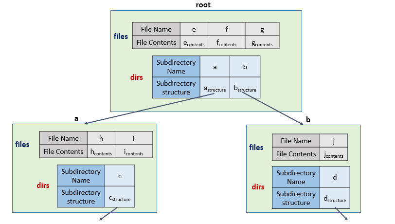
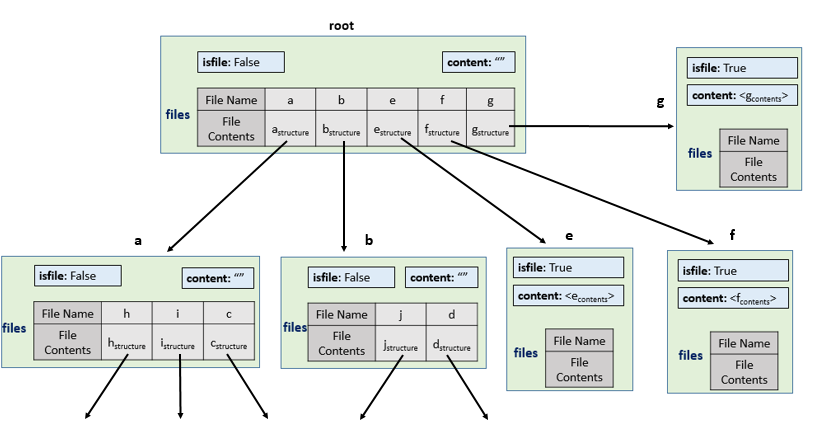

588. Design In-Memory File System

Design an in-memory file system to simulate the following functions:

`ls`: Given a path in string format. If it is a file path, return a list that only contains this file's name. If it is a directory path, return the list of file and directory names **in this directory**. Your output (file and directory names together) should in **lexicographic order**.

`mkdir`: Given a **directory path** that does not exist, you should make a new directory according to the path. If the middle directories in the path don't exist either, you should create them as well. This function has void return type.

`addContentToFile`: Given a **file path** and **file content** in string format. If the file doesn't exist, you need to create that file containing given content. If the file already exists, you need to **append** given content to original content. This function has void return type.

`readContentFromFile`: Given a **file path**, return its **content** in string format.

 

**Example:**
```
Input: 
["FileSystem","ls","mkdir","addContentToFile","ls","readContentFromFile"]
[[],["/"],["/a/b/c"],["/a/b/c/d","hello"],["/"],["/a/b/c/d"]]

Output:
[null,[],null,null,["a"],"hello"]

Explanation:
```


**Note:**

* You can assume all file or directory paths are absolute paths which begin with `/` and do not end with / except that the path is just `"/"`.
* You can assume that all operations will be passed valid parameters and users will not attempt to retrieve file content or list a directory or file that does not exist.
* You can assume that all directory names and file names only contain lower-case letters, and same names won't exist in the same directory.

# Solution
---
## Approach #1 Using separate Directory and File List[Accepted]
We start our discussion by looking at the directory structure used. The root directory acts as the base of the directory structure. Each directory contains two hashmaps namely $dirs$ and $files$. The $dirs$ contains data in the form $[(subdirectory_1\_name: subdirectory_{1\_structure}), (subdirectory_2\_name: subdirectory_{2\_structure})...]$. The $files$ contains data in the form $[(file_1: file_{1\_contents}), (file_2: file_{2\_contents})...]$. This directory structure is shown below with a sample showing just the first two levels.



Now, we'll discuss how we implement the various commands required.

`ls`: In this case, we start off by initializing tt, a temporary directory pointer, to the root directory. We split the input directory path based on `/` and obtain the individual levels of directory names in a $d$ array. Then, we traverse over the tree directory structure based on the individual directories found and we keep on updating the tt directory pointer to point to the new level of directory(child) as we go on entering deeper into the directory structure. At the end, we will stop at either the end level directory or at the file name depending upon the input given. If the last level in the input happens to be a file name, we simply need to return the file name. So, we directly return the last entry in the dd array. If the last level entry happens to be a directory, we can obtain its subdirectory list from the list of keys in its $dirs$ hashmap. Similarly, we can obtain the list of files in the last directory from the keys in the corresponding $files$ hashmap. We append the two lists obtained, sort them and return the sorted appended list.

`mkdir`: In response to this command, as in case of `ls`, we start entering the directory structure level by level. Whenever we reach a state where a directory mentioned in the path of mkdir doesn't exist, we create a new entry in the last valid directory's $dirs$ structure and initialize its subdirectory list as an empty list. We keep on doing so till we reach the end level directory.

`addContentToFile`: In response to this command as well, as in case of `ls`, we start entering the directory structure level by level. When we reach the level of the file name, we check if the file name already exists in the $files$ keys. If it exists, we concatenate the current contents to the contents of the file(in the value section of the corresponding file). If it doesn't exist, we create a new entry in the current directory's $files$ and initialize its contents with the current contents.

`readContentFromFile`: As the previous cases, we reach the last directory level by traversing through the directory structure level by level. Then, in the last directory, we search for the file name entry in the corresponding $files$' keys and return its corresponding value as the contents of the file.

**Java**
```java
public class FileSystem {
    class Dir {
        HashMap < String, Dir > dirs = new HashMap < > ();
        HashMap < String, String > files = new HashMap < > ();
    }
    Dir root;
    public FileSystem() {
        root = new Dir();
    }
    public List < String > ls(String path) {
        Dir t = root;
        List < String > files = new ArrayList < > ();
        if (!path.equals("/")) {
            String[] d = path.split("/");
            for (int i = 1; i < d.length - 1; i++) {
                t = t.dirs.get(d[i]);
            }
            if (t.files.containsKey(d[d.length - 1])) {
                files.add(d[d.length - 1]);
                return files;
            } else {
                t = t.dirs.get(d[d.length - 1]);
            }
        }
        files.addAll(new ArrayList < > (t.dirs.keySet()));
        files.addAll(new ArrayList < > (t.files.keySet()));
        Collections.sort(files);
        return files;
    }

    public void mkdir(String path) {
        Dir t = root;
        String[] d = path.split("/");
        for (int i = 1; i < d.length; i++) {
            if (!t.dirs.containsKey(d[i]))
                t.dirs.put(d[i], new Dir());
            t = t.dirs.get(d[i]);
        }
    }

    public void addContentToFile(String filePath, String content) {
        Dir t = root;
        String[] d = filePath.split("/");
        for (int i = 1; i < d.length - 1; i++) {
            t = t.dirs.get(d[i]);
        }
        t.files.put(d[d.length - 1], t.files.getOrDefault(d[d.length - 1], "") + content);
    }

    public String readContentFromFile(String filePath) {
        Dir t = root;
        String[] d = filePath.split("/");
        for (int i = 1; i < d.length - 1; i++) {
            t = t.dirs.get(d[i]);
        }
        return t.files.get(d[d.length - 1]);
    }
}

/**
 * Your FileSystem object will be instantiated and called as such:
 * FileSystem obj = new FileSystem();
 * List<String> param_1 = obj.ls(path);
 * obj.mkdir(path);
 * obj.addContentToFile(filePath,content);
 * String param_4 = obj.readContentFromFile(filePath);
 */
```

**Performance Analysis**

* The time complexity of executing an `ls` command is $O\big(m+n+klog(k)\big)$. Here, $m$ refers to the length of the input string. We need to scan the input string once to split it and determine the various levels. $n$ refers to the depth of the last directory level in the given input for ls. This factor is taken because we need to enter nn levels of the tree structure to reach the last level. $k$ refers to the number of entries(files+subdirectories) in the last level directory(in the current input). We need to sort these names giving a factor of $klog(k)$.

* The time complexity of executing an `mkdir` command is $O(m+n)$. Here, mm refers to the length of the input string. We need to scan the input string once to split it and determine the various levels. nn refers to the depth of the last directory level in the mkdir input. This factor is taken because we need to enter nn levels of the tree structure to reach the last level.

* The time complexity of both `addContentToFile` and `readContentFromFile` is $O(m+n)$. Here, mm refers to the length of the input string. We need to scan the input string once to split it and determine the various levels. nn refers to the depth of the file name in the current input. This factor is taken because we need to enter nn levels of the tree structure to reach the level where the files's contents need to be added/read from.

* The advantage of this scheme of maintaining the directory structure is that it is expandable to include even more commands easily. For example, `rmdir` to remove a directory given an input directory path. We need to simply reach to the destined directory level and remove the corresponding directory entry from the corresponding $dirs$ keys.

* Renaming files/directories is also very simple, since all we need to do is to create a temporary copy of the directory structure/file with a new name and delete the last entry.

* Relocating a hierarchichal subdirectory structure from one directory to the other is also very easy, since, all we need to do is obtain the address for the corresponding subdirectory class, and assign the same at the new positon in the new directory structure.

* Extracting only directories or files list on any path is easy in this case, since we maintain separate entires for $dirs$ and $files$.

## Approach #2 Using unified Directory and File List[Accepted]
This design differs from the first design in that the current data structure for a Directory contains a unified $files$ hashmap, which contains the list of all the files and subdirectories in the current directory. Apart from this, we contain an entry isfileisfile, which when True indicates that the current $files$ entry is actually corresponding to a file, otherwise it represents a directory. Further, since we are considering the directory and files' entries in the same manner, we need an entry for contentcontent, which contains the contents of the current file(if isfileisfile entry is True in the current case). For entries corresponding to directories, the contentcontent field is kept empty.

The following figure shows the directory structure for the same example as in the case above, for the first two levels of the hierarchical structure.



The implementation of all the commands remains the same as in the last design, except that we need to make entries in the same $files$ hashmap for both files and directories, corresponding to `addContentToFile` and `mkdir` respectively. Further, for `ls`, we need not extract entries separately for the files and directories, since they are unified in the current case, and can be obtained in a single go.

This approach is inspired by @shawngao


**Java**
```java
public class FileSystem {
    class File {
        boolean isfile = false;
        HashMap < String, File > files = new HashMap < > ();
        String content = "";
    }
    File root;
    public FileSystem() {
        root = new File();
    }

    public List < String > ls(String path) {
        File t = root;
        List < String > files = new ArrayList < > ();
        if (!path.equals("/")) {
            String[] d = path.split("/");
            for (int i = 1; i < d.length; i++) {
                t = t.files.get(d[i]);
            }
            if (t.isfile) {
                files.add(d[d.length - 1]);
                return files;
            }
        }
        List < String > res_files = new ArrayList < > (t.files.keySet());
        Collections.sort(res_files);
        return res_files;
    }

    public void mkdir(String path) {
        File t = root;
        String[] d = path.split("/");
        for (int i = 1; i < d.length; i++) {
            if (!t.files.containsKey(d[i]))
                t.files.put(d[i], new File());
            t = t.files.get(d[i]);
        }
    }

    public void addContentToFile(String filePath, String content) {
        File t = root;
        String[] d = filePath.split("/");
        for (int i = 1; i < d.length - 1; i++) {
            t = t.files.get(d[i]);
        }
        if (!t.files.containsKey(d[d.length - 1]))
            t.files.put(d[d.length - 1], new File());
        t = t.files.get(d[d.length - 1]);
        t.isfile = true;
        t.content = t.content + content;
    }

    public String readContentFromFile(String filePath) {
        File t = root;
        String[] d = filePath.split("/");
        for (int i = 1; i < d.length - 1; i++) {
            t = t.files.get(d[i]);
        }
        return t.files.get(d[d.length - 1]).content;
    }
}

/**
 * Your FileSystem object will be instantiated and called as such:
 * FileSystem obj = new FileSystem();
 * List<String> param_1 = obj.ls(path);
 * obj.mkdir(path);
 * obj.addContentToFile(filePath,content);
 * String param_4 = obj.readContentFromFile(filePath);
 */
```

**Performance Analysis**

* The time complexity of executing an `ls` command is $O\big(m+n+klog(k)\big)$. Here, $m$ refers to the length of the input string. We need to scan the input string once to split it and determine the various levels. nn refers to the depth of the last directory level in the given input for `ls`. This factor is taken because we need to enter $n$ levels of the tree structure to reach the last level. kk refers to the number of entries(files+subdirectories) in the last level directory(in the current input). We need to sort these names giving a factor of $klog(k)$.

* The time complexity of executing an `mkdir` command is $O(m+n)$. Here, $m$ refers to the length of the input string. We need to scan the input string once to split it and determine the various levels. nn refers to the depth of the last directory level in the `mkdir` input. This factor is taken because we need to enter nn levels of the tree structure to reach the last level.

* The time complexity of both `addContentToFile` and `readContentFromFile` is $O(m+n)$. Here, $m$ refers to the length of the input string. We need to scan the input string once to split it and determine the various levels. nn refers to the depth of the file name in the current input. This factor is taken because we need to enter nn levels of the tree structure to reach the level where the files's contents need to be added/read from.

* The advantage of this scheme of maintaining the directory structure is that it is expandable to include even more commands easily. For example, `rmdir` to remove a directory given an input directory path. We need to simply reach to the destined directory level and remove the corresponding directory entry from the corresponding $dirs$ keys.

* Renaming files/directories is also very simple, since all we need to do is to create a temporary copy of the directory structure/file with a new name and delete the last entry.

* Relocating a hierarchichal subdirectory structure from one directory to the other is also very easy, since, all we need to do is obtain the address for the corresponding subdirectory class, and assign the same at the new positon in the new directory structure.

* If the number of directories is very large, we waste redundant space for $isfile$ and $content$, which wasn't needed in the first design.

* A problem with the current design could occur if we want to list only the directories(and not the files), on any given path. In this case, we need to traverse over the whole contents of the current directory, check for each entry, whether it is a file or a directory, and then extract the required data.

# Submissions
---
**Solution 1: (Trie)**
```
Runtime: 76 ms
Memory Usage: 14 MB
```
```python
class FileSystem:

    def __init__(self):
        self.dirs = collections.defaultdict(dict)
        self.files = collections.defaultdict(str)
    
    def ls(self, path: str) -> List[str]:
        ps = path.split('/')
        if path in self.files:
            fileName = ps[-1]
            return [fileName]
        
        tmp = self.dirs
        for p in ps:
            if p == '': continue
            if p in tmp:
                tmp = tmp[p]
            else:
                return []
        return list(sorted(tmp.keys()))

    def mkdir(self, path: str) -> None:
        ps = path.split('/')
        tmp = self.dirs
        for p in ps:
            if p == '': continue
            if p not in tmp:
                tmp[p] = collections.defaultdict()
            tmp = tmp[p]

    def addContentToFile(self, filePath: str, content: str) -> None:
        if filePath not in self.files:
            self.mkdir(filePath)
            self.files[filePath] = content
        else:
            self.files[filePath] += content

    def readContentFromFile(self, filePath: str) -> str:
        return self.files[filePath]


# Your FileSystem object will be instantiated and called as such:
# obj = FileSystem()
# param_1 = obj.ls(path)
# obj.mkdir(path)
# obj.addContentToFile(filePath,content)
# param_4 = obj.readContentFromFile(filePath)
```

**Solution 2: (Trie)**
```
Runtime: 72 ms
Memory Usage: 14.1 MB
```
```python
class TrieNode:
    def __init__(self):
        self.child = collections.defaultdict(TrieNode)
        self.isFile = False
        self.content = ""
        self.name = ""
        
class FileSystem:

    def __init__(self):
        self.root = TrieNode()
    
    def ls(self, path: str) -> List[str]:
        res = []
        path = path.split('/')[1:]
        cur = self.root
        if path[0]!='':
            for p in path:
                cur = cur.child[p]
        if cur.isFile:
            return [cur.name]
        for ch in cur.child:
            res.append(ch)
        return sorted(res)

    def mkdir(self, path: str) -> None:
        cur = self.root
        paths = path.split('/')[1:]
        for p in paths:
            cur = cur.child[p]
            cur.name = p

    def addContentToFile(self, filePath: str, content: str) -> None:
        cur =self.root
        filePath = filePath.split('/')[1:]
        for p in filePath:
            cur = cur.child[p]
            cur.name = p
        cur.isFile = True
        cur.content += content

    def readContentFromFile(self, filePath: str) -> str:
        cur =self.root
        filePath = filePath.split('/')[1:]
        for p in filePath:
            cur = cur.child[p]
        if cur.isFile:
            return cur.content


# Your FileSystem object will be instantiated and called as such:
# obj = FileSystem()
# param_1 = obj.ls(path)
# obj.mkdir(path)
# obj.addContentToFile(filePath,content)
# param_4 = obj.readContentFromFile(filePath)
```

**Solution 2: (Trie)**
```
Runtime: 4 ms, Beats 67.97%
Memory: 23.31 MB, Beats 20.61%
```
```c++
class FileSystem {
    struct TrieNode {
        bool isFile;
        string content;
        unordered_map<string, TrieNode *> children;
        TrieNode() : isFile(false) {}
    };

    TrieNode *root;
    vector<string> getStrs(string &path) {
        vector<string> rst;
        stringstream ss(path.substr(1));
        string s;
        while (getline(ss, s, '/')) {
            rst.push_back(s);
        }
        return rst;
    }
public:
    FileSystem() {
        root = new TrieNode();
    }
    
    vector<string> ls(string path) {
        vector<string> &&strs = getStrs(path);
        TrieNode *curr = root;
        for (string &str : strs)
            curr = curr->children[str];
        
        if (curr->isFile)
            return {strs.back()};
        
        vector<string> ans;
        for (auto &p : curr->children)
            ans.push_back(p.first);
        sort(ans.begin(), ans.end());
        return ans;
    }
    
    void mkdir(string path) {
        vector<string> &&strs = getStrs(path);
        TrieNode *curr = root;
        for (string &str : strs) {
            if (!curr->children.count(str))
                curr->children[str] = new TrieNode();
            curr = curr->children[str];
        }
    }
    
    void addContentToFile(string filePath, string content) {
        vector<string> &&strs = getStrs(filePath);
        TrieNode *curr = root;
        for (string &str : strs) {
            if (!curr->children.count(str))
                curr->children[str] = new TrieNode();
            curr = curr->children[str];
        }
        curr->isFile = true;
        curr->content += content;
    }
    
    string readContentFromFile(string filePath) {
        vector<string> &&strs = getStrs(filePath);
        TrieNode *curr = root;
        for (string &str : strs)
            curr = curr->children[str];
        return curr->content;
    }
};

/**
 * Your FileSystem object will be instantiated and called as such:
 * FileSystem* obj = new FileSystem();
 * vector<string> param_1 = obj->ls(path);
 * obj->mkdir(path);
 * obj->addContentToFile(filePath,content);
 * string param_4 = obj->readContentFromFile(filePath);
 */
```
