642. Design Search Autocomplete System

Design a search autocomplete system for a search engine. Users may input a sentence (at least one word and end with a special character `'#'`). For **each character** they type **except '#'**, you need to return the **top 3** historical hot sentences that have prefix the same as the part of sentence already typed. Here are the specific rules:

1. The hot degree for a sentence is defined as the number of times a user typed the exactly same sentence before.
1. The returned top 3 hot sentences should be sorted by hot degree (The first is the hottest one). If several sentences have the same degree of hot, you need to use ASCII-code order (smaller one appears first).
1. If less than 3 hot sentences exist, then just return as many as you can.
1. When the input is a special character, it means the sentence ends, and in this case, you need to return an empty list.

Your job is to implement the following functions:

The constructor function:

`AutocompleteSystem(String[] sentences, int[] times)`: This is the constructor. The input is **historical data**. `Sentences` is a string array consists of previously typed sentences. `Times` is the corresponding times a sentence has been typed. Your system should record these historical data.

Now, the user wants to input a new sentence. The following function will provide the next character the user types:

`List<String> input(char c)`: The input `c` is the next character typed by the user. The character will only be lower-case letters (`'a'` to `'z'`), blank space (`' '`) or a special character (`'#'`). Also, the previously typed sentence should be recorded in your system. The output will be the **top 3** historical hot sentences that have prefix the same as the part of sentence already typed.

 
**Example:**

**Operation:** AutocompleteSystem(["i love you", "island","ironman", "i love leetcode"], [5,3,2,2])
The system have already tracked down the following sentences and their corresponding times:  
`"i love you"` : `5` times  
`"island"` : `3` times  
`"ironman"` : `2` times  
`"i love leetcode"` : `2` times  
Now, the user begins another search:

**Operation:** input('i')  
**Output:** ["i love you", "island","i love leetcode"]  
**Explanation:**  
There are four sentences that have prefix "i". Among them, "ironman" and "i love leetcode" have same hot degree. Since ' ' has ASCII code 32 and 'r' has ASCII code 114, "i love leetcode" should be in front of "ironman". Also we only need to output top 3 hot sentences, so "ironman" will be ignored.

**Operation:** input(' ')  
**Output:** ["i love you","i love leetcode"]  
**Explanation:**  
There are only two sentences that have prefix "i ".

**Operation:** input('a')  
**Output:** []  
**Explanation:**  
There are no sentences that have prefix "i a".

**Operation:** input('#')  
**Output:** []  
**Explanation:**  
The user finished the input, the sentence "i a" should be saved as a historical sentence in system. And the following input will be counted as a new search.

**Note:**

* The input sentence will always start with a letter and end with '#', and only one blank space will exist between two words.
* The number of **complete sentences** that to be searched won't exceed 100. The length of each sentence including those in the historical data won't exceed 100.
* Please use double-quote instead of single-quote when you write test cases even for a character input.
* Please remember to **RESET** your class variables declared in class AutocompleteSystem, as static/class variables are **persisted across multiple test cases**. Please see here for more details.

# Solution
---
## Approach 1: Brute Force
In this solution, we make use of a HashMap $map$ which stores entries in the form $(sentence_i, times_i)$. Here, $times_i$ refers to the number of times the $sentence_i$ has been typed earlier.

`AutocompleteSystem`: We pick up each sentence from $sentences$ and their corresponding times from the $times$, and make their entries in the $map$ appropriately.

`input(c)`: We make use of a current sentence tracker variable, $\text{cur_sent}$, which is used to store the sentence entered till now as the input. For $c$ as the current input, firstly, we append this $c$ to $\text{cur_sent}$ and then iterate over all the keys of $map$ to check if a key exists whose initial characters match with $\text{cur_sent}$. We add all such keys to a $list$. Then, we sort this $list$ as per our requirements, and obtain the first three values from this $list$.

**Java**
```java
class Node {
  String sentence;
  int times;

  Node(String st, int t) {
    sentence = st;
    times = t;
  }
}

class AutocompleteSystem {
  private HashMap<String, Integer> map = new HashMap<>();
  private String cur_sent = "";

  public AutocompleteSystem(String[] sentences, int[] times) {
    for (int i = 0; i < sentences.length; i++) map.put(sentences[i], times[i]);
  }

  public List<String> input(char c) {
    List<String> res = new ArrayList<>();
    if (c == '#') {
      map.put(cur_sent, map.getOrDefault(cur_sent, 0) + 1);
      cur_sent = "";
    } else {
      List<Node> list = new ArrayList<>();
      cur_sent += c;
      for (String key : map.keySet())
        if (key.indexOf(cur_sent) == 0) {
          list.add(new Node(key, map.get(key)));
        }
      Collections.sort(
          list,
          (a, b) -> a.times == b.times ? a.sentence.compareTo(b.sentence) : b.times - a.times);
      for (int i = 0; i < Math.min(3, list.size()); i++) res.add(list.get(i).sentence);
    }
    return res;
  }
}

/**
 * Your AutocompleteSystem object will be instantiated and called as such:
 * AutocompleteSystem obj = new AutocompleteSystem(sentences, times);
 * List<String> param_1 = obj.input(c);
 */
```

**Performance Analysis**

`AutocompleteSystem()` takes $O(k*l)$ time. This is because, putting an entry in a hashMap takes $O(1)$ time. But, to create a hash value for a sentence of average length $k$, it will be scanned atleast once. We need to put $l$ such entries in the $map$.

`input()` takes $O\big(n+m \log m\big)$ time. We need to iterate over the list of sentences, in $map$, entered till now(say with a count $n$), taking $O(n)$ time, to populate the $list$ used for finding the hot sentences. Then, we need to sort the $list$ of length $m$, taking $O\big(m \log m\big)$ time.

## Approach 2: Using One level Indexing
This method is almost the same as that of the last approach except that instead of making use of simply a HashMap to store the sentences along with their number of occurences, we make use of a Two level HashMap.

Thus, we make use of an array $arr$ of HashMaps. Each element of this array, $arr$, is used to refer to one of the alphabets possible. Each element is a HashMap itself, which stores the sentences and their number of occurences similar to the last approach. e.g. $arr[0]$ is used to refer to a HashMap which stores the sentences starting with an 'a'.

The process of adding the data in `AutocompleteSystem` and retrieving the data remains the same as in the last approach, except the one level indexing using arrarr which needs to be done prior to accessing the required HashMap.

**Java**
```java
class Node {
  String sentence;
  int times;

  Node(String st, int t) {
    sentence = st;
    times = t;
  }
}

class AutocompleteSystem {
  private HashMap<String, Integer>[] arr;
  private String cur_sent = "";

  public AutocompleteSystem(String[] sentences, int[] times) {
    arr = new HashMap[26];
    for (int i = 0; i < 26; i++) arr[i] = new HashMap<String, Integer>();
    for (int i = 0; i < sentences.length; i++)
      arr[sentences[i].charAt(0) - 'a'].put(sentences[i], times[i]);
  }

  public List<String> input(char c) {
    List<String> res = new ArrayList<>();
    if (c == '#') {
      arr[cur_sent.charAt(0) - 'a'].put(
          cur_sent, arr[cur_sent.charAt(0) - 'a'].getOrDefault(cur_sent, 0) + 1);
      cur_sent = "";
    } else {
      List<Node> list = new ArrayList<>();
      cur_sent += c;
      for (String key : arr[cur_sent.charAt(0) - 'a'].keySet()) {
        if (key.indexOf(cur_sent) == 0) {
          list.add(new Node(key, arr[cur_sent.charAt(0) - 'a'].get(key)));
        }
      }
      Collections.sort(
          list,
          (a, b) -> a.times == b.times ? a.sentence.compareTo(b.sentence) : b.times - a.times);
      for (int i = 0; i < Math.min(3, list.size()); i++) res.add(list.get(i).sentence);
    }
    return res;
  }
}
```

**Performance Analysis**

* `AutocompleteSystem()` takes $O(k*l+26)$ time. Putting $a$ entry in a hashMap takes $O(1)$ time. But, to create a hash value for a sentence of average length $k$, it will be scanned atleast once. We need to put ll such entries in the $map$.

* `input()` takes $O\big(s+m \log m\big)$ time. We need to iterate only over one hashmap corresponding to the sentences starting with the first character of the current sentence, to populate the $list$ for finding the hot sentences. Here, $s$ refers to the size of this corresponding hashmap. Then, we need to sort the $list$ of length mm, taking $O\big(m \log m\big)$ time.

## Approach 3: Using Trie
A Trie is a special data structure used to store strings that can be visualized like a tree. It consists of nodes and edges. Each node consists of at max 26 children and edges connect each parent node to its children. These 26 pointers are nothing but pointers for each of the 26 letters of the English alphabet A separate edge is maintained for every edge.

Strings are stored in a top to bottom manner on the basis of their prefix in a trie. All prefixes of length 1 are stored at until level 1, all prefixes of length 2 are sorted at until level 2 and so on.

A Trie data structure is very commonly used for representing the words stored in a dictionary. Each level represents one character of the word being formed. A word available in the dictionary can be read off from the Trie by starting from the root and going till the leaf.

By doing a small modification to this structure, we can also include an entry, timestimes, for the number of times the current word has been previously typed. This entry can be stored in the leaf node corresponding to the particular word.

Now, for implementing the `AutoComplete` function, we need to consider each character of the every word given in $sentence$ array, and add an entry corresponding to each such character at one level of the trie. At the leaf node of every word, we can update the $times$ section of the node with the corresponding number of times this word has been typed.

The following figure shows a trie structure for the words "A","to", "tea", "ted", "ten", "i", "in", and "inn", occuring 15, 7, 3, 4, 12, 11, 5 and 9 times respectively.


Similarly, to implement the `input(c)` function, for every input character cc, we need to add this character to the word being formed currently, i.e. to \text{cur_sent}cur_sent. Then, we need to traverse in the current trie till all the characters in the current word, \text{cur_sent}cur_sent, have been exhausted.

From this point onwards, we traverse all the branches possible in the Trie, put the sentences/words formed by these branches to a listlist along with their corresponding number of occurences, and find the best 3 out of them similar to the last approach. The following animation shows a typical illustration.


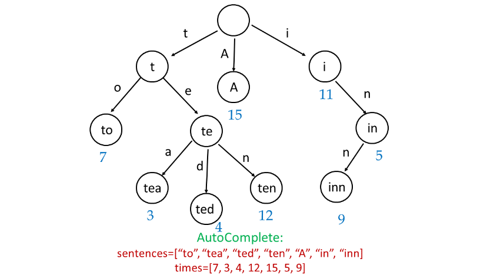
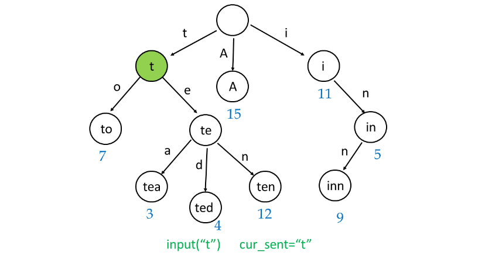
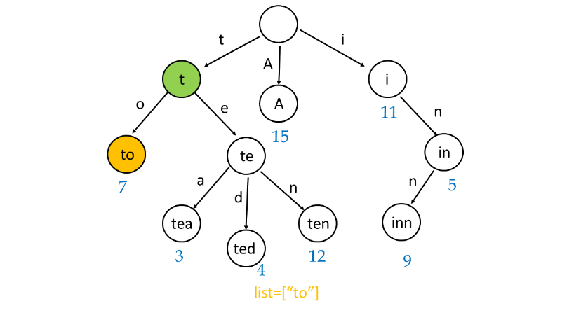
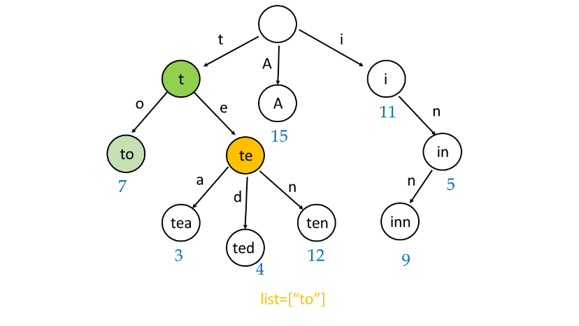
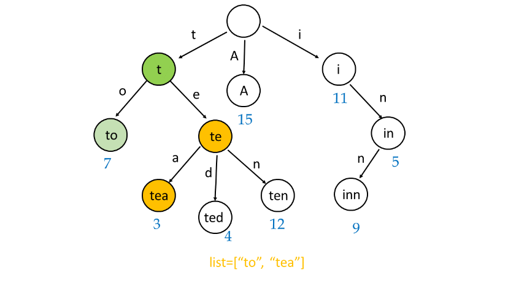
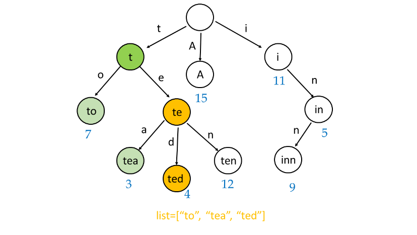
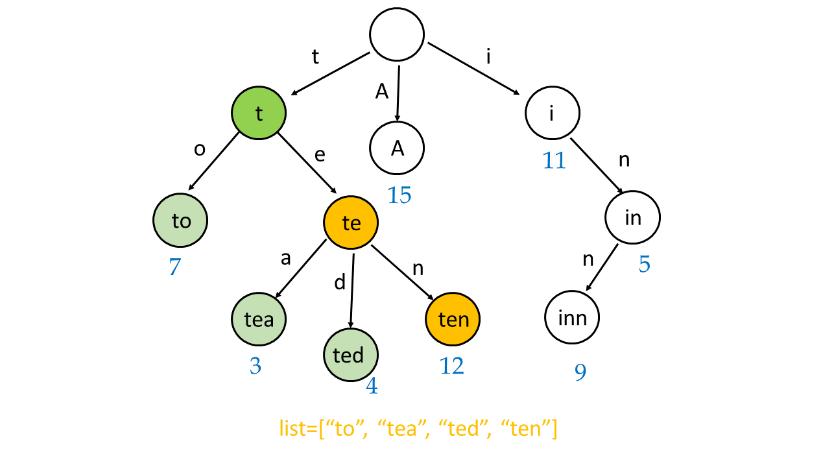
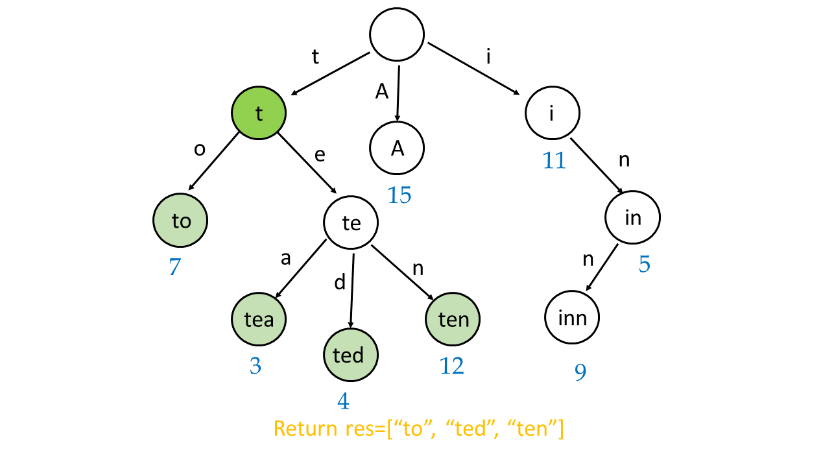
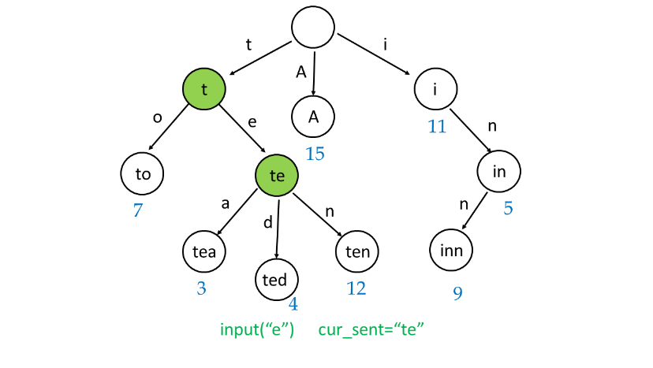
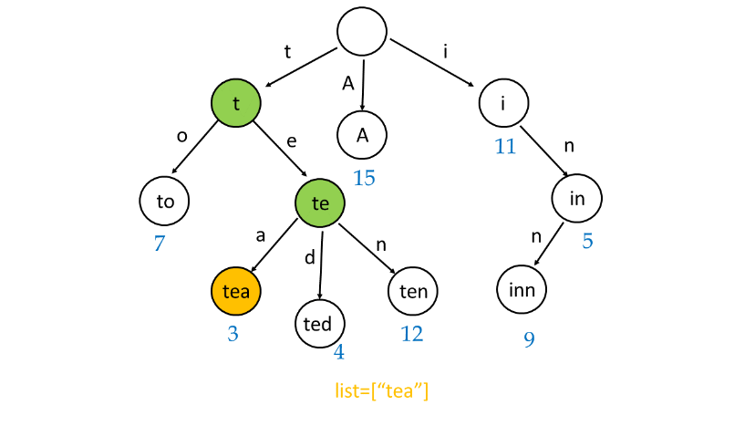
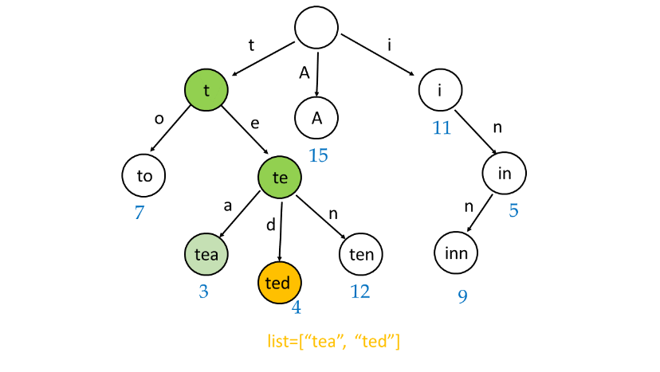
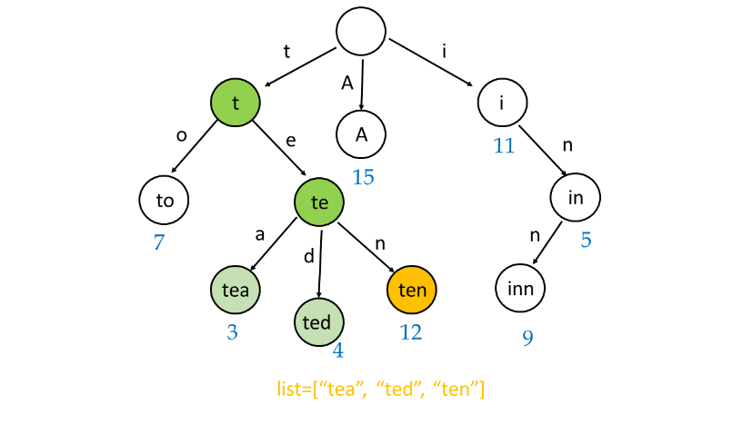
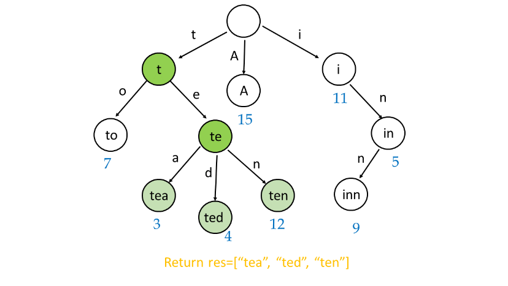

**Java**
```java
class Node {
  String sentence;
  int times;

  Node(String st, int t) {
    sentence = st;
    times = t;
  }
}

class Trie {
  int times;
  Trie[] branches = new Trie[27];
}

class AutocompleteSystem {
  private Trie root;
  private String cur_sent = "";

  public AutocompleteSystem(String[] sentences, int[] times) {
    root = new Trie();
    for (int i = 0; i < sentences.length; i++) {
      insert(root, sentences[i], times[i]);
    }
  }

  private int toInt(char c) {
    return c == ' ' ? 26 : c - 'a';
  }

  private void insert(Trie t, String s, int times) {
    for (int i = 0; i < s.length(); i++) {
      if (t.branches[toInt(s.charAt(i))] == null) {
        t.branches[toInt(s.charAt(i))] = new Trie();
      }
      t = t.branches[toInt(s.charAt(i))];
    }
    t.times += times;
  }

  private List<Node> lookup(Trie t, String s) {
    List<Node> list = new ArrayList<>();
    for (int i = 0; i < s.length(); i++) {
      if (t.branches[toInt(s.charAt(i))] == null) {
        return new ArrayList<>();
      }
      t = t.branches[toInt(s.charAt(i))];
    }
    traverse(s, t, list);
    return list;
  }

  private void traverse(String s, Trie t, List<Node> list) {
    if (t.times > 0) list.add(new Node(s, t.times));
    for (char i = 'a'; i <= 'z'; i++) {
      if (t.branches[i - 'a'] != null) {
        traverse(s + i, t.branches[i - 'a'], list);
      }
    }
    if (t.branches[26] != null) {
      traverse(s + ' ', t.branches[26], list);
    }
  }

  public List<String> input(char c) {
    List<String> res = new ArrayList<>();
    if (c == '#') {
      insert(root, cur_sent, 1);
      cur_sent = "";
    } else {
      cur_sent += c;
      List<Node> list = lookup(root, cur_sent);
      Collections.sort(
          list,
          (a, b) -> a.times == b.times ? a.sentence.compareTo(b.sentence) : b.times - a.times);
      for (int i = 0; i < Math.min(3, list.size()); i++) res.add(list.get(i).sentence);
    }
    return res;
  }
}   
```

**Performance Analysis**

* `AutocompleteSystem()` takes $O(k*l)$ time. We need to iterate over $l$ sentences each of average length $k$, to create the trie for the given set of sentencessentences.

* `input()` takes $O\big(p+q+m \log m\big)$ time. Here, $p$ refers to the length of the sentence formed till now, $\text{cur_sent}$. $q$ refers to the number of nodes in the trie considering the sentence formed till now as the root node. Again, we need to sort the $list$ of length $m$ indicating the options available for the hot sentences, which takes $O\big(m \log m\big)$ time.

# Submissions
---
**Solution 1: (Trie)**
```
Runtime: 832 ms
Memory Usage: 19.2 MB
```
```python
class TrieNode:
    def __init__(self):
        self.children = collections.defaultdict(TrieNode)
        self.is_END = False
        self.hot = 0
        self.sentence = None
        
class Trie:
    def __init__(self):
        self.root = TrieNode()
        
    def insert(self, sentence, times):
        curr = self.root
        
        for char in sentence:
            curr = curr.children[char]
        
        curr.is_END = True         # when last char is added
        curr.hot -= times           # negating to sort as ascending order later 
        curr.sentence = sentence   # store sentence
        
    def search(self, sentence):
        curr = self.root
        
        for char in sentence:
            if char not in curr.children:
                return []
            curr = curr.children[char]
        
        return self.dfs(curr)      # search all possible setneces by DFS
        
    def dfs(self, root):
        res = []
        if root:
            if root.is_END:
                res.append((root.hot, root.sentence))
            for child in root.children:
                res.extend(self.dfs(root.children[child]))
        
        return res
        
class AutocompleteSystem:

    def __init__(self, sentences: List[str], times: List[int]):
        self.trie = Trie()
        self.word = ""
        # add each sentence with its corresponding times
        for i, sentence in enumerate(sentences):
            self.trie.insert(sentence, times[i])

    def input(self, c: str) -> List[str]:
        res = []
        if c != "#":                            # when c is not #, search c for each time
            self.word += c
            res = self.trie.search(self.word)
        else:
            self.trie.insert(self.word, 1)
            self.word = ""
        
        return [item[1] for item in sorted(res)[:3]]   # return top 3 hot sentences sorted by hot degree


# Your AutocompleteSystem object will be instantiated and called as such:
# obj = AutocompleteSystem(sentences, times)
# param_1 = obj.input(c)
```

**Solution 2: (Trie)**
```
Runtime: 508 ms
Memory Usage: 295 MB
```
```c++
class Trie{
private:
    struct TrieNode{
        bool isLeaf = false;
        int times = 0;
        TrieNode* children[27];
    };

    TrieNode* root;

public:
    Trie()
    {
        root = new TrieNode();
        for(int i=0; i<27; i++) root->children[i] = NULL;
    }

    void addStringToTrie(string s, int count)
    {
        //cout<<"to add:"<<s<<endl;
        int l = s.length(),index;
        TrieNode* p = root;
        for(int i=0; i<l; i++)
        {
            if(s[i] == ' ') index = 26;
            else index = s[i] - 'a';
            if(p->children[index] == NULL)
            {
                TrieNode *newNode = new TrieNode();
                p->children[index] = newNode;
                for(int i=0; i<27; i++) newNode->children[i] = NULL;
                //cout<<"new node created "<<index<<" "<<s[i]<<endl;
            }

            p = p->children[index];
        }

        p->isLeaf = true;
        p->times += count;
        //cout<<"times="<<p->times<<endl;
        //cout<<"********************"<<endl;
    }

    //search prefix in trie and return list of all sentences
    vector<pair<string,int> > findPrefixInTrie(string searchTerm)
    {
        int l = searchTerm.length();
        vector<pair<string,int> > suggestions;
        TrieNode* p = root;
        for(int i=0; i<l; i++)	
        {
            int index;
            if(searchTerm[i] == ' ') index = 26;
            else index = searchTerm[i] - 'a';
            if(p->children[index] == NULL) return suggestions;
            else p = p->children[index];
        }

        if(p->isLeaf == true) suggestions.push_back(make_pair(searchTerm,p->times));

        //get all sentences from here
        for(int i=0; i<27; i++)
        {
            if(p->children[i] != NULL)
            {
                char c;
                if(i < 26) c = i + 'a';
                else c = ' ';
                reachLeaf(searchTerm+c,suggestions,p->children[i]);
            }
        }

        return suggestions;
    }

    void reachLeaf(string currString,vector<pair<string,int> > &suggestions, TrieNode* p)
    {
        if(p->isLeaf == true) suggestions.push_back(make_pair(currString,p->times));

        int count = 0;
        for(int i=0; i<27; i++)
        {
            if(p->children[i] != NULL) 
            {
                char c;
                if(i < 26) c = i + 'a';
                else c = ' ';
                reachLeaf(currString+c,suggestions,p->children[i]);
            }
        }
    }
};

class AutocompleteSystem {
private:
    string searchTerm;
    Trie t;
public:
    AutocompleteSystem(vector<string>& sentences, vector<int>& times) {
        searchTerm = "";
        int l = sentences.size();
        for(int i=0; i<l; i++) t.addStringToTrie(sentences[i],times[i]);
    }
    
    static bool sortByTimes(const pair<string,int> &p1, const pair<string,int> &p2)
    {
        if(p1.second == p2.second) return p1.first < p2.first;
        else return p1.second > p2.second;
    }
    
    vector<string> input(char c) {
        if(c == '#')
        {
            t.addStringToTrie(searchTerm,1);
            searchTerm = "";
            vector<string> empty;
            return empty;
        }

        searchTerm += c;
        vector<pair<string,int> > suggestions = t.findPrefixInTrie(searchTerm);

        //sort vector acc to times, and ascii
        sort(suggestions.begin(),suggestions.end(),sortByTimes);

        //take first 3 or full if size < 3
        vector<string> result;

        //append to result
        int size = 3 < suggestions.size()?3:suggestions.size();
        for(int i=0; i < size; i++) result.push_back(suggestions[i].first);

        return result;
    }
};

/**
 * Your AutocompleteSystem object will be instantiated and called as such:
 * AutocompleteSystem* obj = new AutocompleteSystem(sentences, times);
 * vector<string> param_1 = obj->input(c);
 */
```