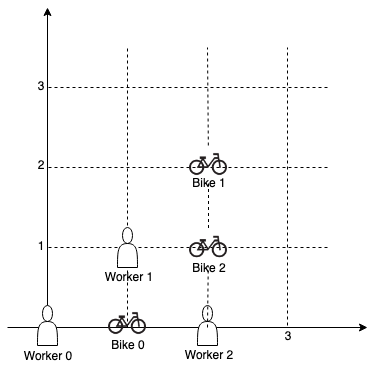

1057. Campus Bikes

On a campus represented as a 2D grid, there are `N` workers and `M` bikes, with `N <= M`. Each worker and bike is a 2D coordinate on this grid.

Our goal is to assign a bike to each worker. Among the available bikes and workers, we choose the (worker, bike) pair with the shortest Manhattan distance between each other, and assign the bike to that worker. (If there are multiple (worker, bike) pairs with the same shortest Manhattan distance, we choose the pair with the smallest worker index; if there are multiple ways to do that, we choose the pair with the smallest bike index). We repeat this process until there are no available workers.

The Manhattan distance between two points `p1` and `p2` is `Manhattan(p1, p2) = |p1.x - p2.x| + |p1.y - p2.y`|.

Return a vector ans of length `N`, where `ans[i]` is the index (`0`-indexed) of the bike that the `i`-th worker is assigned to.

 

**Example 1:**


```
Input: workers = [[0,0],[2,1]], bikes = [[1,2],[3,3]]
Output: [1,0]
Explanation: 
Worker 1 grabs Bike 0 as they are closest (without ties), and Worker 0 is assigned Bike 1. So the output is [1, 0].
```

**Example 2:**


```
Input: workers = [[0,0],[1,1],[2,0]], bikes = [[1,0],[2,2],[2,1]]
Output: [0,2,1]
Explanation: 
Worker 0 grabs Bike 0 at first. Worker 1 and Worker 2 share the same distance to Bike 2, thus Worker 1 is assigned to Bike 2, and Worker 2 will take Bike 1. So the output is [0,2,1].
```

**Note:**

* `0 <= workers[i][j], bikes[i][j] < 1000`
* All worker and bike locations are distinct.
* `1 <= workers.length <= bikes.length <= 1000`

# Submissions
---
**Solution 1: (Sort, Greedy)**
```
Runtime: 824 ms
Memory Usage: 110.9 MB
```
```python
class Solution:
    def assignBikes(self, workers: List[List[int]], bikes: List[List[int]]) -> List[int]:
        distances = {}
        used = set()
        res = [None]*len(workers)
        for w, worker in enumerate(workers): 
            for b, bike in enumerate(bikes):
                dist = abs(worker[0]-bike[0]) + abs(worker[1]-bike[1])
                if dist not in distances: 
                    distances[dist] = [(w, b)]
                else: 
                    distances[dist].append((w,b))
        keyList = list(distances.keys())
        keyList.sort()
        for k in keyList: 
            wbList = distances[k]
            for pair in wbList: 
                w = pair[0]
                b = pair[1]
                if res[w] == None and b not in used: 
                    res[w] = b 
                    used.add(b)
        return res 
```

**Solution 2: (Sort)**
```
Runtime: 244 ms
Memory: 39.3 MB
```
```c++
class Solution {
    // Function to return the Manhattan distance
    int findDistance(vector<int>& worker, vector<int>& bike) {
        return abs(worker[0] - bike[0]) + abs(worker[1] - bike[1]);
    }
public:
    vector<int> assignBikes(vector<vector<int>>& workers, vector<vector<int>>& bikes) {
        // List of WorkerBikeTuples's to store all the possible triplets
        vector<tuple<int, int, int>> allTriplets;
        
        // Generate all the possible pairs
        for (int worker = 0; worker < workers.size(); worker++) {
            for (int bike = 0; bike < bikes.size(); bike++) {
                int distance = findDistance(workers[worker], bikes[bike]);        
                allTriplets.push_back({distance, worker, bike});
            }
        }
        
        // Sort the triplets. By default, each sorting will prioritize the
        // Tuple's first value, then second value, and finally the third value
        sort(allTriplets.begin(), allTriplets.end());  
        
        // Initialize all values to false, to signify no bikes have been taken
        vector<int> bikeStatus(bikes.size(), false);
        // Initialize all index to -1, to signify no worker has a bike
        vector<int> workerStatus(workers.size(), -1);
        // Keep track of how many worker-bike pairs have been made
        int pairCount = 0;
        
        for (auto[dist, worker, bike] : allTriplets) { 
            // If both worker and bike are free, assign them to each other
            if (workerStatus[worker] == -1 && !bikeStatus[bike]) {
                bikeStatus[bike] = true;
                workerStatus[worker] = bike;
                pairCount++;
                
                // If all the workers have the bike assigned, we can stop
                if (pairCount == workers.size()) {
                    return workerStatus;
                }
            }
        }
        
        return workerStatus;
    }
};
```

**Solution 3: (Heap)**
```
Runtime: 165 ms
Memory: 60 MB
```
```c++
class Solution {
    // Function to return the Manhattan distance
    int distance(vector<int>& worker_loc, vector<int>& bike_loc) {
        return abs(worker_loc[0] - bike_loc[0]) + abs(worker_loc[1] - bike_loc[1]);
    }
public:
    vector<int> assignBikes(vector<vector<int>>& workers, vector<vector<int>>& bikes) {
        // List of triplets (distance, worker, bike) for each bike corresponding to worker
        vector<vector<tuple<int, int, int>>> workerToBikeList;
        
        priority_queue<tuple<int, int, int>, vector<tuple<int, int, int>>, 
                       greater<tuple<int, int, int>>> pq;
        
        for (int worker = 0; worker < workers.size(); worker++) {
            // Add all the bikes with their distances from the current worker
            vector<tuple<int, int, int>> currWorkerPairs;
            for (int bike = 0; bike < bikes.size(); bike++) {
                int dist = distance(workers[worker], bikes[bike]);
                currWorkerPairs.push_back({dist, worker, bike});
            }
            
            // Sort the workerToBikeList for the current worker in reverse order.
            sort(currWorkerPairs.begin(), currWorkerPairs.end(), greater<tuple<int, int, int>>());

            // For each worker, add their closest bike to the priority queue
            pq.push(currWorkerPairs.back());
            // Second last bike is now the closest bike for this worker
            currWorkerPairs.pop_back();
            
            // Store the remaining options for the current worker in workerToBikeList
            workerToBikeList.push_back(currWorkerPairs);
        }
        
        // Initialize all values to false, to signify no bikes have been taken
        vector<int> bikeStatus(bikes.size(), false);
        // Initialize all index to -1, to signify no worker has a bike
        vector<int> workerStatus(workers.size(), -1);
        
        while (!pq.empty()) {
            // Pop the pair with smallest distance
            auto[dist, worker, bike] = pq.top();
            pq.pop();
            bike = bike;
            worker = worker;
            
            if (!bikeStatus[bike]) {
                // If the bike is free, assign the bike to the worker
                bikeStatus[bike] = true;
                workerStatus[worker] = bike;
            } else {
                // Otherwise, add the next closest bike for the current worker
                pq.push(workerToBikeList[worker].back());
                workerToBikeList[worker].pop_back();
            }
        }
        
        return workerStatus; 
    }
};
```
