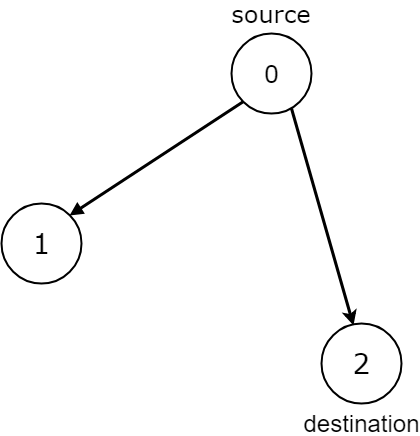
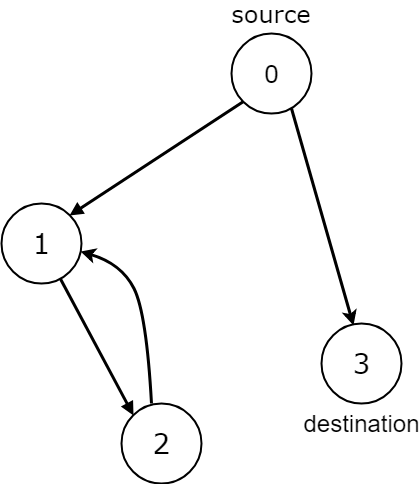
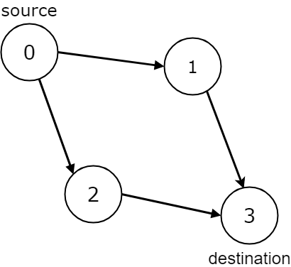

1059. All Paths from Source Lead to Destination

Given the `edges` of a directed graph where `edges[i] = [ai, bi]` indicates there is an edge between nodes `ai` and `bi`, and two nodes `source` and `destination` of this graph, determine whether or not all paths starting from `source` eventually, end at `destination`, that is:

* At least one path exists from the `source` node to the `destination` node
* If a path exists from the `source` node to a node with no outgoing edges, then that node is equal to `destination`.
* The number of possible paths from `source` to `destination` is a finite number.

Return `true` if and only if all roads from `source` lead to `destination`.

 

**Example 1:**


```
Input: n = 3, edges = [[0,1],[0,2]], source = 0, destination = 2
Output: false
Explanation: It is possible to reach and get stuck on both node 1 and node 2.
```

**Example 2:**


```
Input: n = 4, edges = [[0,1],[0,3],[1,2],[2,1]], source = 0, destination = 3
Output: false
Explanation: We have two possibilities: to end at node 3, or to loop over node 1 and node 2 indefinitely.
```

**Example 3:**


```
Input: n = 4, edges = [[0,1],[0,2],[1,3],[2,3]], source = 0, destination = 3
Output: true
```

**Constraints:**

* `1 <= n <= 10^4`
* `0 <= edges.length <= 10^4`
* `edges.length == 2`
* `0 <= ai, bi <= n - 1`
* `0 <= source <= n - 1`
* `0 <= destination <= n - 1`
* The given graph may have self-loops and parallel edges.

# Submissions
---
**SOlution 1: (Depth First Search)**
```
Runtime: 280 ms
Memory Usage: 19.3 MB
```
```python
class Solution:
    
    # We don't use the state WHITE as such anywhere. Instead, the "null" value in the states array below is a substitute for WHITE.
    GRAY = 1
    BLACK = 2
    
    def leadsToDestination(self, n: int, edges: List[List[int]], source: int, destination: int) -> bool:
        graph = self.buildDigraph(n, edges)
        return self.leadsToDest(graph, source, destination, [None] * n)
        
    def leadsToDest(self, graph, node, dest, states):
        
        # If the state is GRAY, this is a backward edge and hence, it creates a Loop.
        if states[node] != None:
            return states[node] == Solution.BLACK
        
        # If this is a leaf node, it should be equal to the destination.
        if len(graph[node]) == 0:
            return node == dest
        
        # Now, we are processing this node. So we mark it as GRAY.
        states[node] = Solution.GRAY
        
        for next_node in graph[node]:
            
            # If we get a `false` from any recursive call on the neighbors, we short circuit and return from there.
            if not self.leadsToDest(graph, next_node, dest, states):
                return False;
        
        # Recursive processing done for the node. We mark it BLACK.
        states[node] = Solution.BLACK
        return True
        
    def buildDigraph(self, n, edges):
        graph = [[] for _ in range(n)]
        
        for edge in edges:
            graph[edge[0]].append(edge[1])
            
        return graph
```
