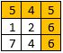
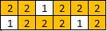
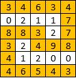

1102. Path With Maximum Minimum Value

Given a matrix of integers `A` with R rows and C columns, find the **maximum** score of a path starting at `[0,0]` and ending at [R-1,C-1].

The score of a path is the **minimum** value in that path.  For example, the value of the path `8 →  4 →  5 →  9` is `4`.

A path moves some number of times from one visited cell to any neighbouring unvisited cell in one of the 4 cardinal directions (north, east, west, south).

 

**Example 1:**


```
Input: [[5,4,5],[1,2,6],[7,4,6]]
Output: 4
Explanation: 
The path with the maximum score is highlighted in yellow. 
```

**Example 2:**


```
Input: [[2,2,1,2,2,2],[1,2,2,2,1,2]]
Output: 2
```

**Example 3:**


```
Input: [[3,4,6,3,4],[0,2,1,1,7],[8,8,3,2,7],[3,2,4,9,8],[4,1,2,0,0],[4,6,5,4,3]]
Output: 3
```

**Note:**

* `1 <= R, C <= 100`
* `0 <= A[i][j] <= 10^9`

# Submissions
---
**Solution 1: (Dijkstra)**
```
Runtime: 1532 ms
Memory Usage: 17.1 MB
```
```python
class Solution:
    def maximumMinimumPath(self, A: List[List[int]]) -> int:
        R, C = len(A), len(A[0])
        d = [[0] * C for _ in range(R)]
        d[0][0] = A[0][0]
        queue = [(-A[0][0], 0, 0)]
        seen = set()
        while queue:
            _, r, c = heapq.heappop(queue)
            seen.add((r, c))
            for nr, nc in [(r+1, c), (r-1, c), (r, c+1), (r, c-1)]:
                if 0 <= nr < R and 0 <= nc < C and (nr, nc) not in seen:
                    cur = min(d[r][c], A[nr][nc])
                    if d[nr][nc] < cur:
                        d[nr][nc] = cur
                        heapq.heappush(queue, (-cur, nr, nc))
        return d[-1][-1]
```

**Solution 2: (Dijkstra)**
```
Runtime: 224 ms
Memory Usage: 33.4 MB
```
```c++
class Solution {
public:
    int maximumMinimumPath(vector<vector<int>>& A) {
        int R{(int)A.size()},  C{(int)A[0].size()};
        auto Cmp = [](const auto& a, const auto& b) {return a.first < b.first;};
        std::priority_queue<std::pair<int,int>, std::vector<std::pair<int,int>>, decltype(Cmp)> pq(Cmp);
        pq.emplace(A[0][0], 0);
        std::vector<std::vector<bool>> visited(R, std::vector<bool>(C, false));
        while(1) {
            auto [min_, s]{pq.top()}; pq.pop();
            int i{s/1000}, j{s%1000};
            if(visited[i][j]) continue;
            if(i == R-1 && j == C-1) return min_;
            visited[i][j] = true;
            if(i > 0 && !visited[i-1][j]) pq.emplace(std::min(min_, A[i-1][j]), s-1000);
            if(i < R-1 && !visited[i+1][j]) pq.emplace(std::min(min_, A[i+1][j]), s+1000);
            if(j > 0 && !visited[i][j-1]) pq.emplace(std::min(min_, A[i][j-1]), s-1);
            if(j < C-1 && !visited[i][j+1]) pq.emplace(std::min(min_, A[i][j+1]), s+1);
        }
        return 69.420;
    }
};
```