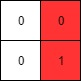

Leftmost Column with at Least a One

(This problem is an interactive problem.)

A binary matrix means that all elements are `0` or `1`. For each individual row of the matrix, this row is sorted in non-decreasing order.

Given a row-sorted binary matrix `binaryMatrix`, return leftmost column index(0-indexed) with at least a `1` in it. If such index doesn't exist, return `-1`.

**You can't access the Binary Matrix directly**.  You may only access the matrix using a `BinaryMatrix` interface:

* `BinaryMatrix.get(x, y)` returns the element of the matrix at index `(x, y)` (0-indexed).
* `BinaryMatrix.dimensions()` returns a list of 2 elements `[n, m]`, which means the matrix is `n * m`.

Submissions making more than `1000` calls to `BinaryMatrix.get` will be judged Wrong Answer.  Also, any solutions that attempt to circumvent the judge will result in disqualification.

For custom testing purposes you're given the binary matrix `mat` as input in the following four examples. You will not have access the binary matrix directly.

 

**Example 1:**


```
Input: mat = [[0,0],[1,1]]
Output: 0
```

**Example 2:**


```
Input: mat = [[0,0],[0,1]]
Output: 1
```

**Example 3:**


```
Input: mat = [[0,0],[0,0]]
Output: -1
```

**Example 4:**


```
Input: mat = [[0,0,0,1],[0,0,1,1],[0,1,1,1]]
Output: 1
``` 

**Constraints:**

* `1 <= mat.length, mat[i].length <= 100`
* `mat[i][j]` is either `0` or `1`.
* `mat[i]` is sorted in a non-decreasing way.

**Hint**

1. (Binary Search) For each row do a binary search to find the leftmost one on that row and update the answer.
1. (Optimal Approach) Imagine there is a pointer p(x, y) starting from top right corner. p can only move left or down. If the value at p is 0, move down. If the value at p is 1, move left. Try to figure out the correctness and time complexity of this algorithm.

# Submissions
---
**Solution 1: (2D Binary Search)**

(Optimal Approach) Imagine there is a pointer p(x, y) starting from top right corner. p can only move left or down. If the value at p is 0, move down. If the value at p is 1, move left. Try to figure out the correctness and time complexity of this algorithm.

```
Runtime: 112 ms
Memory Usage: 14.4 MB
```
```python
# """
# This is BinaryMatrix's API interface.
# You should not implement it, or speculate about its implementation
# """
#class BinaryMatrix(object):
#    def get(self, x: int, y: int) -> int:
#    def dimensions(self) -> list[]:

class Solution:
    def leftMostColumnWithOne(self, binaryMatrix: 'BinaryMatrix') -> int:
        R, C = binaryMatrix.dimensions()
        leftmost_col = -1
        
        def dfs(r, c):
            nonlocal leftmost_col
            if r >= R or c < 0:
                return
            if binaryMatrix.get(r,c) == 1:
                leftmost_col = c
                dfs(r, c-1)
            else:
                dfs(r+1, c)
        
        dfs(0, C-1)
        return leftmost_col
```

**Solution 2: (Iterative)**
```
Runtime: 112 ms
Memory Usage: 14 MB
```
```python
# """
# This is BinaryMatrix's API interface.
# You should not implement it, or speculate about its implementation
# """
#class BinaryMatrix(object):
#    def get(self, x: int, y: int) -> int:
#    def dimensions(self) -> list[]:

class Solution:
    def leftMostColumnWithOne(self, binaryMatrix: 'BinaryMatrix') -> int:
        R, C = binaryMatrix.dimensions()
        r, c = 0, C - 1 
        leftmost_col = -1
        while r < R and c >= 0:
            if binaryMatrix.get(r,c) == 1:
                leftmost_col = c
                c -= 1
            else:
                r += 1
                
        return leftmost_col

```

**Solution 3: (Binary Search Each Row, Time: O(NLogM), Space: O(1))**
```
Runtime: 113 ms
Memory: 14.3 MB
```
```python
# """
# This is BinaryMatrix's API interface.
# You should not implement it, or speculate about its implementation
# """
#class BinaryMatrix(object):
#    def get(self, row: int, col: int) -> int:
#    def dimensions(self) -> list[]:

class Solution:
    def leftMostColumnWithOne(self, binaryMatrix: 'BinaryMatrix') -> int:
        rows, cols = binaryMatrix.dimensions()
        smallest_index = cols
        for row in range(rows):
            # Binary Search for the first 1 in the row.
            lo = 0
            hi = cols - 1
            while lo < hi:
                mid = (lo + hi) // 2
                if binaryMatrix.get(row, mid) == 0:
                    lo = mid + 1
                else:
                    hi = mid
            # If the last element in the search space is a 1, then this row
            # contained a 1.
            if binaryMatrix.get(row, lo) == 1:
                smallest_index = min(smallest_index, lo)
        # If smallest_index is still set to cols, then there were no 1's in 
        # the grid. 
        return -1 if smallest_index == cols else smallest_index
```

**Solution 4: (Start at Top Right, Move Only Left and Down, Time: O(N+M), Space: O(1))**
```
Runtime: 112 ms
Memory: 14.3 MB
```
```python
# """
# This is BinaryMatrix's API interface.
# You should not implement it, or speculate about its implementation
# """
#class BinaryMatrix(object):
#    def get(self, row: int, col: int) -> int:
#    def dimensions(self) -> list[]:

class Solution:
    def leftMostColumnWithOne(self, binaryMatrix: 'BinaryMatrix') -> int:
        rows, cols = binaryMatrix.dimensions()
        
        # Set pointers to the top-right corner.
        current_row = 0
        current_col = cols - 1
        
        # Repeat the search until it goes off the grid.
        while current_row < rows and current_col >= 0:
            if binaryMatrix.get(current_row, current_col) == 0:
                current_row += 1
            else:
                current_col -= 1
        
        # If we never left the last column, it must have been all 0's.
        return current_col + 1 if current_col != cols - 1 else -1
```
