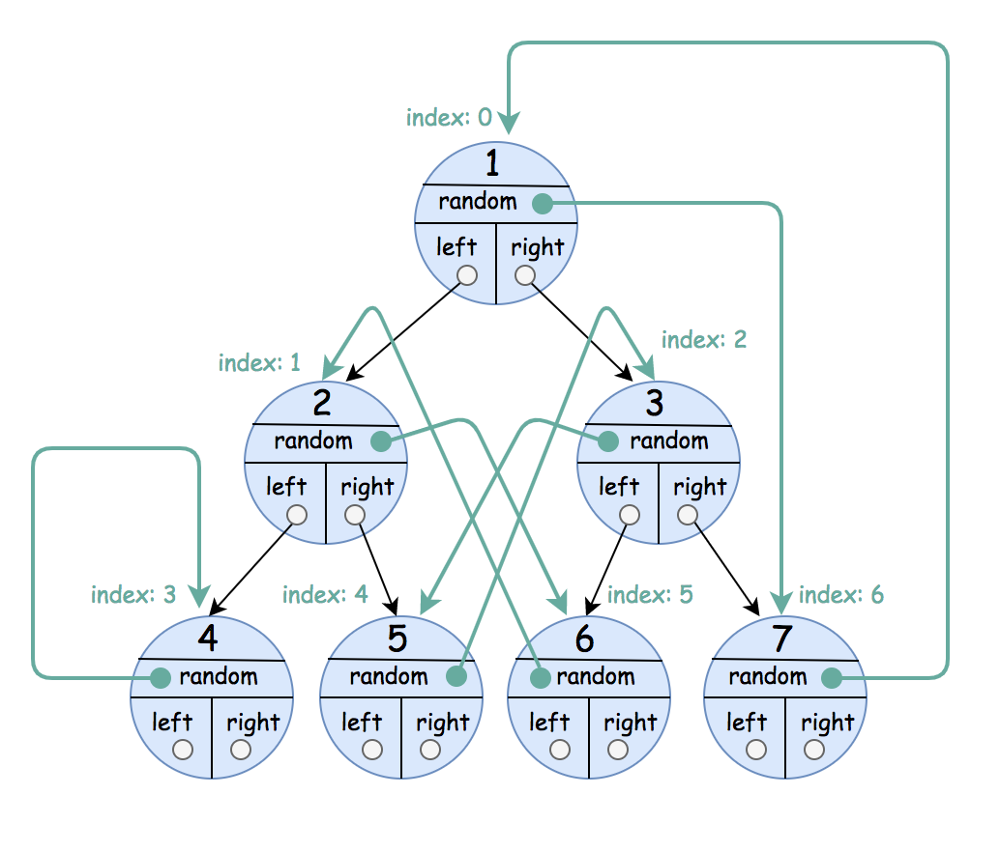

1485. Clone Binary Tree With Random Pointer

A binary tree is given such that each node contains an additional random pointer which could point to any node in the tree or null.

Return a deep copy of the tree.

The tree is represented in the same input/output way as normal binary trees where each node is represented as a pair of `[val, random_index]` where:

* `val`: an integer representing Node.val
* `random_index`: the index of the node (in the input) where the random pointer points to, or `null` if it does not point to any node.

You will be given the tree in class `Node` and you should return the cloned tree in class `NodeCopy`. `NodeCopy` class is just a clone of `Node` class with the same attributes and constructors.

 

**Example 1:**


```
Input: root = [[1,null],null,[4,3],[7,0]]
Output: [[1,null],null,[4,3],[7,0]]
Explanation: The original binary tree is [1,null,4,7].
The random pointer of node one is null, so it is represented as [1, null].
The random pointer of node 4 is node 7, so it is represented as [4, 3] where 3 is the index of node 7 in the array representing the tree.
The random pointer of node 7 is node 1, so it is represented as [7, 0] where 0 is the index of node 1 in the array representing the tree.
```

**Example 2:**


```
Input: root = [[1,4],null,[1,0],null,[1,5],[1,5]]
Output: [[1,4],null,[1,0],null,[1,5],[1,5]]
Explanation: The random pointer of a node can be the node itself.
```

**Example 3:**


```
Input: root = [[1,6],[2,5],[3,4],[4,3],[5,2],[6,1],[7,0]]
Output: [[1,6],[2,5],[3,4],[4,3],[5,2],[6,1],[7,0]]
```

**Constraints:**

* The number of nodes in the tree is in the range `[0, 1000]`.
* `1 <= Node.val <= 10^6`

# Submissions
---
**Solution 1: (Iterative Tree Traversal + Hashmap)**
```
Runtime: 267 ms
Memory Usage: 19.1 MB
```
```python
# Definition for Node.
# class Node:
#     def __init__(self, val=0, left=None, right=None, random=None):
#         self.val = val
#         self.left = left
#         self.right = right
#         self.random = random

class Solution:
    def copyRandomBinaryTree(self, root: 'Optional[Node]') -> 'Optional[NodeCopy]':
        if not root:   # Protection against a null root input  
            return None

        # Step 1. Create a copy of each node
        copy = {}
        stack = [root]

        while stack:
            node = stack.pop()
            copy[node] = NodeCopy(node.val)
            if node.left:
                stack.append(node.left)
            if node.right:
                stack.append(node.right)

        # Step 2. Connect the copied nodes together
        stack = [root]

        while stack:
            node = stack.pop()
            if node.left:
                copy[node].left = copy[node.left]
                stack.append(node.left)
            if node.right:
                copy[node].right = copy[node.right]
                stack.append(node.right)
            if node.random:
                copy[node].random = copy[node.random]

        return copy[root]
```

**Solution 2: (Recursive Tree Traversal + Hashmap)**
```
Runtime: 353 ms
Memory Usage: 19.5 MB
```
```python
# Definition for Node.
# class Node:
#     def __init__(self, val=0, left=None, right=None, random=None):
#         self.val = val
#         self.left = left
#         self.right = right
#         self.random = random

class Solution:
    def copyRandomBinaryTree(self, root: 'Optional[Node]') -> 'Optional[NodeCopy]':
        if not root:
            return None

        def dfs_copy(node):
            if not node:
                return

            copy[node] = NodeCopy(node.val)

            dfs_copy(node.left)
            dfs_copy(node.right)

            return node

        def dfs_connect(node):
            if not node:
                return

            if node.left:
                copy[node].left = copy[node.left]
            if node.right:
                copy[node].right = copy[node.right]
            if node.random:
                copy[node].random = copy[node.random]

            dfs_connect(node.left)
            dfs_connect(node.right)

            return node     

        copy = {}
        dfs_copy(root)
        dfs_connect(root)
        return copy[root]
```

**Solution 3: (DFS, Hash Table)**
```
Runtime: 320 ms
Memory Usage: 76.2 MB
```
```c++
/**
 * Definition for a Node.
 * struct Node {
 *     int val;
 *     Node *left;
 *     Node *right;
 *     Node *random;
 *     Node() : val(0), left(nullptr), right(nullptr), random(nullptr) {}
 *     Node(int x) : val(x), left(nullptr), right(nullptr), random(nullptr) {}
 *     Node(int x, Node *left, Node *right, Node *random) : val(x), left(left), right(right), random(random) {}
 * };
 */

class Solution {
public:
    unordered_map<Node*, NodeCopy*> map;
    void inorder(Node* node, bool setRandom) {
        if(!node)
            return;
        if (setRandom) {
            map[node]->left = map[node->left];
            map[node]->right = map[node->right];
            map[node]->random = map[node->random];
        } else {
            map[node] = new NodeCopy(node->val);
        }
        inorder(node->left, setRandom);
        inorder(node->right, setRandom);
    }

    NodeCopy* copyRandomBinaryTree(Node* root) {
        inorder(root, false);
        inorder(root, true);
        return map[root];
    }
};
```
