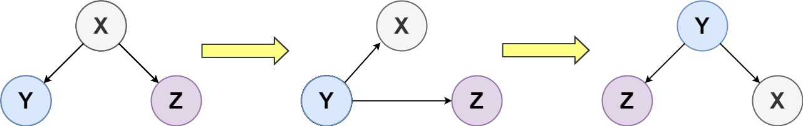

156. Binary Tree Upside Down

Given the `root` of a binary tree, turn the tree upside down and return the new root.

You can turn a binary tree upside down with the following steps:

1. The original left child becomes the new root.
1. The original root becomes the new right child.
1. The original right child becomes the new left child.



The mentioned steps are done level by level. It is **guaranteed** that every right node has a sibling (a left node with the same parent) and has no children.

 

**Example 1:**


```
Input: root = [1,2,3,4,5]
Output: [4,5,2,null,null,3,1]
```

**Example 2:**
```
Input: root = []
Output: []
```

**Example 3:**
```
Input: root = [1]
Output: [1]
```

**Constraints:**

* The number of nodes in the tree will be in the range `[0, 10]`.
* `1 <= Node.val <= 10`
* Every right node in the tree has a sibling (a left node that shares the same parent).
* Every right node in the tree has no children.

# Submissions
---
**Solution 1: (DFS, Post-Order)**
```
Runtime: 35 ms
Memory Usage: 14.1 MB
```
```python
# Definition for a binary tree node.
# class TreeNode:
#     def __init__(self, val=0, left=None, right=None):
#         self.val = val
#         self.left = left
#         self.right = right
class Solution:
    def upsideDownBinaryTree(self, root: Optional[TreeNode]) -> Optional[TreeNode]:
        ans = None
        
        def dfs(node):
            nonlocal ans
            if not node:
                return
            dfs(node.left)
            if not ans:
                ans = node
            if node.left:
                node.left.left = node.right
                node.left.right = node
            node.left = node.right = None
        
        dfs(root)
        return ans
```

**Solution 2: (DFS, Post-Order)**
```
Runtime: 11 ms
Memory Usage: 9.5 MB
```
```c++
/**
 * Definition for a binary tree node.
 * struct TreeNode {
 *     int val;
 *     TreeNode *left;
 *     TreeNode *right;
 *     TreeNode() : val(0), left(nullptr), right(nullptr) {}
 *     TreeNode(int x) : val(x), left(nullptr), right(nullptr) {}
 *     TreeNode(int x, TreeNode *left, TreeNode *right) : val(x), left(left), right(right) {}
 * };
 */
class Solution {
public:
    TreeNode* traverse(TreeNode* node, TreeNode* parent)
    {
        if (!node)
            return parent;
        TreeNode* res = traverse(node->left, node);
        if (parent)
        {
            node->right = parent;
            node->left = parent->right;
        }
        else
        {
            node->left = nullptr;
            node->right = nullptr;
        }
        return res;
    }
    
    TreeNode* upsideDownBinaryTree(TreeNode* root) {
        return traverse(root, nullptr);
    }
};
```
