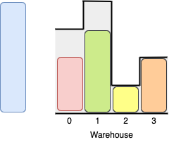

1580. Put Boxes Into the Warehouse II

You are given two arrays of positive integers, `boxes` and `warehouse`, representing the heights of some boxes of unit width and the heights of n rooms in a warehouse respectively. The warehouse's rooms are labeled from `0` to `n - 1` from left to right where `warehouse[i]` (0-indexed) is the height of the `i`th room.

Boxes are put into the warehouse by the following rules:

* Boxes cannot be stacked.
* You can rearrange the insertion order of the boxes.
* Boxes can be pushed into the warehouse from **either side** (left or right)
* If the height of some room in the warehouse is less than the height of a box, then that box and all other boxes behind it will be stopped before that room.

Return the maximum number of boxes you can put into the warehouse.

 

**Example 1:**


```
Input: boxes = [1,2,2,3,4], warehouse = [3,4,1,2]
Output: 4
Explanation:
```

```
We can store the boxes in the following order:
1- Put the yellow box in room 2 from either the left or right side.
2- Put the orange box in room 3 from the right side.
3- Put the green box in room 1 from the left side.
4- Put the red box in room 0 from the left side.
Notice that there are other valid ways to put 4 boxes such as swapping the red and green boxes or the red and orange boxes.
```

**Example 2:**


```
Input: boxes = [3,5,5,2], warehouse = [2,1,3,4,5]
Output: 3
Explanation:
```

```
It is not possible to put the two boxes of height 5 in the warehouse since there's only 1 room of height >= 5.
Other valid solutions are to put the green box in room 2 or to put the orange box first in room 2 before putting the green and red boxes.
```

**Constraints:**

* `n == warehouse.length`
* `1 <= boxes.length, warehouse.length <= 10^5`
* `1 <= boxes[i], warehouse[i] <= 10^9`

# Submissions
---
**Solution 1: (Greedy)**
```
Runtime: 861 ms
Memory Usage: 33.4 MB
```
```python
class Solution:
    def maxBoxesInWarehouse(self, boxes: List[int], warehouse: List[int]) -> int:
        ans = lo = 0
        hi = len(warehouse)-1
        for box in sorted(boxes, reverse=True): 
            if lo <= hi: 
                if box <= warehouse[lo]: 
                    lo += 1
                    ans += 1
                elif box <= warehouse[hi]: 
                    hi -= 1
                    ans += 1
        return ans
```
