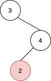

1602. Find Nearest Right Node in Binary Tree

Given the `root` of a binary tree and a node `u` in the tree, return the nearest node on the same level that is to the **right** of `u`, or return `null` if `u` is the rightmost node in its level.

 

**Example 1:**


```
Input: root = [1,2,3,null,4,5,6], u = 4
Output: 5
Explanation: The nearest node on the same level to the right of node 4 is node 5.
```

**Example 2:**


```
Input: root = [3,null,4,2], u = 2
Output: null
Explanation: There are no nodes to the right of 2.
```

**Constraints:**

* The number of nodes in the tree is in the range `[1, 10^5]`.
* `1 <= Node.val <= 10^5`
* All values in the tree are **distinct**.
* `u` is a node in the binary tree rooted at root.

# Submissions
---
**Solution 1: (BFS: Two Queues)**
```
Runtime: 617 ms
Memory Usage: 52.4 MB
```
```python
# Definition for a binary tree node.
# class TreeNode:
#     def __init__(self, val=0, left=None, right=None):
#         self.val = val
#         self.left = left
#         self.right = right
class Solution:
    def findNearestRightNode(self, root: TreeNode, u: TreeNode) -> Optional[TreeNode]:
        if root is None:
            return []

        next_level = deque([root,])
        while next_level:
            # prepare for the next level
            curr_level = next_level
            next_level = deque()

            while curr_level:
                node = curr_level.popleft()

                if node == u:
                    return curr_level.popleft() if curr_level else None
                # add child nodes of the current level
                # in the queue for the next level
                if node.left:
                    next_level.append(node.left)
                if node.right:
                    next_level.append(node.right)
```

**Solution 2: (BFS: One Queue + Sentinel)**
```
Runtime: 363 ms
Memory Usage: 52.2 MB
```
```python
# Definition for a binary tree node.
# class TreeNode:
#     def __init__(self, val=0, left=None, right=None):
#         self.val = val
#         self.left = left
#         self.right = right
class Solution:
    def findNearestRightNode(self, root: TreeNode, u: TreeNode) -> Optional[TreeNode]:
        if root is None:
            return None

        queue = deque([root, None,])
        while queue:
            curr = queue.popleft()

            # if it's the given node
            if curr == u:
                return queue.popleft()

            if curr:
                # add child nodes in the queue
                if curr.left:
                    queue.append(curr.left)
                if curr.right:
                    queue.append(curr.right)
            else:
                # once the level is finished,
                # add a sentinel to mark end of level
                if queue:
                    queue.append(None)
```

**Solution 3: (BFS: One Queue + Level Size Measurements)**
```
Runtime: 376 ms
Memory Usage: 52.3 MB
```
```python
# Definition for a binary tree node.
# class TreeNode:
#     def __init__(self, val=0, left=None, right=None):
#         self.val = val
#         self.left = left
#         self.right = right
class Solution:
    def findNearestRightNode(self, root: TreeNode, u: TreeNode) -> Optional[TreeNode]:
        if root is None:
            return None

        queue = deque([root,])
        while queue:
            level_length = len(queue)

            for i in range(level_length):
                node = queue.popleft()
                # if it's the given node
                if node == u:
                    return queue.popleft() if i != level_length - 1 else None

                # add child nodes in the queue
                if node.left:
                    queue.append(node.left)
                if node.right:
                    queue.append(node.right)
```

**Solution 4: (Recursive DFS: Preorder Traversal)**
```
Runtime: 328 ms
Memory Usage: 52.3 MB
```
```python
# Definition for a binary tree node.
# class TreeNode:
#     def __init__(self, val=0, left=None, right=None):
#         self.val = val
#         self.left = left
#         self.right = right
class Solution:
    def findNearestRightNode(self, root: TreeNode, u: TreeNode) -> Optional[TreeNode]:
        
        def dfs(current_node, depth):
            nonlocal u_depth, next_node
            # the depth to look for next node is identified
            if current_node == u:
                u_depth = depth
                return
            # we're on the level to look for the next node
            if depth == u_depth:
                # if this next node is not identified yet
                if next_node is None:
                    next_node = current_node
                return
            # continue to traverse the tree
            if current_node.left:
                dfs(current_node.left, depth + 1)
            if current_node.right:
                dfs(current_node.right, depth + 1)

        u_depth, next_node = -1, None
        dfs(root, 0)
        return next_node
```
