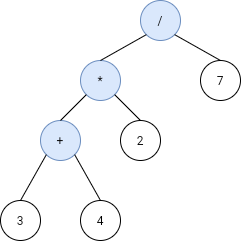
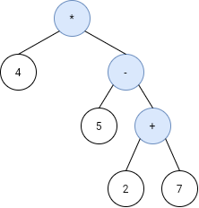

1628. Design an Expression Tree With Evaluate Function

Given the `postfix` tokens of an arithmetic expression, build and return the binary expression tree that represents this expression.

**Postfix** notation is a notation for writing arithmetic expressions in which the operands (numbers) appear before their operators. For example, the postfix tokens of the expression `4*(5-(7+2))` are represented in the array `postfix = ["4","5","7","2","+","-","*"]`.

The class `Node` is an interface you should use to implement the binary expression tree. The returned tree will be tested using the evaluate function, which is supposed to evaluate the tree's value. You should not remove the Node class; however, you can modify it as you wish, and you can define other classes to implement it if needed.

A binary expression tree is a kind of binary tree used to represent arithmetic expressions. Each node of a binary expression tree has either zero or two children. Leaf nodes (nodes with 0 children) correspond to operands (numbers), and internal nodes (nodes with two children) correspond to the operators '+' (addition), '-' (subtraction), '*' (multiplication), and '/' (division).

It's guaranteed that no subtree will yield a value that exceeds 109 in absolute value, and all the operations are valid (i.e., no division by zero).

**Follow up:** Could you design the expression tree such that it is more modular? For example, is your design able to support additional operators without making changes to your existing evaluate implementation?

 

**Example 1:**


```
Input: s = ["3","4","+","2","*","7","/"]
Output: 2
Explanation: this expression evaluates to the above binary tree with expression ((3+4)*2)/7) = 14/7 = 2.
```

**Example 2:**


```
Input: s = ["4","5","7","2","+","-","*"]
Output: -16
Explanation: this expression evaluates to the above binary tree with expression 4*(5-(2+7)) = 4*(-4) = -16.
```

**Example 3:**
```
Input: s = ["4","2","+","3","5","1","-","*","+"]
Output: 18
```

**Example 4:**
```
Input: s = ["100","200","+","2","/","5","*","7","+"]
Output: 757
```

**Constraints:**

* `1 <= s.length < 100`
* `s.length` is odd.
* `s` consists of numbers and the characters `'+'`, `'-'`, `'*'`, and `'/'`.
* If `s[i]` is a number, its integer representation is no more than `10^5`.
* It is guaranteed that `s` is a valid expression.
* The absolute value of the result and intermediate values will not exceed 109.
* It is guaranteed that no expression will include division by zero.

# Submissions
---
**Solution 1: (DFS)**
```
Runtime: 48 ms
Memory Usage: 15.1 MB`
```
```python
import abc 
from abc import ABC, abstractmethod 
"""
This is the interface for the expression tree Node.
You should not remove it, and you can define some classes to implement it.
"""

class Node(ABC):
    @abstractmethod
    # define your fields here
    def evaluate(self) -> int:
        pass

class PostfixNode(Node):
    def __init__(self, val, left=None, right=None):
        self.operad_map = {
            "/": self.divide,
            "*": self.mul,
            "+": self.add,
            "-": self.sub
        }
        self.val = val
        self.left = left
        self.right = right
        
    
    def evaluate(self) -> int:
        if self.val not in self.operad_map:
            return self.val
        op = self.operad_map[self.val]
        return op(self.left.evaluate(), self.right.evaluate())
    
    
    def divide(self, a, b) -> int:
        return int(a)//int(b)
    
    
    def mul(self,a, b) -> int:
        return int(a)*int(b)
    
    
    def add(self,a, b) -> int:
        return int(a)+int(b)
    
    
    def sub(self,a, b) -> int:
        return int(a)-int(b)

"""    
This is the TreeBuilder class.
You can treat it as the driver code that takes the postinfix input
and returns the expression tree represnting it as a Node.
"""

class TreeBuilder(object):
    def buildTree(self, postfix: List[str]) -> 'Node':
        # print(postfix)
        val = postfix.pop()
        root = PostfixNode(val)
        if val not in root.operad_map:
            return root
        
        root.right = self.buildTree(postfix)
        root.left = self.buildTree(postfix)
        # print(left_leaf.val)
        # print(right_leaf.val)
        return root
		
"""
Your TreeBuilder object will be instantiated and called as such:
obj = TreeBuilder();
expTree = obj.buildTree(postfix);
ans = expTree.evaluate();
"""
```

**Solution 2: (Stack)**
```
Runtime: 36 ms
Memory Usage: 14.3 MB
```
```python
import abc 
from abc import ABC, abstractmethod 
"""
This is the interface for the expression tree Node.
You should not remove it, and you can define some classes to implement it.
"""

class Node(ABC):
    @abstractmethod
    # define your fields here
    def evaluate(self) -> int:
        pass

class OperatorNode(Node):
    """
    All operator ndoes are internal nodes
    """
    def __init__(self, op, left = None, right = None):
        self.op = op
        self.left = left
        self.right = right
    
    def evaluate(self) -> int:
        if self.op == '+':
            return self.left.evaluate() + self.right.evaluate()
        elif self.op == '-':
            return self.left.evaluate() - self.right.evaluate()
        elif self.op == '*':
            return self.left.evaluate() * self.right.evaluate()
        else:
            return self.left.evaluate() // self.right.evaluate()


class ValueNode(Node):
    """
    All value nodes are leaf nodes
    """
    def __init__(self, val):
        self.val = val
    
    def evaluate(self) -> int:
        return self.val

"""    
This is the TreeBuilder class.
You can treat it as the driver code that takes the postinfix input
and returns the expression tree represnting it as a Node.
"""

class TreeBuilder(object):
    def buildTree(self, postfix: List[str]) -> 'Node':
        OPS = set(['+', '-', '*', '/'])
        stack = []
        for char in postfix:
            if char not in OPS:
                valueNode = ValueNode(int(char))
                stack.append(valueNode)
            else:
                right = stack.pop()
                left = stack.pop()
                operatorNode = OperatorNode(char, left, right)
                stack.append(operatorNode)
        
        return stack[0]
		
"""
Your TreeBuilder object will be instantiated and called as such:
obj = TreeBuilder();
expTree = obj.buildTree(postfix);
ans = expTree.evaluate();
"""
        
```