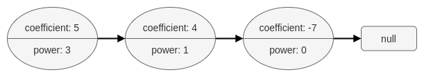
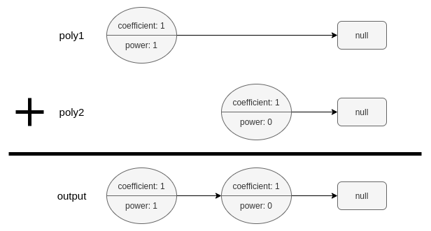

1634. Add Two Polynomials Represented as Linked Lists

A polynomial linked list is a special type of linked list where every node represents a term in a polynomial expression.

Each node has three attributes:

* `coefficient`: an integer representing the number multiplier of the term. The coefficient of the term `9x^4` is `9`.
* `power`: an integer representing the exponent. The power of the term `9x^4` is `4`.
* `next`: a pointer to the next node in the list, or null if it is the last node of the list.

For example, the polynomial `5x^3 + 4x - 7` is represented by the polynomial linked list illustrated below:



The polynomial linked list must be in its standard form: the polynomial must be in strictly descending order by its power value. Also, terms with a coefficient of 0 are omitted.

Given two polynomial linked list heads, `poly1` and `poly2`, add the polynomials together and return the head of the sum of the polynomials.

PolyNode **format**:

The input/output format is as a list of `n` nodes, where each node is represented as its `[coefficient, power]`. For example, the polynomial `5x^3 + 4x - 7` would be represented as: `[[5,3],[4,1],[-7,0]]`.

 

**Example 1:**


```
Input: poly1 = [[1,1]], poly2 = [[1,0]]
Output: [[1,1],[1,0]]
Explanation: poly1 = x. poly2 = 1. The sum is x + 1.
```

**Example 2:**
```
Input: poly1 = [[2,2],[4,1],[3,0]], poly2 = [[3,2],[-4,1],[-1,0]]
Output: [[5,2],[2,0]]
Explanation: poly1 = 2x2 + 4x + 3. poly2 = 3x2 - 4x - 1. The sum is 5x2 + 2. Notice that we omit the "0x" term.
```

**Example 3:**
```
Input: poly1 = [[1,2]], poly2 = [[-1,2]]
Output: []
Explanation: The sum is 0. We return an empty list.
```

**Constraints:**

* `0 <= n <= 10^4`
* `-10^9 <= PolyNode.coefficient <= 10^9`
* `PolyNode.coefficient != 0`
* `0 <= PolyNode.power <= 10^9`
* `PolyNode.power > PolyNode.next.power`

# Submissions
---
**Solution 1: (Linked List)**
```
Runtime: 96 ms
Memory Usage: 39.9 MB
```
```c++
/**
 * Definition for polynomial singly-linked list.
 * struct PolyNode {
 *     int coefficient, power;
 *     PolyNode *next;
 *     PolyNode(): coefficient(0), power(0), next(nullptr) {};
 *     PolyNode(int x, int y): coefficient(x), power(y), next(nullptr) {};
 *     PolyNode(int x, int y, PolyNode* next): coefficient(x), power(y), next(next) {};
 * };
 */

class Solution {
public:
    PolyNode* addPoly(PolyNode* poly1, PolyNode* poly2) {
        PolyNode* head;
        auto pCurr = &head;
        while (poly1 != nullptr && poly2 != nullptr) {
            int c, p;
            if (poly1->power == poly2->power) {
                c = poly1->coefficient + poly2->coefficient;
                p = poly1->power;
                poly1 = poly1->next;
                poly2 = poly2->next;
            } else {
                auto& larger = (poly1->power > poly2->power ? poly1 : poly2);
                c = larger->coefficient;
                p = larger->power;
                larger = larger->next;
            }
            if (c != 0) {
                auto& curr = *pCurr;
                curr = new PolyNode(c, p);
                pCurr = &curr->next;
            }
        }
        *pCurr = (poly1 == nullptr ? poly2 : poly1);
        return head;
    }
};
```
