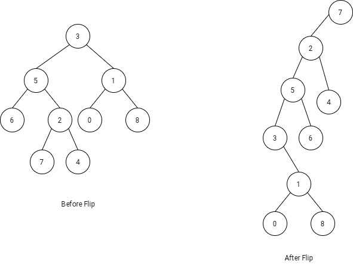

1666. Change the Root of a Binary Tree

Given the `root` of a binary tree and a `leaf` node, reroot the tree so that the `leaf` is the new root.

You can reroot the tree with the following steps for each node `cur` on the path **starting from** the `leaf` up to the `root` **excluding the root**:

1. If `cur` has a left child, then that child becomes `cur`'s right child.
1. `cur`'s original parent becomes `cur`'s left child. Note that in this process the original parent's pointer to `cur` becomes `null`, making it have at most one child.

Return the new root of the rerooted tree.

**Note:** Ensure that your solution sets the Node.parent pointers correctly after rerooting or you will receive "Wrong Answer".

 

**Example 1:**


```
Input: root = [3,5,1,6,2,0,8,null,null,7,4], leaf = 7
Output: [7,2,null,5,4,3,6,null,null,null,1,null,null,0,8]
```

**Example 2:**
```
Input: root = [3,5,1,6,2,0,8,null,null,7,4], leaf = 0
Output: [0,1,null,3,8,5,null,null,null,6,2,null,null,7,4]
```

**Constraints:**

* The number of nodes in the tree is in the range `[2, 100]`.
* `-10^9 <= Node.val <= 10^9`
* All `Node.val` are **unique**.
* `leaf` exist in the tree.

**Solution 1: (DFS)**
```
Runtime: 36 ms
Memory Usage: 14.8 MB
```
```python
"""
# Definition for a Node.
class Node:
    def __init__(self, val):
        self.val = val
        self.left = None
        self.right = None
        self.parent = None
"""

class Solution:
    def flipBinaryTree(self, root: 'Node', leaf: 'Node') -> 'Node':
        
        def fn(node, prev=None): 
            """Return updated node."""
            if node == root: 
                if prev == node.left: node.left = None
                else: node.right = None
            else: 
                if prev == node.right: node.right = node.left
                node.left = fn(node.parent, node)
            node.parent = prev
            return node 
        
        return fn(leaf)
```

**Solution 2: (Iterative)**
```
Runtime: 36 ms
Memory Usage: 14.6 MB
```
```python
"""
# Definition for a Node.
class Node:
    def __init__(self, val):
        self.val = val
        self.left = None
        self.right = None
        self.parent = None
"""

class Solution:
    def flipBinaryTree(self, root: 'Node', leaf: 'Node') -> 'Node':
        prev, node = None, leaf
        while node: 
            if node == root:
                if prev == node.right: node.right = None
                else: node.left = None
            else: 
                if prev == node.right: node.right = node.left 
                node.left = node.parent
            node.parent, node, prev = prev, node.parent, node 
        return leaf
```