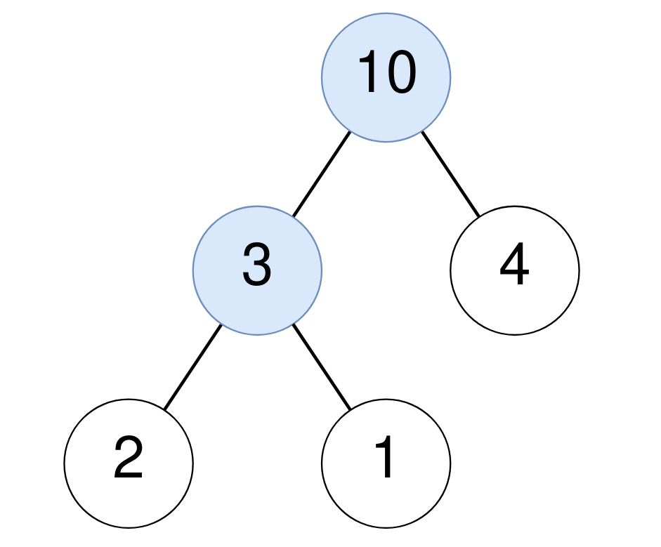
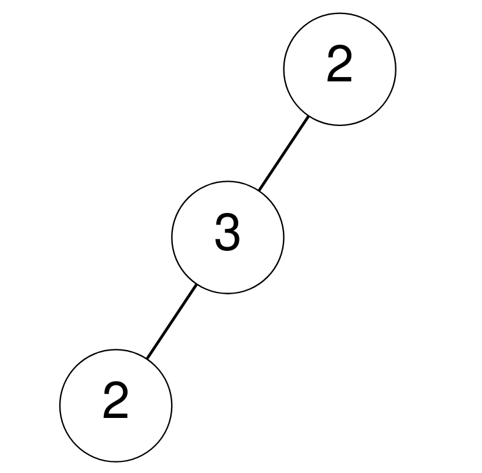
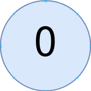

1973. Count Nodes Equal to Sum of Descendants

Given the `root` of a binary tree, return the number of nodes where the value of the node is equal to the **sum** of the values of its descendants.

A **descendant** of a node `x` is any node that is on the path from node `x` to some leaf node. The sum is considered to be `0` if the node has no descendants.

 

**Example 1:**


```
Input: root = [10,3,4,2,1]
Output: 2
Explanation:
For the node with value 10: The sum of its descendants is 3+4+2+1 = 10.
For the node with value 3: The sum of its descendants is 2+1 = 3.
```

**Example 2:**


```
Input: root = [2,3,null,2,null]
Output: 0
Explanation:
No node has a value that is equal to the sum of its descendants.
```

**Example 3:**


```
Input: root = [0]
Output: 1
For the node with value 0: The sum of its descendants is 0 since it has no descendants.
```

**Constraints:**

* The number of nodes in the tree is in the range `[1, 10^5]`.
* `0 <= Node.val <= 10^5`

# Submissions
---
**Solution 1: (DFS, Post-Order)**
```
Runtime: 1241 ms
Memory Usage: 144.7 MB
```
```python
# Definition for a binary tree node.
# class TreeNode:
#     def __init__(self, val=0, left=None, right=None):
#         self.val = val
#         self.left = left
#         self.right = right
class Solution:
    def equalToDescendants(self, root: Optional[TreeNode]) -> int:
        ans = 0
        
        def dfs(node):
            nonlocal ans
            if not node:
                return 0
            left = dfs(node.left)
            right = dfs(node.right)
            if node.val == left + right:
                ans += 1
            return node.val + left + right
            
        dfs(root)
        return ans
```
