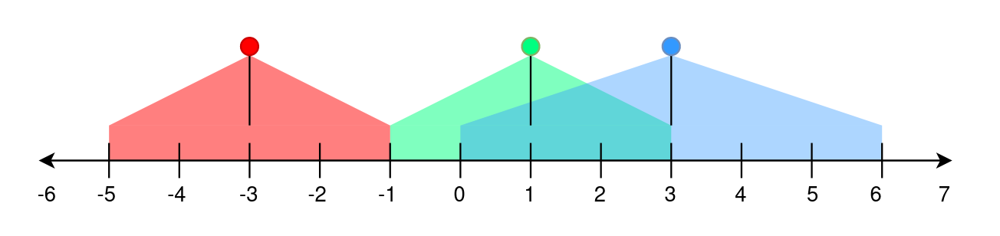

2021. Brightest Position on Street

A perfectly straight street is represented by a number line. The street has street lamp(s) on it and is represented by a 2D integer array `lights`. Each `lights[i] = [positioni, rangei]` indicates that there is a street lamp at position `positioni` that `lights` up the area from `[positioni - rangei, positioni + rangei]` (**inclusive**).

The **brightness** of a position `p` is defined as the number of street lamp that light up the position `p`.

Given `lights`, return the **brightest** position on the street. If there are multiple brightest positions, return the **smallest** one.

 

**Example 1:**


```
Input: lights = [[-3,2],[1,2],[3,3]]
Output: -1
Explanation:
The first street lamp lights up the area from [(-3) - 2, (-3) + 2] = [-5, -1].
The second street lamp lights up the area from [1 - 2, 1 + 2] = [-1, 3].
The third street lamp lights up the area from [3 - 3, 3 + 3] = [0, 6].

Position -1 has a brightness of 2, illuminated by the first and second street light.
Positions 0, 1, 2, and 3 have a brightness of 2, illuminated by the second and third street light.
Out of all these positions, -1 is the smallest, so return it.
```

**Example 2:**
```
Input: lights = [[1,0],[0,1]]
Output: 1
Explanation:
The first street lamp lights up the area from [1 - 0, 1 + 0] = [1, 1].
The second street lamp lights up the area from [0 - 1, 0 + 1] = [-1, 1].

Position 1 has a brightness of 2, illuminated by the first and second street light.
Return 1 because it is the brightest position on the street.
```

**Example 3:**
```
Input: lights = [[1,2]]
Output: -1
Explanation:
The first street lamp lights up the area from [1 - 2, 1 + 2] = [-1, 3].

Positions -1, 0, 1, 2, and 3 have a brightness of 1, illuminated by the first street light.
Out of all these positions, -1 is the smallest, so return it.
```

**Constraints:**

* `1 <= lights.length <= 10^5`
* `lights[i].length == 2`
* `-10^8 <= positioni <= 10^8`
* `0 <= rangei <= 10^8`

# Submissions
---
**Solution 1: (Greedy, Sort, Hash Table)**
```
Runtime: 1757 ms
Memory Usage: 80.6 MB
```
```python
class Solution:
    def brightestPosition(self, lights: List[List[int]]) -> int:
        # light range array
        light_r = []
        for p,r in lights:
            light_r.append((p-r,'start'))
            light_r.append((p+r+1,'end'))
        light_r.sort(key = lambda x:x[0])
        # focus on the boundary of light range 
		
        bright = collections.defaultdict(int)
        power = 0
        for l in light_r:
            if 'start' in l:
                power += 1
            else:
                power -= 1
            bright[l[0]] = power
                
        list_bright = list(bright.values())
        list_position = list(bright.keys())
        
        max_bright = max(list_bright)
        max_bright_index = list_bright.index(max_bright)
        
        return list_position[max_bright_index]
```
