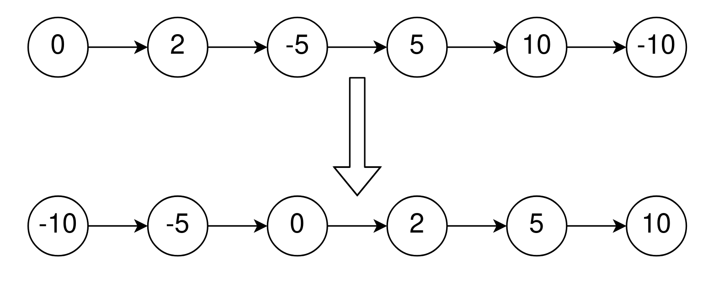
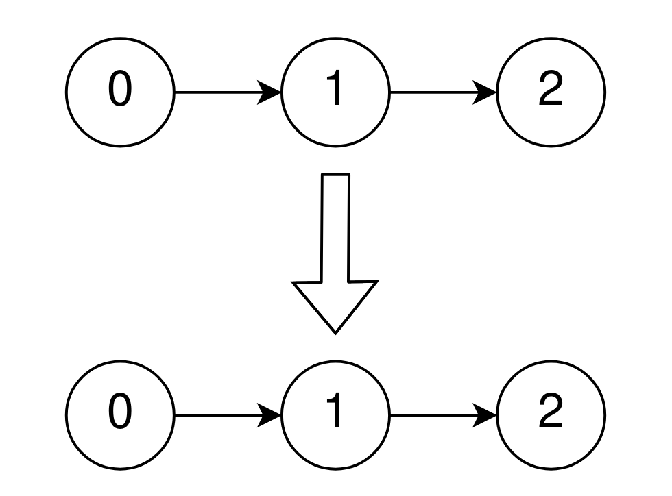

2046. Sort Linked List Already Sorted Using Absolute Values

Given the `head` of a singly linked list that is sorted in **non-decreasing** order using the **absolute values** of its nodes, return the list sorted in **non-decreasing** order using the **actual values** of its nodes.
 

**Example 1:**


```
Input: head = [0,2,-5,5,10,-10]
Output: [-10,-5,0,2,5,10]
Explanation:
The list sorted in non-descending order using the absolute values of the nodes is [0,2,-5,5,10,-10].
The list sorted in non-descending order using the actual values is [-10,-5,0,2,5,10].
```

**Example 2:**


```
Input: head = [0,1,2]
Output: [0,1,2]
Explanation:
The linked list is already sorted in non-decreasing order.
```

**Example 3:**
```
Input: head = [1]
Output: [1]
Explanation:
The linked list is already sorted in non-decreasing order.
```

**Constraints:**

* The number of nodes in the list is the range `[1, 10^5]`.
* `-5000 <= Node.val <= 5000`
* head is sorted in non-decreasing order using the absolute value of its nodes.
 

**Follow up:**

* Can you think of a solution with `O(n)` time complexity?

# Submissions
---
**Solution 1: (Linked List)**
```
Runtime: 163 ms
Memory Usage: 29.7 MB
```
```c
/**
 * Definition for singly-linked list.
 * struct ListNode {
 *     int val;
 *     struct ListNode *next;
 * };
 */


struct ListNode* sortLinkedList(struct ListNode* head){
    struct ListNode *cur = head->next, *prev = head;
    while (cur) {
        if (cur->val < 0) {
            prev->next = cur->next;
            cur->next = head;
            head = cur;
            cur = prev->next;
        } else {
            prev = cur;
            cur = cur->next;
        }
    }
    return head;
}
```
