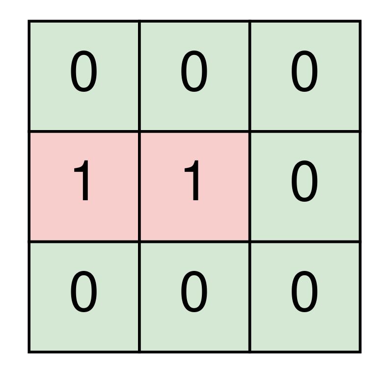
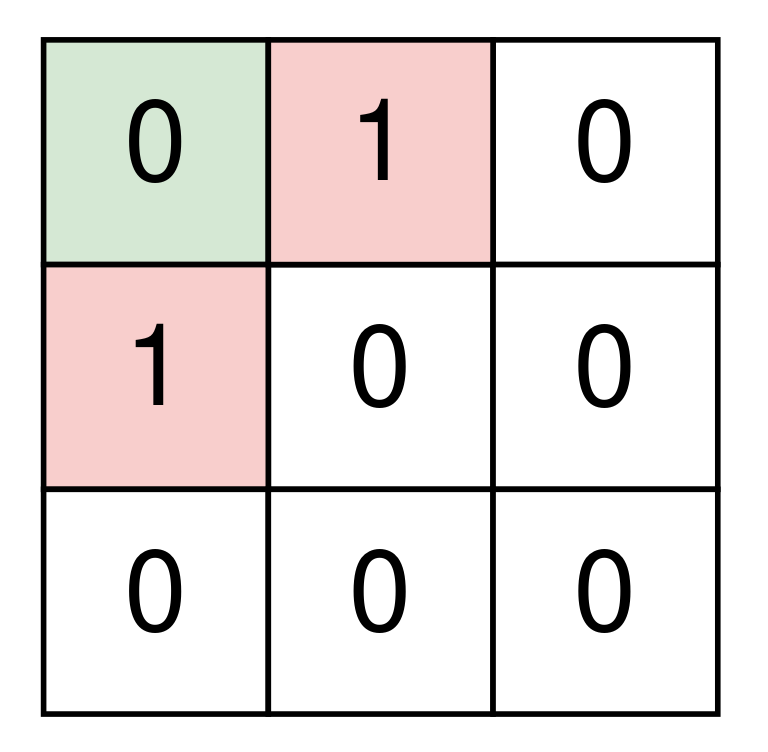

2061. Number of Spaces Cleaning Robot Cleaned

A room is represented by a **0-indexed** 2D binary matrix `room` where a `0` represents an **empty** space and a `1` represents a space with an **object**. The top left corner of the room will be empty in all test cases.

A cleaning robot starts at the top left corner of the room and is facing right. The robot will continue heading straight until it reaches the edge of the room or it hits an object, after which it will turn 90 degrees **clockwise** and repeat this process. The starting space and all spaces that the robot visits are **cleaned** by it.

Return the number of **clean** spaces in the room if the robot runs indefinetely.

 

**Example 1:**


```
Input: room = [[0,0,0],[1,1,0],[0,0,0]]
Output: 7
Explanation:
The robot cleans the spaces at (0, 0), (0, 1), and (0, 2).
The robot is at the edge of the room, so it turns 90 degrees clockwise and now faces down.
The robot cleans the spaces at (1, 2), and (2, 2).
The robot is at the edge of the room, so it turns 90 degrees clockwise and now faces left.
The robot cleans the spaces at (2, 1), and (2, 0).
The robot has cleaned all 7 empty spaces, so return 7.
```

**Example 2:**


```
Input: room = [[0,1,0],[1,0,0],[0,0,0]]
Output: 1
Explanation:
The robot cleans the space at (0, 0).
The robot hits an object, so it turns 90 degrees clockwise and now faces down.
The robot hits an object, so it turns 90 degrees clockwise and now faces left.
The robot is at the edge of the room, so it turns 90 degrees clockwise and now faces up.
The robot is at the edge of the room, so it turns 90 degrees clockwise and now faces right.
The robot is back at its starting position.
The robot has cleaned 1 space, so return 1.
```

**Constraints:**

* `m == room.length`
* `n == room[r].length`
* `1 <= m, n <= 300`
* `room[r][c]` is either `0` or `1`.
* `room[0][0] == 0`

# Submissions
---
**Solution 1: (DFS)**
```
Runtime: 724 ms
Memory Usage: 17.1 MB
```
```python
class Solution:
    def numberOfCleanRooms(self, room: List[List[int]]) -> int:
        m, n = len(room), len(room[0])

        if not ((m > 1 and room[1][0] == 0) or (n > 1 and room[0][1] == 0)):
            return 1

        directions = (0, 1), (1, 0), (0, -1), (-1, 0)  # order matters
        cleaned = dict()  # {(row, col): direction}
        r = c = d = 0  # row, col, direction

        while True:
            if (r, c) in cleaned and cleaned[(r, c)] == d:
                break
            if (r, c) not in cleaned:
                cleaned[(r, c)] = d
            nr, nc = r + directions[d][0], c + directions[d][1]
            while nr < 0 or nr >= m or nc < 0 or nc >= n or room[nr][nc]:
                d = (d + 1) % 4
                nr, nc = r + directions[d][0], c + directions[d][1]
            r, c = nr, nc

        return len(cleaned)
```

**Solution 2: (DFS)**
```
Runtime: 428 ms
Memory: 168.97 MB
```
```c++
class Solution {
    const vector<int> DIRECTIONS = {0, 1, 0, -1, 0};
    int clean(vector<vector<int>>& room, int rows, int cols, int row, int col,
              int direction, unordered_set<string> visited,
              unordered_set<string> cleaned) {
        // If the robot already visited this space facing this direction
        // Return the number of spaces cleaned
        if (visited.find(to_string(row) + to_string(col) +
                         to_string(direction)) != visited.end()) {
            return cleaned.size();
        }

        // Mark the space as visited facing this direction and cleaned
        visited.insert(to_string(row) + to_string(col) + to_string(direction));
        cleaned.insert(to_string(row) + to_string(col));

        // Clean the next space straight ahead if it's empty and in the room
        int nextRow = row + DIRECTIONS[direction];
        int nextCol = col + DIRECTIONS[direction + 1];
        if (0 <= nextRow && nextRow < rows && 0 <= nextCol && nextCol < cols &&
            room[nextRow][nextCol] == 0) {
            return clean(room, rows, cols, nextRow, nextCol, direction, visited,
                         cleaned);
        }

        // Otherwise turn right and clean the current space
        return clean(room, rows, cols, row, col, (direction + 1) % 4, visited,
                     cleaned);
    };
public:
    int numberOfCleanRooms(vector<vector<int>>& room) {
        int rows = room.size();
        int cols = room[0].size();
        unordered_set<string> visited;
        unordered_set<string> cleaned;
        return clean(room, rows, cols, 0, 0, 0, visited, cleaned);
    }
};
```

**Solution 3: (BFS)**
```
Runtime: 34 ms
Memory: 27.91 MB
```
```c++
class Solution {
    const vector<int> DIRECTIONS = {0, 1, 0, -1, 0};
public:
    int numberOfCleanRooms(vector<vector<int>>& room) {
        int rows = room.size();
        int cols = room[0].size();
        vector<vector<int>> visited(rows, vector<int>(cols, 0));
        int cleaned = 0;

        queue<vector<int>> queue;
        queue.push(vector<int>{0, 0, 0});

        while (!queue.empty()) {
            vector<int> current = queue.front();
            queue.pop();
            int row = current[0];
            int col = current[1];
            int direction = current[2];

            // If the robot hasn't cleaned this space yet, increment cleaned
            if (visited[row][col] == 0) {
                cleaned += 1;
            }

            // Mark the space as visited facing this direction
            visited[row][col] |= 1 << direction;

            for (int d = 0; d < 4; d++) {
                // Get the next direction and coordinates for the next space
                int nextDir = (direction + d) % 4;
                int nextRow = row + DIRECTIONS[nextDir];
                int nextCol = col + DIRECTIONS[nextDir + 1];

                // Clean the next space if it's empty and in the room
                if (0 <= nextRow && nextRow < rows && 0 <= nextCol 
                    && nextCol < cols && room[nextRow][nextCol] == 0) {
                    // If we already visited the next space facing the next
                    // direction, return the number of spaces cleaned
                    if (visited[nextRow][nextCol] >> nextDir & 1) {
                        return cleaned;
                    } else {
                        queue.push(vector<int>{nextRow, nextCol, nextDir});
                        break;
                    }
                }
            }
        }
        return cleaned;
    }
};
```
