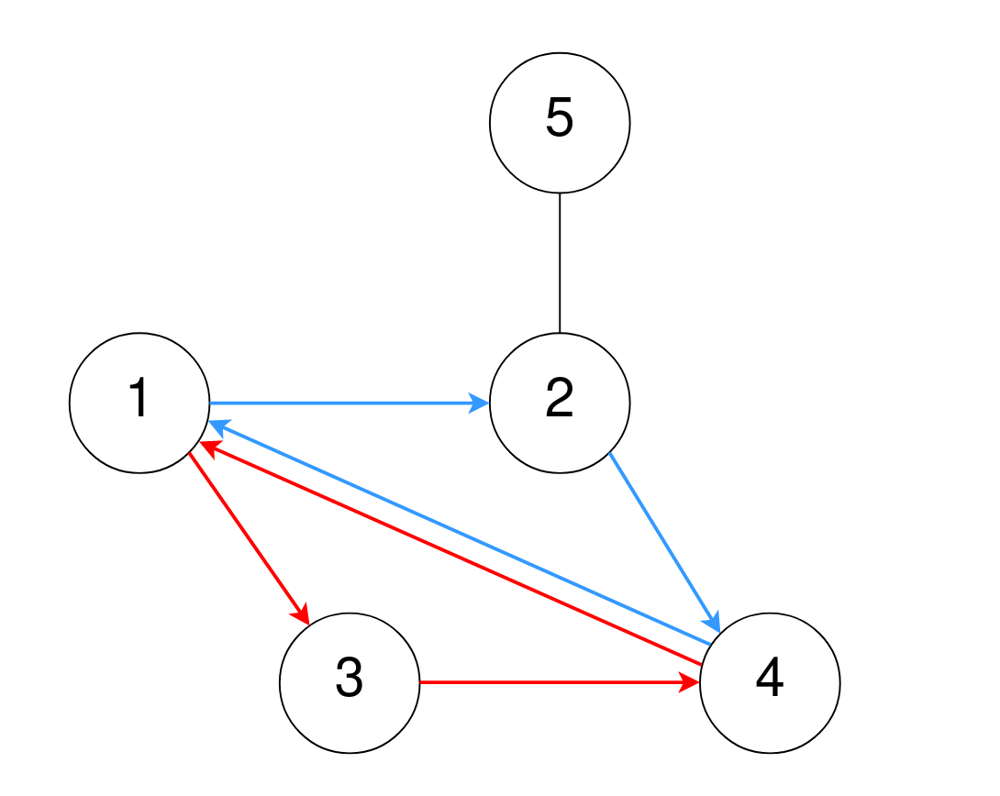
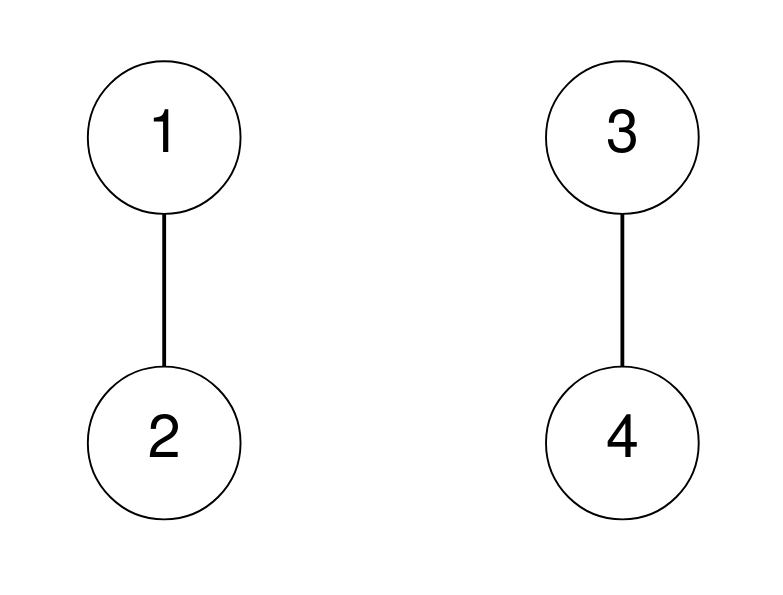

2077. Paths in Maze That Lead to Same Room

A maze consists of `n` rooms numbered from `1` to `n`, and some rooms are connected by corridors. You are given a 2D integer array `corridors` where `corridors[i] = [room1i, room2i]` indicates that there is a corridor connecting `room1i` and `room2i`, allowing a person in the maze to go from `room1i` to `room2i` and **vice versa**.

The designer of the maze wants to know how confusing the maze is. The **confusion score** of the maze is the number of different cycles of **length 3**.

* For example, `1 → 2 → 3 → 1` is a cycle of length `3`, but `1 → 2 → 3 → 4` and `1 → 2 → 3 → 2 → 1` are not.

Two cycles are considered to be **different** if one or more of the rooms visited in the first cycle is **not** in the second cycle.

Return the **confusion score** of the maze.

 

**Example 1:**


```
Input: n = 5, corridors = [[1,2],[5,2],[4,1],[2,4],[3,1],[3,4]]
Output: 2
Explanation:
One cycle of length 3 is 4 → 1 → 3 → 4, denoted in red.
Note that this is the same cycle as 3 → 4 → 1 → 3 or 1 → 3 → 4 → 1 because the rooms are the same.
Another cycle of length 3 is 1 → 2 → 4 → 1, denoted in blue.
Thus, there are two different cycles of length 3.
```

**Example 2:**


```
Input: n = 4, corridors = [[1,2],[3,4]]
Output: 0
Explanation:
There are no cycles of length 3.
```

**Constraints:**

* `2 <= n <= 1000`
* `1 <= corridors.length <= 5 * 10^4`
* `corridors[i].length == 2`
* `1 <= room1i, room2i <= n`
* `room1i != room2i`
There are no duplicate corridors.

# Submissions
---
**Solution 1: (BFS)**
```
Runtime: 2944 ms
Memory Usage: 35.8 MB
```
```python
class Solution:
    def numberOfPaths(self, n: int, corridors: List[List[int]]) -> int:
        graph = defaultdict(set)
        count = 0
        stack = [1]
        visited = set()
        
		# building bidirectional graph
        for s, e in corridors:
            graph[s].add(e)
            graph[e].add(s)
		# BFS traversal
        while stack:
            curr = stack.pop()
            visited.add(curr)
            for neigh in graph[curr]:
                if neigh not in visited:
                    stack.append(neigh)
					# graph[neigh] => neigh's neighbors // graph[curr] => current node's neighbors
                    tmpInter = graph[neigh].intersection(graph[curr])
					# number of intersected nodes can create length of three cycle
                    count += len(tmpInter)
        
		# divide by 3 because redundatnly counted from every vertices 
        return count // 3
```
