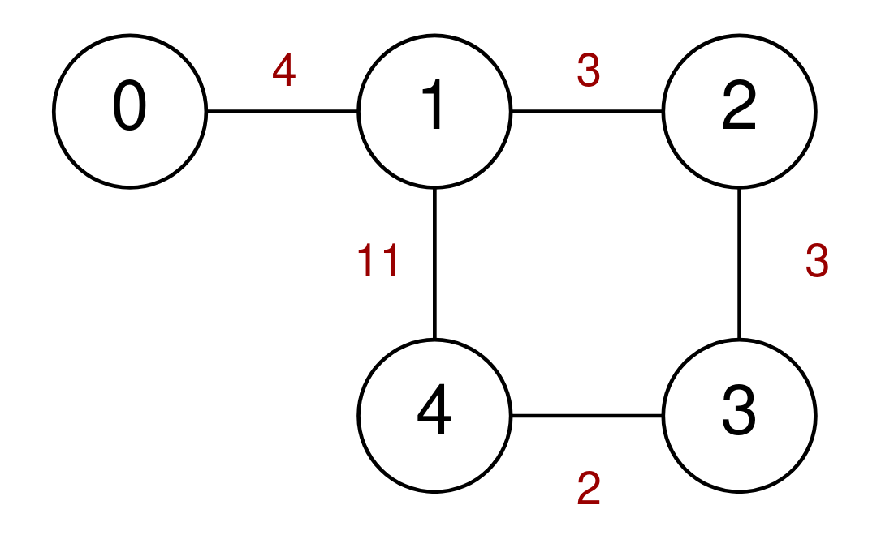
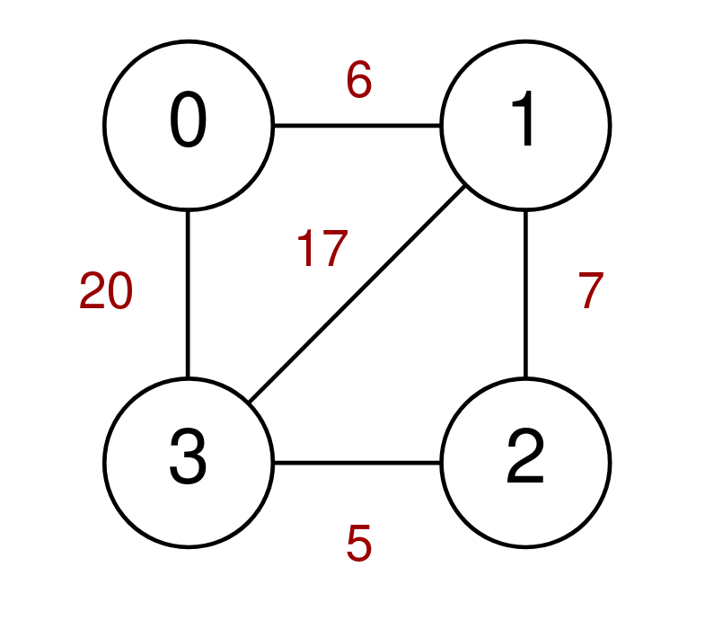
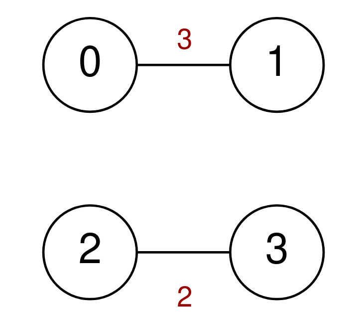

2093. Minimum Cost to Reach City With Discounts

A series of highways connect `n` cities numbered from `0` to `n - 1`. You are given a 2D integer array `highways` where `highways[i] = [city1i, city2i, tolli]` indicates that there is a highway that connects `city1i` and `city2i`, allowing a car to go from `city1i` to `city2i` and **vice versa** for a cost of `tolli`.

You are also given an integer `discounts` which represents the number of discounts you have. You can use a discount to travel across the `i`th highway for a cost of `tolli / 2` (**integer division**). Each discount may only be used **once**, and you can only use at most **one** discount per highway.

Return the **minimum total cost** to go from city `0` to city `n - 1`, or `-1` if it is not possible to go from city `0` to city `n - 1`.

 

**Example 1:**


```
Input: n = 5, highways = [[0,1,4],[2,1,3],[1,4,11],[3,2,3],[3,4,2]], discounts = 1
Output: 9
Explanation:
Go from 0 to 1 for a cost of 4.
Go from 1 to 4 and use a discount for a cost of 11 / 2 = 5.
The minimum cost to go from 0 to 4 is 4 + 5 = 9.
```

**Example 2:**


```
Input: n = 4, highways = [[1,3,17],[1,2,7],[3,2,5],[0,1,6],[3,0,20]], discounts = 20
Output: 8
Explanation:
Go from 0 to 1 and use a discount for a cost of 6 / 2 = 3.
Go from 1 to 2 and use a discount for a cost of 7 / 2 = 3.
Go from 2 to 3 and use a discount for a cost of 5 / 2 = 2.
The minimum cost to go from 0 to 3 is 3 + 3 + 2 = 8.
```

**Example 3:**


```
Input: n = 4, highways = [[0,1,3],[2,3,2]], discounts = 0
Output: -1
Explanation:
It is impossible to go from 0 to 3 so return -1.
```

**Constraints:**

* `2 <= n <= 1000`
* `1 <= highways.length <= 1000`
* `highways[i].length == 3`
* `0 <= city1i, city2i <= n - 1`
* `city1i != city2i`
* `0 <= tolli <= 10^5`
* `0 <= discounts <= 500`
* There are no duplicate `highways`.

# Submissions
---
**Solution 1: (Dijkstra)**
```
Runtime: 1160 ms
Memory Usage: 14.8 MB
```
```python
class Solution:
    def minimumCost(self, n: int, highways: List[List[int]], discounts: int) -> int:
        #build a graph between cities based on the highways
        #use Dijkstra's algorithim to keep track of the (cost, discounts, city) in a heap
        #the top of heap always has the min cost, if the city is the destination, return the cost
        #if not, keep exploring, if we meet the same city again, if we have more distcount, that might lead us to the optimal solution, otherwise skip it, which also make sure we won't use the discoun for the same highway
        #ElogE time, where e is the number of edges in the graph
        
        graph = defaultdict(dict)
        seen = {}
        for i, j, cost in highways:
            graph[i][j] = cost
            graph[j][i] = cost
        pq = [(0, discounts, 0)]
        while pq:
            cost, discounts, city = heapq.heappop(pq)
            if city == n - 1:
                return cost
            if city not in seen or seen[city] < discounts:
                seen[city] = discounts
                for nxt in graph[city]:
                    heapq.heappush(pq, (cost + graph[city][nxt], discounts, nxt))
                    if discounts:
                        heapq.heappush(pq, (cost + graph[city][nxt]//2, discounts - 1, nxt))
        return -1
```
