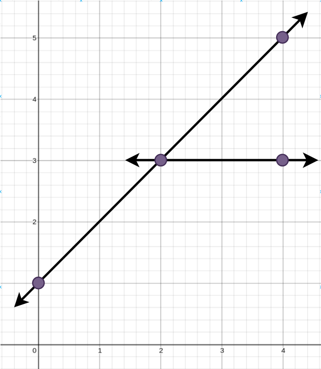
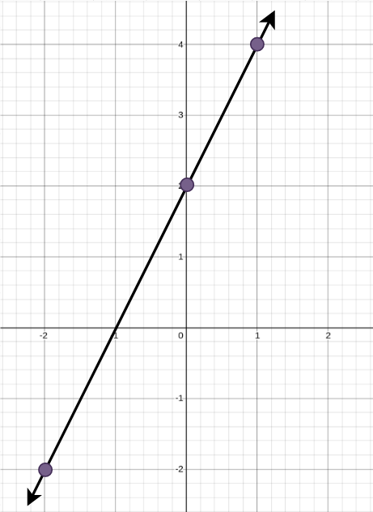

2152. Minimum Number of Lines to Cover Points

You are given an array `points` where `points[i] = [xi, yi]` represents a point on an **X-Y** plane.

**Straight lines** are going to be added to the **X-Y** plane, such that every point is covered by **at least** one line.

Return the **minimum** number of **straight lines** needed to cover all the points.

 

**Example 1:**


```
Input: points = [[0,1],[2,3],[4,5],[4,3]]
Output: 2
Explanation: The minimum number of straight lines needed is two. One possible solution is to add:
- One line connecting the point at (0, 1) to the point at (4, 5).
- Another line connecting the point at (2, 3) to the point at (4, 3).
```

**Example 2:**


```
Input: points = [[0,2],[-2,-2],[1,4]]
Output: 1
Explanation: The minimum number of straight lines needed is one. The only solution is to add:
- One line connecting the point at (-2, -2) to the point at (1, 4).
```

**Constraints:**

`1 <= points.length <= 10`
`points[i].length == 2`
`-100 <= xi, yi <= 100`
All the `points` are **unique**.

# Submissions
---
**Solution 1: (Greedy, DP)**
```
Runtime: 200 ms
Memory Usage: 14.5 MB
```
```python
class Solution:
    def minimumLines(self, points: List[List[int]]) -> int:
        
        @lru_cache(None)
        def helper(tups):
            if len(tups) == 0: return 0
            elif len(tups) <= 2: return 1
            else:
                slope_dict = {}
                for i in range(len(tups)):
                    s_x, s_y = points[tups[i]]
                    for j in range(i+1, len(tups)):
                        t_x, t_y = points[tups[j]]
                        slope = None
                        const = None
                        if s_x == t_x:
                            slope = "inf"
                            const = s_x
                        else:
                            slope = (s_y - t_y)*1.0/(s_x - t_x)
                            const = s_y - slope*s_x
                        if (slope, const) not in slope_dict:
                            slope_dict[(slope, const)] = set()
                            slope_dict[(slope, const)].add(tups[i])
                            slope_dict[(slope, const)].add(tups[j])
                        else:
                            slope_dict[(slope, const)].add(tups[i])
                            slope_dict[(slope, const)].add(tups[j])
                maxi = -sys.maxsize
                track = None
                for key, value in slope_dict.items():
                    if len(value) > maxi:
                      maxi = len(value)
                      track = [key]
                    elif len(value) == maxi:
                      track.append(key)
                best = sys.maxsize
                for element in track:
                    new_points = []
                    for t in range(len(tups)):
                        if tups[t] not in slope_dict[element]:
                            new_points.append(tups[t])
                    new_tups = tuple(new_points)
                    best = min(best, helper(new_tups))
                return best + 1

        return helper(tuple([i for i in range(len(points))]))
```
