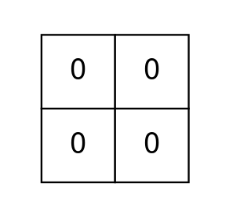

2174. Remove All Ones With Row and Column Flips II

You are given a **0-indexed** `m x n` **binary** matrix `grid`.

In one operation, you can choose any `i` and `j` that meet the following conditions:

* `0 <= i < m`
* `0 <= j < n`
* `grid[i][j] == 1`

and change the values of all cells in row `i` and column `j` to zero.

Return the **minimum** number of operations needed to remove all 1's from grid.

 

**Example 1:**


```
Input: grid = [[1,1,1],[1,1,1],[0,1,0]]
Output: 2
Explanation:
In the first operation, change all cell values of row 1 and column 1 to zero.
In the second operation, change all cell values of row 0 and column 0 to zero.
```

**Example 2:**


```
Input: grid = [[0,1,0],[1,0,1],[0,1,0]]
Output: 2
Explanation:
In the first operation, change all cell values of row 1 and column 0 to zero.
In the second operation, change all cell values of row 2 and column 1 to zero.
Note that we cannot perform an operation using row 1 and column 1 because grid[1][1] != 1.
```

**Example 3:**


```
Input: grid = [[0,0],[0,0]]
Output: 0
Explanation:
There are no 1's to remove so return 0.
```

**Constraints:**

* `m == grid.length`
* `n == grid[i].length`
* `1 <= m, n <= 15`
* `1 <= m * n <= 15`
* `grid[i][j`] is either `0` or `1`.

# Submissions
---
**Solution 1: (Backtracking, DFS, Set)**
```
Runtime: 85 ms
Memory: 13.9 MB
```
```python
class Solution:
    def removeOnes(self, grid: List[List[int]]) -> int:
        m = len(grid)
        n = len(grid[0])
        self.ans = float('inf')
        self.flips = 0
        seen = set()
        def helper():
            flag = False
            for x in range(m):
                for y in range(n):
                    if grid[x][y] == 1 and ('r', x) not in seen and ('c', y) not in seen :
                        flag = True
                        seen.add(('r', x))
                        seen.add(('c', y))
                        self.flips+=1
                        helper()
                        self.flips-=1
                        seen.remove(('r', x))
                        seen.remove(('c', y))
                        
            if not flag:
                self.ans=min(self.ans, self.flips)
        
        helper()
        return self.ans
```
