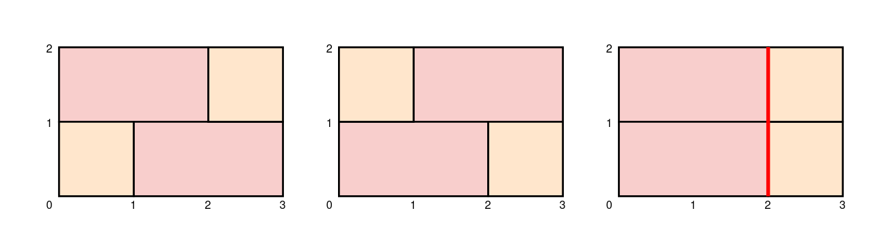

2184. Number of Ways to Build Sturdy Brick Wall

You are given integers `height` and `width` which specify the dimensions of a brick wall you are building. You are also given a **0-indexed** array of unique integers `bricks`, where the `i`th brick has a height of `1` and a width of `bricks[i]`. You have an **infinite** supply of each type of brick and bricks may not be rotated.

Each row in the wall must be exactly width units long. For the wall to be **sturdy**, adjacent rows in the wall should not join bricks at the same location, except at the ends of the wall.

Return the number of ways to build a **sturdy** wall. Since the answer may be very large, return it **modulo** `10^9 + 7`.

 

**Example 1:**


```
Input: height = 2, width = 3, bricks = [1,2]
Output: 2
Explanation:
The first two walls in the diagram show the only two ways to build a sturdy brick wall.
Note that the third wall in the diagram is not sturdy because adjacent rows join bricks 2 units from the left.
```

**Example 2:**
```
Input: height = 1, width = 1, bricks = [5]
Output: 0
Explanation:
There are no ways to build a sturdy wall because the only type of brick we have is longer than the width of the wall.
```

**Constraints:**

* `1 <= height <= 100`
* `1 <= width <= 10`
* `1 <= bricks.length <= 10`
* `1 <= bricks[i] <= 10`
All the values of `bricks` are **unique**.

# Submissions
---
**Solution 1: (Backtracking, DP)**
```
Runtime: 1371 ms
Memory: 14.9 MB
```
class Solution:
    def buildWall(self, height: int, width: int, bricks: List[int]) -> int:
        mod = 10 ** 9 + 7
        combo = []
        
        def backtrack(cur_sum, cur_list):
            if cur_sum == width:
                combo.append(cur_list[:len(cur_list) - 1])
                return
            elif cur_sum > width:
                return
            for x in bricks:
                cur_list.append(x + cur_list[-1] if cur_list else x)
                backtrack(cur_sum + x, cur_list)
                cur_list.pop()
        
        def valid_transition(i, j):
            nums = set(combo[i])
            for x in combo[j]:
                if x in nums:
                    return False
            return True
        
        backtrack(0, [])
        l = len(combo)
        nxt = [list() for _ in range(l)]
        for i in range(l):
            for j in range(l):
                if valid_transition(i, j):
                    nxt[i].append(j)
        
        dp = [1] * l
        for _ in range(height - 1):
            dp_nxt = [0] * l
            for i in range(l):
                if dp[i] > 0:
                    for j in nxt[i]:
                        dp_nxt[j] = (dp_nxt[j] + dp[i]) % mod
            dp = dp_nxt
        res = 0
        for x in dp:
            res = (res + x) % mod
        return res
```
