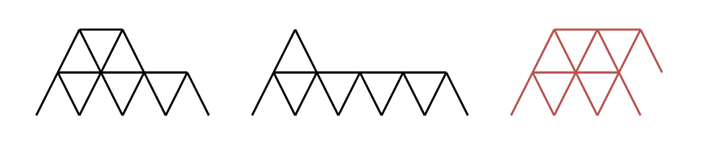
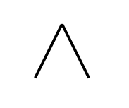

2189. Number of Ways to Build House of Cards

You are given an integer `n` representing the number of playing cards you have. A house of cards meets the following conditions:

* **A house of cards** consists of one or more rows of **triangles** and horizontal cards.
* **Triangles** are created by leaning two cards against each other.
* One card must be placed horizontally between **all adjacent** triangles in a row.
* Any triangle on a row higher than the first must be placed on a horizontal card from the previous row.
* Each triangle is placed in the **leftmost** available spot in the row.

Return the number of **distinct house of cards** you can build using **all** `n` cards. Two houses of cards are considered distinct if there exists a row where the two houses contain a different number of cards.

 

**Example 1:**


```
Input: n = 16
Output: 2
Explanation: The two valid houses of cards are shown.
The third house of cards in the diagram is not valid because the rightmost triangle on the top row is not placed on top of a horizontal card.
```

**Example 2:**


```
Input: n = 2
Output: 1
Explanation: The one valid house of cards is shown.
```

**Example 3:**


```
Input: n = 4
Output: 0
Explanation: The three houses of cards in the diagram are not valid.
The first house of cards needs a horizontal card placed between the two triangles.
The second house of cards uses 5 cards.
The third house of cards uses 2 cards.
```

**Constraints:**

* `1 <= n <= 500`

# Submissions
---
**Solution 1: (DP Top-Down)**
```
Runtime: 8376 ms
Memory: 130 MB
```
```python
class Solution:
    def houseOfCards(self, n: int) -> int:
    
        @functools.lru_cache(None)
        def dp(maxTriangle, remaining):
            if remaining == 0:
                return 1
            if remaining < 0:
                return 0
            res = 0
            for i in range(0, maxTriangle):
                needed = 2 + 3 * i
                if needed > remaining:
                    break
                res += dp(i, remaining - needed)
            return res

        return dp(n, n)
```
