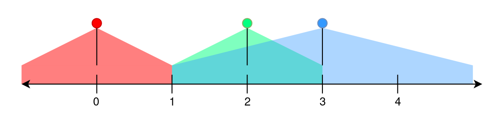

2237. Count Positions on Street With Required Brightness

You are given an integer `n`. A perfectly straight street is represented by a number line ranging from `0` to `n - 1`. You are given a 2D integer array `lights` representing the street lamp(s) on the street. Each `lights[i] = [positioni, rangei]` indicates that there is a street lamp at position positioni that lights up the area from `[max(0, positioni - rangei), min(n - 1, positioni + rangei)]` (**inclusive**).

The **brightness** of a position `p` is defined as the number of street lamps that light up the position `p`. You are given a **0-indexed** integer array `requirement` of size `n` where `requirement[i]` is the minimum brightness of the `i`th position on the street.

Return the number of positions `i` on the street between `0` and `n - 1` that have a brightness of at least `requirement[i]`.

 

**Example 1:**


```
Input: n = 5, lights = [[0,1],[2,1],[3,2]], requirement = [0,2,1,4,1]
Output: 4
Explanation:
- The first street lamp lights up the area from [max(0, 0 - 1), min(n - 1, 0 + 1)] = [0, 1] (inclusive).
- The second street lamp lights up the area from [max(0, 2 - 1), min(n - 1, 2 + 1)] = [1, 3] (inclusive).
- The third street lamp lights up the area from [max(0, 3 - 2), min(n - 1, 3 + 2)] = [1, 4] (inclusive).

- Position 0 is covered by the first street lamp. It is covered by 1 street lamp which is greater than requirement[0].
- Position 1 is covered by the first, second, and third street lamps. It is covered by 3 street lamps which is greater than requirement[1].
- Position 2 is covered by the second and third street lamps. It is covered by 2 street lamps which is greater than requirement[2].
- Position 3 is covered by the second and third street lamps. It is covered by 2 street lamps which is less than requirement[3].
- Position 4 is covered by the third street lamp. It is covered by 1 street lamp which is equal to requirement[4].

Positions 0, 1, 2, and 4 meet the requirement so we return 4.
```

**Example 2:**
```
Input: n = 1, lights = [[0,1]], requirement = [2]
Output: 0
Explanation:
- The first street lamp lights up the area from [max(0, 0 - 1), min(n - 1, 0 + 1)] = [0, 0] (inclusive).
- Position 0 is covered by the first street lamp. It is covered by 1 street lamp which is less than requirement[0].
- We return 0 because no position meets their brightness requirement.
```

**Constraints:**

* `1 <= n <= 10^5`
* `1 <= lights.length <= 10^5`
* `0 <= positioni < n`
* `0 <= rangei <= 10^5`
* `requirement.length == n`
* `0 <= requirement[i] <= 10^5`

# Submissions
---
**Solution 1: (Greedy)**
```
Runtime: 4004 ms
Memory: 49.4 MB
```
```python
class Solution:
    def meetRequirement(self, n: int, lights: List[List[int]], requirement: List[int]) -> int:
        dp = [0]*(n+1)
        for p, r in lights:
            dp[max(0, p-r)] += 1
            dp[min(n, p+r+1)] -= 1
        ans = 0
        cur = 0
        for i in range(n):
            cur += dp[i]
            ans += 1 if cur >= requirement[i] else 0
        return ans
```
