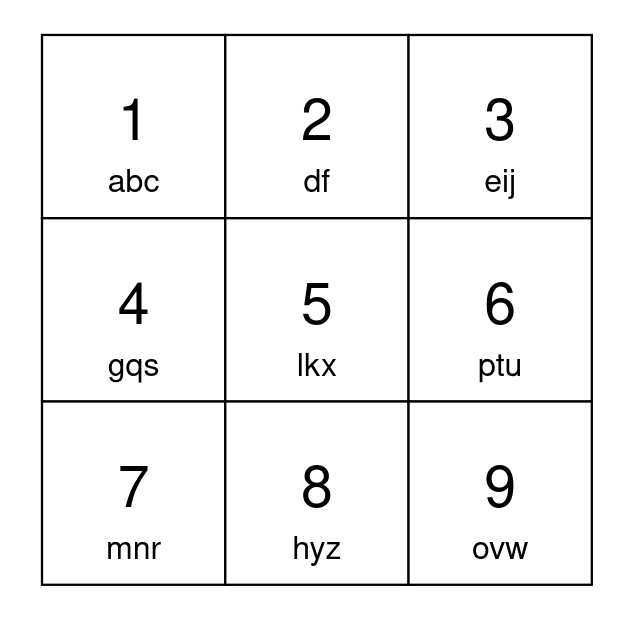
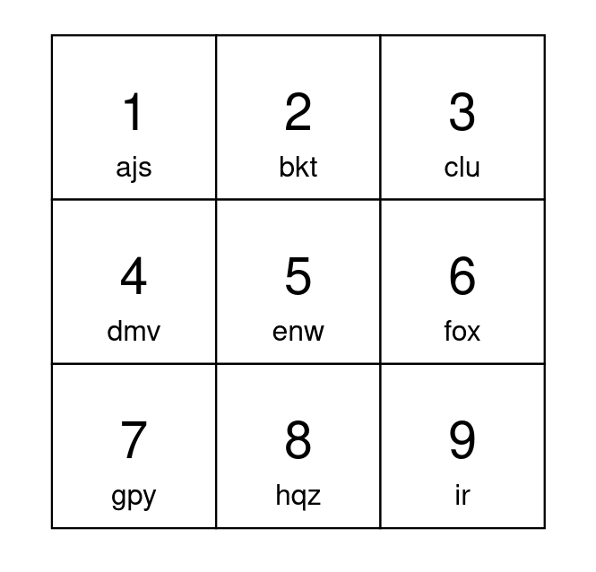

2268. Minimum Number of Keypresses

You have a keypad with `9` buttons, numbered from `1` to `9`, each mapped to lowercase English letters. You can choose which characters each button is matched to as long as:

* All `26` lowercase English letters are mapped to.
* Each character is mapped to by **exactly** `1` button.
* Each button maps to **at most** `3` characters.

To type the first character matched to a button, you press the button once. To type the second character, you press the button twice, and so on.

Given a string `s`, return the **minimum** number of keypresses needed to type s using your keypad.

**Note** that the characters mapped to by each button, and the order they are mapped in cannot be changed.

 

**Example 1:**


```
Input: s = "apple"
Output: 5
Explanation: One optimal way to setup your keypad is shown above.
Type 'a' by pressing button 1 once.
Type 'p' by pressing button 6 once.
Type 'p' by pressing button 6 once.
Type 'l' by pressing button 5 once.
Type 'e' by pressing button 3 once.
A total of 5 button presses are needed, so return 5.
```

**Example 2:**


```
Input: s = "abcdefghijkl"
Output: 15
Explanation: One optimal way to setup your keypad is shown above.
The letters 'a' to 'i' can each be typed by pressing a button once.
Type 'j' by pressing button 1 twice.
Type 'k' by pressing button 2 twice.
Type 'l' by pressing button 3 twice.
A total of 15 button presses are needed, so return 15.
```

**Constraints:**

* `1 <= s.length <= 10^5`
* `s` consists of lowercase English letters.

# Submissions
---
**Solution 1: (Counter)**
```
Runtime: 140 ms
Memory: 14.9 MB
```
```python
class Solution:
    def minimumKeypresses(self, s: str) -> int:
        freqs = sorted(collections.Counter(s).values(), reverse=True)
        return sum([f * (i//9 + 1) for i, f in enumerate(freqs)])
```
