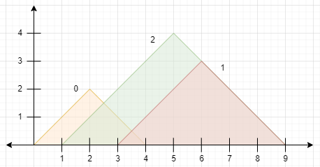
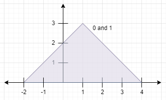

2345. Finding the Number of Visible Mountains

You are given a **0-indexed** 2D integer array `peaks` where `peaks[i] = [xi, yi]` states that mountain `i` has a peak at coordinates `(xi, yi)`. A mountain can be described as a right-angled isosceles triangle, with its base along the x-axis and a right angle at its peak. More formally, the **gradients** of ascending and descending the mountain are `1` and `-1` respectively.

A mountain is considered **visible** if its peak does not lie within another mountain (including the border of other mountains).

Return the number of visible mountains.

 

**Example 1:**


```
Input: peaks = [[2,2],[6,3],[5,4]]
Output: 2
Explanation: The diagram above shows the mountains.
- Mountain 0 is visible since its peak does not lie within another mountain or its sides.
- Mountain 1 is not visible since its peak lies within the side of mountain 2.
- Mountain 2 is visible since its peak does not lie within another mountain or its sides.
There are 2 mountains that are visible.
```

**Example 2:**


```
Input: peaks = [[1,3],[1,3]]
Output: 0
Explanation: The diagram above shows the mountains (they completely overlap).
Both mountains are not visible since their peaks lie within each other.
```

**Constraints:**

* `1 <= peaks.length <= 10^5`
* `peaks[i].length == 2`
* `1 <= xi, yi <= 10^5`

# Submissions
---
**Solution 1: (Monotonic Stack)**
```
Runtime: 2033 ms
Memory: 61 MB
```
```python
class Solution:
    def visibleMountains(self, peaks: List[List[int]]) -> int:
        cnt = Counter(tuple(p) for p in peaks)
        peaks.sort()
        stk = []
        
        for i, (x, h) in enumerate(peaks):
            while stk and h - peaks[stk[-1]][1] >= x - peaks[stk[-1]][0]:
                stk.pop()
            if not stk or peaks[stk[-1]][1] - h < x - peaks[stk[-1]][0]:
                stk.append(i)
        return len([i for i in stk if cnt[tuple(peaks[i])] == 1])
```
